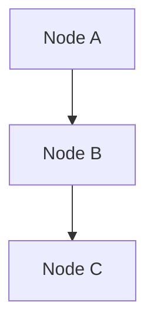

# DEV.GUIDE.md — Glory Hinody Blog

> Hướng dẫn phát triển nội bộ. Đọc kỹ trước khi chỉnh sửa bất kỳ file nào.

---

## ⚠️ CẢNH BÁO QUAN TRỌNG: ENCODING UTF-8

### Vấn đề đã xảy ra (2026-09-29)

Toàn bộ 7 file bài viết trong `content/posts/` bị hiển thị lỗi tiếng Việt (mojibake) trên live site:

```
# Thay vì:
OpenVideoLab: Tạo Sinh Video AI Đa Phương Thức Trên GPU 16GB

# Web hiển thị:
OpenVideoLab: Tạo Sinh Video AI Äa PhÆ°Æ¡ng Thức Trên GPU 16GB
```

**Nguyên nhân:** PowerShell trên Windows đọc file UTF-8 rồi ghi lại bằng `Set-Content` / `[System.IO.File]::WriteAllText` với encoding sai (Windows-1252/ANSI), làm hỏng các ký tự multi-byte của tiếng Việt trong quá trình xử lý file.

---

### Quy tắc bắt buộc khi làm việc với file content

#### ✅ ĐÚNG — Cách chỉnh sửa file nội dung

**1. Dùng trực tiếp công cụ AI (write_to_file / replace_file_content)**

Đây là cách an toàn nhất. Các công cụ này ghi UTF-8 thuần (no BOM) chính xác.

```
# AI tool: write_to_file hoặc replace_file_content
# → Luôn ghi đúng UTF-8, không có vấn đề encoding
```

**2. Dùng trình soạn thảo có hỗ trợ UTF-8**

VS Code, Notepad++, hoặc bất kỳ editor nào — kiểm tra góc dưới phải hiển thị `UTF-8`.

---

#### ❌ SAI — Tuyệt đối KHÔNG làm

```powershell
# ❌ KHÔNG dùng Set-Content (mặc định Windows-1252 trên hệ cũ)
Set-Content $path $content -Encoding UTF8

# ❌ KHÔNG dùng Out-File mà không chỉ định encoding
$content | Out-File $path

# ❌ KHÔNG đọc file bằng Get-Content rồi ghi lại
$content = Get-Content $path -Raw
Set-Content $path $content    # ← Hỏng encoding!

# ❌ KHÔNG dùng regex replace qua PowerShell pipeline lên file .md có tiếng Việt
(Get-Content $path) -replace "old", "new" | Set-Content $path
```

---

#### ✅ Nếu bắt buộc phải dùng PowerShell để xử lý file .md

```powershell
# ✅ Đọc bằng byte, decode UTF-8, write lại UTF-8 no-BOM
$bytes = [System.IO.File]::ReadAllBytes($path)
$content = [System.Text.Encoding]::UTF8.GetString($bytes)

# ... chỉnh sửa $content ...

$utf8NoBom = New-Object System.Text.UTF8Encoding($false)  # false = no BOM
[System.IO.File]::WriteAllText($path, $content, $utf8NoBom)
```

> **Lưu ý:** Vẫn nên ưu tiên dùng AI tool thay vì PowerShell để tránh rủi ro.

---

### Cách kiểm tra encoding file hiện tại

```powershell
# Kiểm tra bytes đầu của file (UTF-8 không có BOM bắt đầu bằng 2D 2D 2D = "---")
$bytes = [System.IO.File]::ReadAllBytes("content\posts\ten-bai.md")
Write-Host "First 3 bytes: $($bytes[0].ToString('X2')) $($bytes[1].ToString('X2')) $($bytes[2].ToString('X2'))"
# UTF-8 no BOM: 2D 2D 2D
# UTF-8 with BOM: EF BB BF
```

```powershell
# Kiểm tra tiếng Việt có bị hỏng không — tìm byte "ạ" = E1 BA A1
$bytes = [System.IO.File]::ReadAllBytes("content\posts\ten-bai.md")
$hasCorrectVietnamese = $false
for ($i = 0; $i -lt $bytes.Length - 2; $i++) {
    if ($bytes[$i] -eq 0xE1 -and ($bytes[$i+1] -eq 0xBA -or $bytes[$i+1] -eq 0xBB)) {
        $hasCorrectVietnamese = $true; break
    }
}
Write-Host "Vietnamese UTF-8 OK: $hasCorrectVietnamese"
```

---

### Cách khôi phục nếu file bị hỏng encoding

Nếu phát hiện file bị mojibake, **đừng dùng git checkout** (vì git history cũng bị hỏng từ đầu).

**Cách duy nhất đúng:** Đọc nội dung qua `view_file` tool (tool này decode đúng UTF-8 và hiển thị text đúng), sau đó dùng `write_to_file` để ghi lại toàn bộ nội dung sạch.

```
1. view_file → đọc nội dung đúng (tool xử lý UTF-8 chính xác)
2. write_to_file với Overwrite: true → ghi lại clean UTF-8
3. hugo --gc --minify → build và verify
4. Kiểm tra bytes E1 BA / E1 BB trong public HTML
5. git add && git commit && git push
```

---

## Quy tắc Push Git

> **Cloudflare Pages có quota build nhất định — mỗi push = 1 lần build.**

- ✅ Gom **tất cả thay đổi** vào **1 commit duy nhất** trước khi push.
- ❌ Không push từng thay đổi nhỏ một.
- ❌ Không push để "thử xem có lỗi không" — test bằng `hugo server` trên local trước.

```bash
# Quy trình chuẩn:
hugo server                    # 1. Test local, kiểm tra kỹ
hugo --gc --minify             # 2. Build production, đảm bảo 0 error
git add -A
git commit -m "mô tả rõ ràng"
git push                       # 3. Push 1 lần duy nhất
```

---

## Cấu trúc dự án

```
glory-hinody/
├── assets/css/extended/
│   └── custom.css              ← CSS tùy chỉnh (theme override)
├── content/
│   ├── about.md                ← Trang hồ sơ (layout: about)
│   ├── 404.md                  ← Trang lỗi 404
│   └── posts/                  ← Tất cả bài viết
├── layouts/
│   ├── about.html              ← Layout riêng cho trang About (không có blog chrome)
│   ├── 404.html                ← Layout trang 404 branded
│   ├── list.html               ← Danh sách bài (post cards)
│   ├── _default/_markup/
│   │   └── render-codeblock-mermaid.html   ← Mermaid render hook
│   └── partials/
│       ├── header.html         ← Override header (theme toggle Lucide icons)
│       ├── home_info.html      ← Hero section trang chủ
│       ├── extend_head.html    ← Font loading + OG image meta
│       ├── extend_footer.html  ← Mermaid JS init
│       ├── post_meta.html      ← Meta bài viết (stat badges)
│       └── comments.html       ← Giscus comments
├── static/
│   └── js/blog-stats.js        ← Đếm reaction/comment/share từ Giscus API
└── hugo.yaml                   ← Cấu hình site chính
```

---

## Thêm bài viết mới

```bash
# Tạo bài mới từ archetype
hugo new posts/ten-bai-viet.md
```

Frontmatter bắt buộc:

```yaml
---
title: "Tiêu đề bài viết"
date: 2026-MM-DDT10:00:00+07:00    # ← Ngày phân bổ khác nhau giữa các bài
draft: false
tags: ["tag1", "tag2"]
description: "Mô tả ngắn hiện trên card và SEO (1-2 câu)"
summary: "Tóm tắt hiện trên card danh sách bài"
ShowToc: true
TocOpen: true
---
```

> **Lưu ý ngày:** Không để tất cả bài cùng một ngày — sẽ trông như blog được tạo hàng loạt.

---

## Mermaid Diagrams

Dùng code block với language `mermaid`:

````markdown

````

**Quy tắc tránh lỗi Mermaid:**

| ❌ Không làm | ✅ Làm thay |
|---|---|
| Link `subgraph` → `subgraph` trực tiếp | Link node bên trong: `T1 --> T2` |
| Dùng `<` trong label | Dùng `&lt;` hoặc viết lại không dùng ký tự đặc biệt |
| Subgraph lồng nhau nhiều cấp | Gộp thành node đơn với label mô tả |

---

## Thông tin kỹ thuật

| Hạng mục | Giá trị |
|---|---|
| **Hugo version** | `v0.167.0-extended` |
| **Theme** | PaperMod (git submodule) |
| **Hosting** | Cloudflare Pages (CI/CD tự động từ GitHub) |
| **Comments** | Giscus — repo: `vinh-gogo/glory-hinody`, category: Announcements |
| **Fonts** | JetBrains Mono · Plus Jakarta Sans · Space Grotesk (Google Fonts) |
| **Live URL** | https://glory-hinody.pages.dev/ |
| **GitHub repo** | https://github.com/vinh-gogo/glory-hinody |
