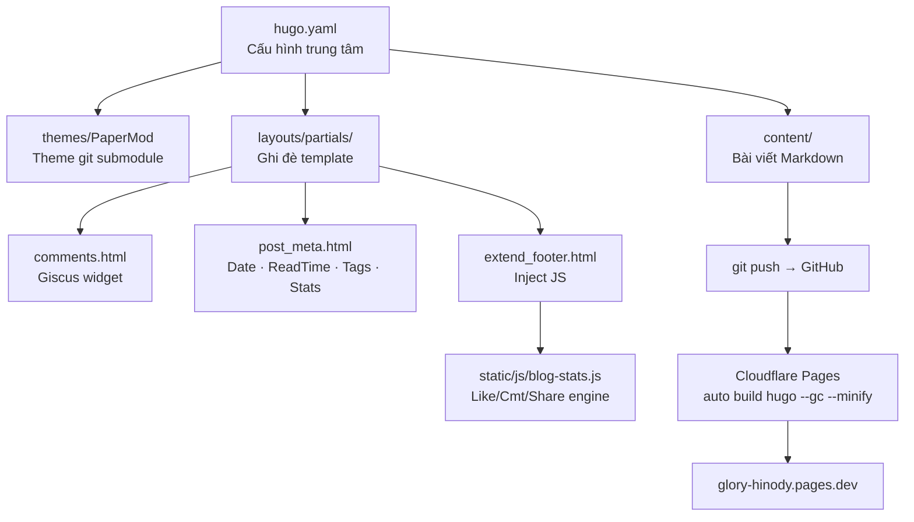

# DEV.GUIDE.md — Glory Hinody Blog

> **Dành cho:** Dev quay lại sau thời gian dài | Dev mới onboard  
> **Cập nhật lần cuối:** 2026-09-29  
> **Tác giả gốc:** Lê Quang Vinh (`vinh-gogo`)

---

## 🗺️ Bản đồ tổng quan



---

## 1. Thông tin dự án

| Mục | Giá trị |
|---|---|
| **URL live** | https://glory-hinody.pages.dev |
| **GitHub repo** | https://github.com/vinh-gogo/glory-hinody |
| **Cloudflare account** | lea26462@gmail.com |
| **Hugo version** | `0.167.0 extended` |
| **Theme** | PaperMod (git submodule) |
| **Comment system** | Giscus → GitHub Discussions |
| **Hosting** | Cloudflare Pages (free tier) |

---

## 2. Cấu trúc thư mục

```
glory-hinody/
│
├── hugo.yaml                     # ← Cấu hình chính (baseURL, menu, params)
├── BUILD-GUIDE.md                # Hướng dẫn xây blog từ đầu
├── DEV.GUIDE.md                  # File này
├── cv.pdf                        # CV gốc — nguồn các bài viết kỹ thuật
│
├── content/
│   ├── about.md                  # Trang Giới thiệu
│   └── posts/
│       ├── bai-viet-dau-tien.md              # Hướng dẫn xây blog (bài đầu)
│       ├── openvideolab-video-diffusion.md   # Generative AI
│       ├── graph-rag-neo4j-qdrant.md         # Agentic RAG
│       ├── multi-agent-workflow-langraph.md  # Agentic RAG
│       ├── on-device-ai-onnx-kotlin.md       # On-Device AI
│       └── quantization-int8-fp4-inference.md # Optimization
│
├── layouts/
│   └── partials/
│       ├── comments.html         # Giscus embed (repo-id + category-id đã điền sẵn)
│       ├── post_meta.html        # Override: Date · ReadTime · Tags · Stats
│       └── extend_footer.html   # Inject blog-stats.js vào mọi trang
│
├── static/
│   └── js/
│       └── blog-stats.js        # Engine đếm like/comment/share (localStorage)
│
├── i18n/
│   └── vi.yaml                  # Override text: "dành X phút để đọc"
│
└── themes/
    └── PaperMod/                # Git submodule — KHÔNG sửa trực tiếp
```

---

## 3. Khởi động local (lần đầu)

```powershell
# 1. Clone về (bắt buộc có --recurse-submodules vì PaperMod là submodule)
git clone --recurse-submodules https://github.com/vinh-gogo/glory-hinody.git
cd glory-hinody

# 2. Nếu clone rồi mà theme bị trống:
git submodule update --init --recursive

# 3. Chạy dev server
hugo server
# → Mở http://localhost:1313
```

> ⚠️ Phải dùng Hugo **Extended** (không phải bản thường).  
> Cài: `winget install Hugo.Hugo.Extended` (Windows) | `brew install hugo` (macOS)

---

## 4. Workflow viết bài hằng ngày

```powershell
# Tạo bài mới
hugo new posts/ten-bai-viet.md

# Mở file vừa tạo, sửa:
#   - title: "Tiêu đề bài"
#   - draft: false          ← QUAN TRỌNG, mặc định là true
#   - tags: ["tag1", "tag2"]
#   - description: "Mô tả ngắn hiện ở list và SEO"

# Xem trước
hugo server

# Đăng bài
git add .
git commit -m "Bài mới: Tiêu đề bài"
git push
# → Cloudflare tự build, ~1-2 phút sau bài lên live
```

### Frontmatter chuẩn cho một bài:

```yaml
---
date: '2026-09-29T18:00:00+07:00'
draft: false
title: 'Tiêu Đề Bài Viết'
description: 'Mô tả ngắn (hiện ở card danh sách và thẻ SEO)'
tags: ["tag-chinh", "tag-phu", "du-an"]
ShowToc: true      # Hiện mục lục (nên bật với bài dài)
TocOpen: false     # true = mở sẵn, false = đóng
---
```

---

## 5. Các customization đã làm (KHÔNG có trong theme gốc)

### 5.1 `layouts/partials/post_meta.html` — Metadata dòng dưới tiêu đề
Ghi đè partial gốc của PaperMod. Hiện:
- **Ngày đăng**
- **"dành X phút để đọc"** (override i18n qua `i18n/vi.yaml`)
- **Tags** dạng pill badge có link
- **Thống kê:** ❤️ like · 💬 comment · 🔗 share (cập nhật qua JS)

Nếu muốn bỏ hoặc thay đổi thứ tự → sửa file này.

### 5.2 `static/js/blog-stats.js` — Engine thống kê
Cơ chế hoạt động:
```
Người đọc mở bài
  → Giscus load → emit postMessage với discussion metadata
  → blog-stats.js nhận: { reactions, totalCommentCount }
  → Lưu vào localStorage key: 'glory_stats_v1'
  → Hiển thị trên post page VÀ list page
```

**Lưu ý quan trọng:**
- Số liệu là **per-browser** (localStorage), không phải global
- `—` = bài chưa được visit trên browser này (chưa có cache)
- Share count = số lần click nút chia sẻ trên browser này
- `data-emit-metadata="1"` trong `comments.html` là bắt buộc để nhận data

localStorage key: `glory_stats_v1`  
Schema: `{ "/posts/slug/": { likes: N, comments: N, shares: N, updated: timestamp } }`

### 5.3 `layouts/partials/comments.html` — Giscus
```
repo:        vinh-gogo/glory-hinody
repo-id:     R_kgDOUydxHQ
category:    Announcements
category-id: DIC_kwDOUydxHc4DGpvq
mapping:     pathname
```
> ⚠️ Giscus **không hiện trên localhost** — chỉ kiểm tra được trên URL thật.  
> Nếu không hiện: kiểm tra Giscus App đã được cài chưa tại https://github.com/apps/giscus

### 5.4 Menu navigation
Menu dùng tag pages thay vì section riêng:

| Menu | URL | Cách hoạt động |
|---|---|---|
| Bài viết | `/posts/` | Section index |
| Generative AI | `/tags/generative-ai/` | Auto từ tags bài viết |
| AI Agentic | `/tags/agentic-rag/` | Auto từ tags bài viết |
| On-Device AI | `/tags/on-device-ai/` | Auto từ tags bài viết |
| Dự án | `/tags/du-an/` | Auto từ tags bài viết |
| Giới thiệu | `/about/` | File `content/about.md` |

→ Muốn thêm bài vào menu "Generative AI": thêm tag `generative-ai` vào frontmatter là đủ.

---

## 6. Cloudflare Pages — Cài đặt build

| Trường | Giá trị |
|---|---|
| Build command | `hugo --gc --minify` |
| Output directory | `public` |
| Env variable | `HUGO_VERSION = 0.167.0` |
| Branch | `main` |

> ⚠️ `HUGO_VERSION` **bắt buộc phải set**. Nếu thiếu, Cloudflare dùng Hugo cũ → build lỗi.  
> Khi nâng cấp Hugo local, nhớ cập nhật biến này trong Cloudflare Dashboard.

---

## 7. Cập nhật theme PaperMod

```powershell
git submodule update --remote --merge
git add themes/PaperMod
git commit -m "Cập nhật PaperMod theme"
git push
```

> ⚠️ Sau khi cập nhật, kiểm tra `hugo server` còn chạy đúng không — theme mới có thể deprecate một số config.

---

## 8. Trạng thái hiện tại & việc còn lại

### ✅ Đã hoàn thành
- [x] Hugo site + PaperMod theme
- [x] Deploy Cloudflare Pages tại `glory-hinody.pages.dev`
- [x] GitHub Discussions bật
- [x] Giscus comments config (repo-id, category-id điền sẵn)
- [x] 6 bài viết kỹ thuật từ CV
- [x] Menu theo chủ đề (Generative AI, AI Agentic, On-Device AI, Dự án)
- [x] Tags badge + thời gian đọc trong danh sách
- [x] Thống kê like/comment/share (localStorage + Giscus metadata)
- [x] i18n tiếng Việt cho reading time

### ⏳ Còn thiếu
- [ ] **Cài Giscus App** → https://github.com/apps/giscus/installations/new (chọn repo `glory-hinody`)
- [ ] **Ảnh bìa** cho từng bài (đặt vào `static/images/` hoặc cạnh bài viết)
- [ ] **Cloudflare Web Analytics** (bật trong Cloudflare dashboard — miễn phí, không cookie)
- [ ] **Favicon** tùy chỉnh (hiện đang dùng default)
- [ ] Bài viết mới định kỳ

---

## 9. Lỗi hay gặp & cách fix

| Triệu chứng | Nguyên nhân | Fix |
|---|---|---|
| Trang trắng sau deploy | Thiếu `HUGO_VERSION` env var | Thêm vào Cloudflare Pages Settings → Env Variables |
| Theme bị mất | Chưa pull submodule | `git submodule update --init --recursive` |
| Giscus không hiện | Chưa cài Giscus App | Vào https://github.com/apps/giscus |
| Stats toàn hiện `—` | Chưa visit bài trên browser đó | Bình thường — mở từng bài, Giscus sẽ emit data |
| Build lỗi `deprecated: languageCode` | Dùng `languageCode` cũ | Đã fix rồi: dùng `locale` trong hugo.yaml |
| Bài không lên sau push | `draft: true` hoặc `date` ở tương lai | Sửa frontmatter |
| Tag page 404 | Chưa có bài nào dùng tag đó | Thêm tag vào ít nhất 1 bài |

---

## 10. Mở rộng trong tương lai

### Thêm chủ đề mới vào menu
1. Quyết định tag slug, ví dụ `computer-vision`
2. Thêm vào `hugo.yaml`:
   ```yaml
   - { name: "Computer Vision", url: "/tags/computer-vision/", weight: 6 }
   ```
3. Thêm tag `computer-vision` vào các bài liên quan

### Thêm ảnh bìa cho bài viết
Đặt ảnh cạnh file bài viết (Page Bundle) hoặc trong `static/`:
```yaml
# Trong frontmatter bài viết:
cover:
  image: "/images/ten-anh.jpg"
  alt: "Mô tả ảnh"
  caption: "Caption hiện dưới ảnh"
```

### Đổi sang tên miền riêng
1. Mua domain
2. Cloudflare Pages → Custom Domains → thêm domain
3. Cập nhật `baseURL` trong `hugo.yaml`
4. Push lại

### Nâng cấp stats lên realtime (tương lai xa)
Hiện tại stats dùng localStorage (per-browser). Để có global realtime counter:
- Thêm Cloudflare Worker làm API endpoint
- Worker lưu vào Cloudflare KV
- `blog-stats.js` fetch từ Worker thay vì localStorage

---

*File này nên được cập nhật mỗi khi có thay đổi kiến trúc lớn.*
