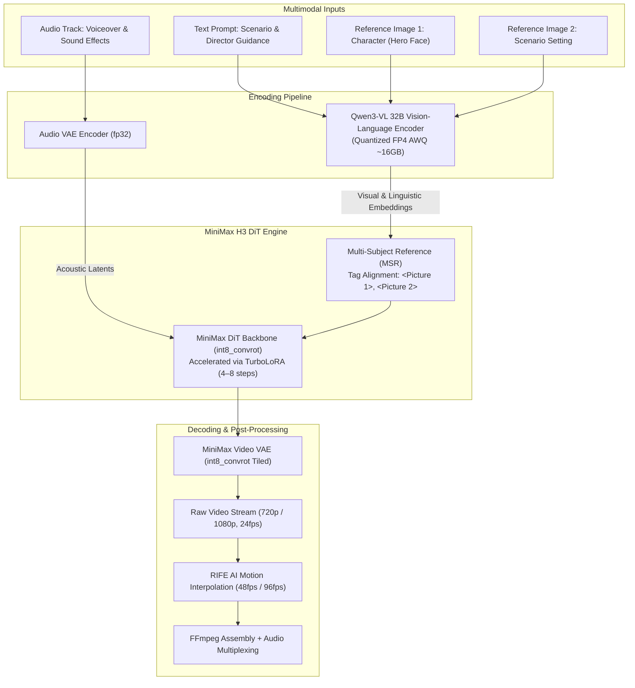
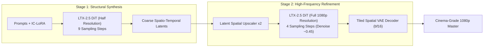

## 1. Context: The Diffusion Transformer (DiT) Paradigm Shift in Video Generation

Between 2025 and 2026, generative AI video underwent a structural transition: **abandoning classical 2D/3D U-Nets in favor of Diffusion Transformers (DiT)**. Mirroring the dominance of Transformers in Large Language Models (LLMs), DiT processes video volumes as sequential spatio-temporal visual tokens, enabling scaling laws up to 20–30 billion parameters without spatial information bottlenecks.

Deploying these massive architectures within resource-constrained production settings (e.g. Google Colab T4/L4/A100 or workstation RTX 3090/4090 GPUs) introduces fundamental challenges:
- **VRAM Saturation:** A 22B–32B parameter model in native FP16 demands 44GB–64GB VRAM solely for weight allocation. Layering activations, KV caching, and temporal VAE decoding easily causes Out-Of-Memory (OOM) failures even on 80GB enterprise GPUs.
- **Multi-Scene Identity Coherence:** Real-world video production requires **multi-scene narrative storyboards (30–60 seconds)** with persistent character identity, coherent background physics, and synchronized lip dynamics across diverse camera angles.

The two prominent open-source paradigms addressing these constraints are **MiniMax H3 (Hailuo)** and **Lightricks LTX-2.5 (22B)**. This article dissects their architectural anatomy, quantization schemes, Multi-Subject Reference (MSR) pipelines, and our end-to-end **Gradio Live Studio** built on a ComfyUI backend.

---

## 2. Comparative Matrix: MiniMax H3 vs. Lightricks LTX-2.5

| Technical Criterion | MiniMax H3 (Hailuo-3) | Lightricks LTX-2.5 (22B) |
| :--- | :--- | :--- |
| **Core DiT Architecture** | Spatio-Temporal DiT Pruned (`int8_convrot`) | 22B Distilled Transformer (`int8_convrot`) |
| **Text Encoder** | **Qwen3-VL 32B** (int8: 27GB or fp4 AWQ: 16GB) | **Gemma4-12B** integrated projection layer (int8) |
| **Video VAE Latent Space** | MiniMax Video VAE (`int8_convrot` ⚡ 1.4–2.7× faster or `fp16`) | LTX-2.5 Video VAE (`bf16`, Tiled Decode) |
| **Audio Synthesis** | Audio VAE `fp32` (rhythm-conditioned) | Audio VAE `bf16` + Voice Lock (`LTXVSetAudioRefTokens`) |
| **Sampling Acceleration** | Turbo LoRA (lightx2v): 4-step / 8-step v1.0 / 4-step v1.2 | Distilled Model + custom Sigmas (9-step Pass 1 + 4-step Pass 2) |
| **Identity Persistence** | Multi-Subject Reference (MSR: `ref2va` + `<Picture N>`) | **IC-LoRA Ingredients** (`LTXAddVideoICLoRAGuide`) |
| **Render Pipeline** | Single-Stage Full/Turbo + Tiled Decode + FFmpeg post-processing | **Dual-Stage:** Stage 1 (half res) $\rightarrow$ Latent Upscaler $\rightarrow$ Stage 2 |
| **Minimum VRAM Floor** | $\ge$ 16GB (FP4 Text Encoder + int8 VAE) | $\ge$ 12GB (Low-VRAM mode + `--cache-none`) |
| **Core Differentiator** | Rapid generation throughput, deep multimodal prompt comprehension | Strict character consistency, photorealistic high-frequency skin textures |

---

## 3. MiniMax H3 Architecture: Multimodal Fusion & Low-Latency Throughput

### 3.1 Tensor Flow Schematics in MiniMax H3

MiniMax H3 integrates the **Qwen3-VL 32B** vision-language encoder as its semantic bridge:



---

## 4. Lightricks LTX-2.5: Cinematic Resolution & Dual-Stage Rendering

To overcome latent degradation during single-pass 1080p synthesis, LTX-2.5 deploys an asymmetric dual-stage scheduler:



---

## 5. Hardware Optimization: Running on 16GB–24GB GPUs

Running these foundational models on accessible hardware requires strict memory budgeting:
- **Int8 Weight-Only Quantization (`int8_convrot`):** Reduces core DiT weights to ~11GB, preventing OOM crashes during temporal self-attention.
- **Sequential Offloading (`--cache-none`):** Text encoders (Qwen3-VL / Gemma4) execute sequentially, offloading from VRAM before the DiT backbone initialises.
- **Tiled Latent Decoding:** Breaks 1080p video latents into overlapping spatio-temporal tiles, bounding decoding memory spikes to <3.5GB.

---

## 6. References

```
[01] Peebles, W., & Xie, S. (2023). Scalable Diffusion Models with Transformers (DiT). ICCV 2023.
[02] Lightricks Research. (2024). LTX-Video: Real-Time High-Resolution Video Generation.
[03] MiniMax Inc. (2025). Hailuo AI Video Architecture & Multimodal Representation.
[04] Dettmers, T., et al. (2023). QLoRA: Efficient Finetuning of Quantized LLMs. NeurIPS 2023.
```

---

## 7. Related Technical Logs

- [OpenVideoLab: Multimodal AI Video Generation on 16GB GPUs](/en/posts/openvideolab-video-diffusion/)
- [Quantization Int8/FP4: Serving Large AI Models on Hardware Constraints](/en/posts/quantization-int8-fp4-inference/)
