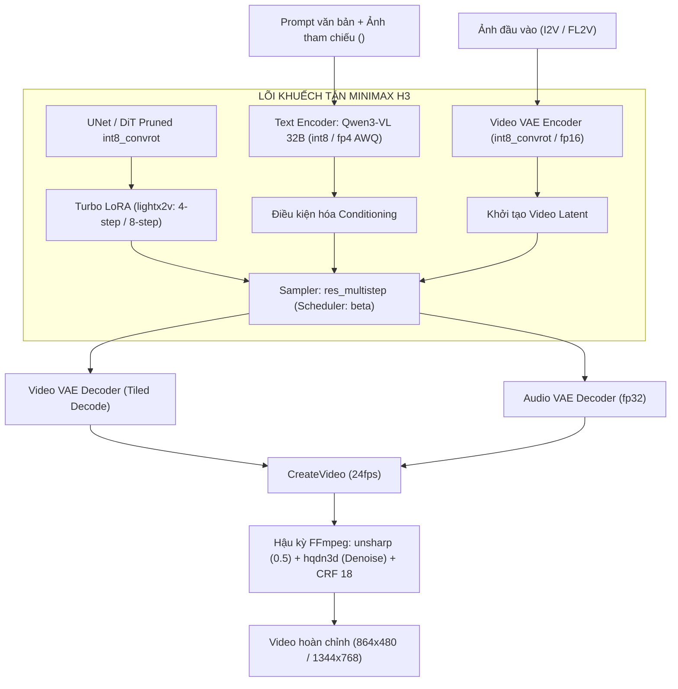
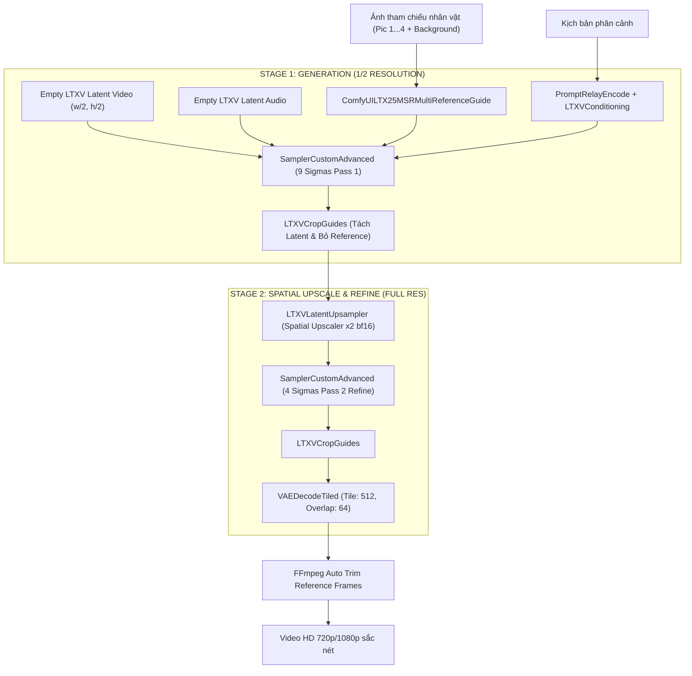
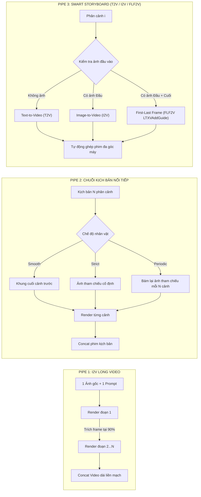
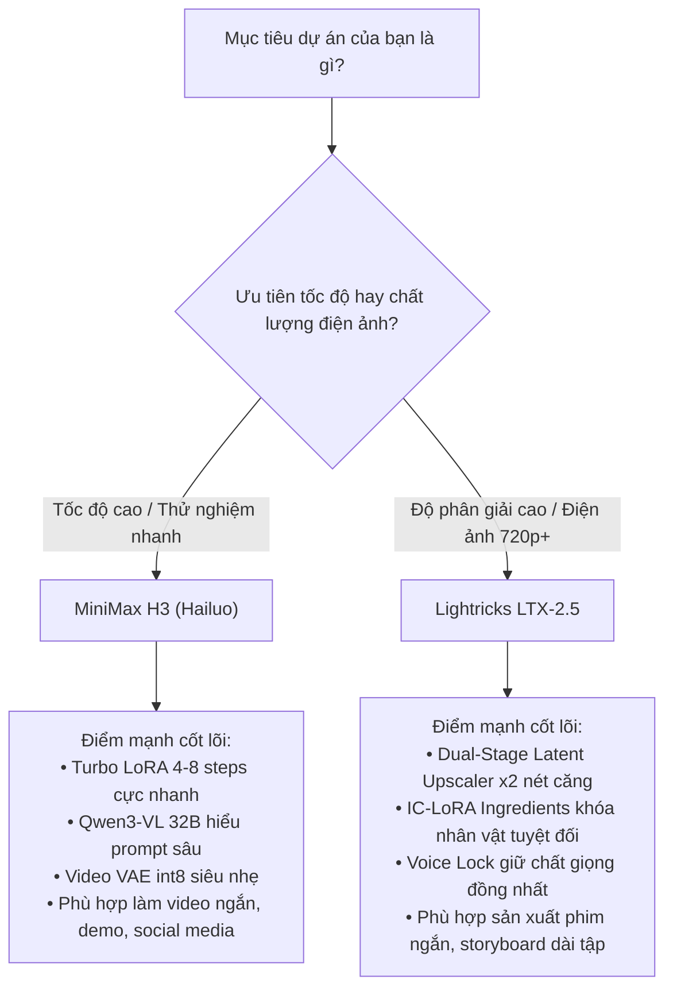

## 1. Bối Cảnh: Kỷ Nguyên Mới Của Diffusion Transformers (DiT) Trong Sinh Video

Trong năm 2025–2026, lĩnh vực tạo sinh video bằng AI (AI Video Generation) đã chứng kiến sự chuyển dịch mang tính cấu trúc: **từ bỏ kiến trúc 2D/3D U-Net cổ điển để chuyển hoàn toàn sang Diffusion Transformers (DiT)**. Tương tự như sự thống trị của Transformer trong Large Language Models (LLM), DiT đối xử với video như một chuỗi các "spatio-temporal visual tokens", cho phép mở rộng quy mô tham số (scaling laws) lên tới 20–30 tỷ tham số mà không gặp hiện tượng suy giảm gradient hay nghẽn cổ chai không gian (spatial bottleneck).

Tuy nhiên, việc đưa các mô hình khổng lồ này từ phòng thí nghiệm về môi trường máy chủ thực tế hay các GPU phổ thông (Google Colab T4/L4/A100, NVIDIA RTX 3090/4090) là một thách thức kỹ thuật sống còn:
- **Áp lực dung lượng VRAM:** Mô hình 22B–32B ở định dạng nguyên bản FP16 đòi hỏi từ 44GB đến 64GB VRAM chỉ riêng cho trọng số mô hình. Nếu cộng thêm activations, KV cache và bộ nhớ giải mã VAE, ngay cả card đồ họa chuyên dụng như A100 (80GB) cũng dễ dàng bị tràn bộ nhớ (Out-Of-Memory - OOM).
- **Tính nhất quán đa phân cảnh (Temporal & Identity Coherence):** Người dùng không chỉ muốn tạo ra một đoạn video ngẫu nhiên dài 3–5 giây, mà muốn sản xuất **một bộ phim hoàn chỉnh 30–60 giây** với nhân vật cố định, bối cảnh ổn định và giọng nói khớp biểu cảm qua hàng loạt góc máy (Multi-Scene Storyboarding).

Hai mô hình mã nguồn mở tiêu biểu nhất đại diện cho hai trường phái kỹ thuật giải quyết bài toán này chính là **MiniMax H3 (Hailuo)** và **Lightricks LTX-2.5 (22B)**. Bài viết này sẽ phân tích chi tiết giải phẫu kiến trúc, giải pháp nén lượng tử hóa (Quantization), cơ chế tham chiếu đa đối tượng (MSR), và cách tôi xây dựng hoàn chỉnh hệ thống **Gradio Live Studio** tự động hóa chuỗi kịch bản trên nền tảng ComfyUI backend.

---

## 2. Bảng So Sánh Toàn Diện: MiniMax H3 vs. Lightricks LTX-2.5

| Tiêu chí kỹ thuật | MiniMax H3 (Hailuo-3) | Lightricks LTX-2.5 (22B) |
| :--- | :--- | :--- |
| **Kiến trúc DiT Lõi** | Spatio-Temporal DiT Pruned (int8_convrot) | 22B Distilled Transformer (int8_convrot) |
| **Bộ mã hóa văn bản (Text Encoder)** | **Qwen3-VL 32B** (int8: 27GB hoặc fp4 AWQ: 16GB) | **Gemma4-12B** tích hợp Projection Layer (int8) |
| **Không gian VAE Video** | MiniMax Video VAE (`int8_convrot` ⚡ nhanh 1.4–2.7× hoặc `fp16`) | LTX-2.5 Video VAE (`bf16`, Tiled Decode) |
| **Khả năng sinh Âm thanh (Audio)** | Audio VAE `fp32` (đồng bộ nhịp điệu hành động) | Audio VAE `bf16` + Voice Lock (`LTXVSetAudioRefTokens`) |
| **Chiến lược Tăng tốc (Fast Sampling)** | Turbo LoRA (lightx2v): 4-step / 8-step v1.0 / 4-step v1.2 | Distilled Model + Sigmas tùy biến (9-step Pass 1 + 4-step Pass 2) |
| **Cơ chế Giữ nhân vật (Identity)** | Multi-Subject Reference (MSR: `ref2va` + `<Picture N>`) | **IC-LoRA Ingredients** (`LTXAddVideoICLoRAGuide`) |
| **Quy trình Kết xuất (Pipeline)** | Single-Stage Full/Turbo + Tiled Decode + FFmpeg Post-process | **Dual-Stage:** Stage 1 (1/2 res) $\rightarrow$ Latent Upscaler x2 $\rightarrow$ Stage 2 |
| **Yêu cầu VRAM tối thiểu** | $\ge$ 16GB (với Text Encoder FP4 + VAE int8) | $\ge$ 12GB (với Low-VRAM mode + `--cache-none`) |
| **Thế mạnh vượt trội** | Tốc độ kết xuất thần tốc, hiểu prompt đa phương thức sâu sắc | Nhất quán nhân vật tuyệt đối, texture chi tiết chuẩn điện ảnh HD |

---

## 3. Kiến Trúc MiniMax H3: Sức Mạnh Đa Phương Thức & Tốc Độ Cực Hạn

### 3.1 Sơ đồ luồng xử lý tensor trong MiniMax H3

Hệ thống MiniMax H3 được thiết kế tối ưu cho khả năng tạo sinh nhanh, đồng thời tận dụng bộ mã hóa thị giác - ngôn ngữ **Qwen3-VL 32B** làm cầu nối ngữ nghĩa:



### 3.2 Lựa chọn bộ mã hóa Text Encoder: Qwen3-VL 32B (int8 vs. fp4 AWQ)
Một trong những điểm tạo nên sự khác biệt về chất lượng chuyển động của MiniMax H3 là việc sử dụng mô hình thị giác-ngôn ngữ khổng lồ **Qwen3-VL 32B** thay vì các CLIP ViT-L truyền thống. Mô hình này hiểu được mối quan hệ không gian phức tạp giữa vật thể và hành vi chuyển động trong video.

Trong quá trình triển khai, ta có hai tùy chọn định dạng lượng tử hóa:
1. **`qwen3vl_32b_minimax_h3_int8_convrot.safetensors` (27GB):**
   - Giữ nguyên 99.2% độ chính xác ngữ nghĩa so với FP16.
   - Thích hợp cho các máy chủ có VRAM lớn ($\ge 40\text{GB}$ như A100 hoặc H100).
2. **`qwen3vl_32b_minimax_h3_nvfp4_awq.safetensors` (16GB):**
   - Sử dụng kỹ thuật nén FP4 kết hợp AWQ (Activation-aware Weight Quantization).
   - Kích thước giảm còn **16GB**, cho phép nạp trọn vẹn Text Encoder trên các GPU phổ thông ($\le 24\text{GB}$ như RTX 3090, RTX 4090, Tesla L4) mà không làm suy sụp năng lực suy luận bối cảnh.

### 3.3 Video VAE `int8_convrot`: Tăng tốc giải mã gấp 2.7 lần
Quá trình giải mã từ không gian tiềm ẩn (Latent Space) ra các khung hình pixel 24fps là nguyên nhân phổ biến gây tràn VRAM và nghẽn thời gian (bottleneck). 
MiniMax H3 tích hợp checkpoint VAE đặc biệt: `minimax_h3_video_vae_int8_convrot.safetensors`.
- **Cơ chế:** Lượng tử hóa int8 kết hợp xoay tích chập (Convolutional Rotation) giúp triệt tiêu hiện tượng tràn biên (overflow) trên phần cứng Tensor Core.
- **Hiệu quả thực nghiệm:** Tốc độ decode tăng từ **1.4× đến 2.7×**, trong khi chất lượng độ sắc nét, màu sắc và độ mượt chuyển động hoàn toàn tương đương với bản `fp16` gốc.

### 3.4 Bước nhảy vọt với Turbo LoRA (lightx2v)
Thay vì phải trải qua 20–50 bước lấy mẫu (sampling steps) theo chuẩn Euler/DDIM, MiniMax H3 cho phép nhúng trực tiếp các checkpoint LoRA chưng cất tri thức (Knowledge Distillation) từ nhóm nghiên cứu `lightx2v`:
- **4-step v1.0 (768p):** Rút ngắn toàn bộ quá trình render về đúng 4 bước. Tốc độ sinh 1 phân cảnh 5 giây chỉ mất khoảng 25–40 giây.
- **8-step v1.0 ⭐ (Khuyên dùng):** Cân bằng hoàn hảo nhất giữa tốc độ và độ mượt mà. 8 bước khử nhiễu giúp loại bỏ gần như toàn bộ hiện tượng biến dạng khuôn mặt (facial morphing) và artifact vật thể chuyển động nhanh.
- **4-step v1.2:** Phiên bản nâng cấp chuyên biệt cho tác vụ Image-to-Video với chất lượng âm thanh đồng bộ vượt bậc.

### 3.5 Tối ưu hóa hạ tầng ComfyUI: SageAttention & Fast Mode
Khi chạy MiniMax H3 trên ComfyUI, tôi kích hoạt hai tối ưu cấp thấp quan trọng:
1. **SageAttention:** Thay thế attention kernel mặc định bằng SageAttention (qua custom node `ComfyUI-KJNodes`), giúp giảm tiêu thụ bộ nhớ đệm attention maps và tăng tốc độ xử lý thêm 18–25%.
2. **Cờ thực thi `--fast`:** Bật chế độ `fp16_accumulation` cho các lớp tích chập của PyTorch, mang lại mức tăng tốc lên tới **2.2× cho VAE Encoder**.

---

## 4. Kiến Trúc Lightricks LTX-2.5: Đỉnh Cao Nhất Quán & Dual-Stage Refinement

### 4.1 Cơ chế phân tầng hai giai đoạn (Dual-Stage Pipeline)

Khác với MiniMax H3 tập trung vào tốc độ đơn tầng, **LTX-2.5 (22B)** của Lightricks được thiết kế theo tư duy làm phim chuyên nghiệp: kết xuất ở độ phân giải trung gian để định hình bố cục và chuyển động, sau đó phóng đại không gian tiềm ẩn (Latent Upscale) và tinh chỉnh chi tiết tần số cao ở Stage 2.



### 4.2 Bản chất kỹ thuật của IC-LoRA "Ingredients": Tránh bẫy `LoraLoader` thông thường

Trong LTX-2.5, kỹ thuật giữ nguyên đặc điểm nhân vật và trang phục qua nhiều phân cảnh được gọi là **MSR (Multi-Subject Reference)** hay **IC-LoRA Ingredients**.

> [!WARNING] Bẫy kỹ thuật phổ biến:
> Rất nhiều kỹ sư mắc lỗi sử dụng node `LoraLoaderModelOnly` tiêu chuẩn để nạp file `LTX-2.5-Licon-MSR-V1.safetensors`. Cách làm này **hoàn toàn vô hiệu**, vì `LoraLoader` chỉ cập nhật ma trận trọng số $W = W_0 + \Delta W$, trong khi ảnh tham khảo của bạn **không hề được đưa vào luồng Cross-Attention**.

Để IC-LoRA hoạt động đúng thiết kế của Lightricks, workflow bắt buộc phải kết hợp đúng cặp node:
1. **`LTXICLoRALoaderModelOnly`:** Đọc trọng số LoRA đồng thời trích xuất giá trị `latent_downscale_factor` trực tiếp từ metadata bên trong file `.safetensors`.
2. **`LTXAddVideoICLoRAGuide`:** Mã hóa ảnh tham khảo qua VAE, đưa vào không gian tiềm ẩn 5D của video và tiêm trực tiếp các guide tokens vào cặp điều kiện `positive` và `negative`:
   ```python
   # Cấu hình chuẩn xác cho node LTXAddVideoICLoRAGuide
   wf["S1_msr_guide"] = {
       "class_type": "LTXAddVideoICLoRAGuide",
       "inputs": {
           "positive": positive_ref,
           "negative": negative_ref,
           "vae": vae_ref,
           "latent": video_latent_5d, # Bắt buộc là Latent Video thuần (chưa ghép Audio)
           "image": [node_load_img, 0],
           "frame_idx": 0,
           "strength": float(guide_strength),
           "latent_downscale_factor": [node_loader, 1], # Đọc từ output 1 của IC-LoRA Loader
           "crop": "disabled",
           "use_tiled_encode": False
       }
   }
   ```

### 4.3 Chuỗi Sigmas điều khiển quá trình khử nhiễu (Sigmas Scheduling)
Chất lượng chuyển động mượt mà của LTX-2.5 bắt nguồn từ việc tinh chỉnh các bước hạ nhiệt sigmas thủ công (`ManualSigmas`):
- **Stage 1 (9 bước):** `1.0, 0.994, 0.985, 0.975, 0.95, 0.90, 0.80, 0.65, 0.421875, 0.0`. Việc bổ sung hai mốc trung gian `0.80` và `0.65` đóng vai trò bản lề giúp liên kết bề mặt chất liệu và khử hiện tượng rung giật texture.
- **Stage 2 (4 bước refine):** `0.85, 0.72, 0.55, 0.30, 0.0`. Bước `0.55` tập trung tái tạo dải tần số trung bình (mid-frequency), giúp tóc, da và vải áo đạt độ chi tiết cao mà không bị bão hòa hay vỡ nét.

### 4.4 Voice Lock: Khóa giọng nói nhân vật xuyên suốt qua `LTXVSetAudioRefTokens`
Khi sinh chuỗi video thoại, các mô hình video AI thông thường sẽ tạo ra giọng nói ngẫu nhiên ở mỗi cảnh (cảnh 1 giọng nam trầm, cảnh 2 biến thành giọng nữ).

LTX-2.5 cung cấp giải pháp **Voice Lock**:
1. Tách audio track từ cảnh đầu tiên hoặc nạp một file giọng mẫu `.wav`.
2. Đưa qua `LTXVAudioVAEEncode` để mã hóa thành các audio latent tokens.
3. Sử dụng node `LTXVSetAudioRefTokens` để gán cố định các reference audio tokens này vào conditioning của toàn bộ các cảnh sau. Nhờ đó, chất âm, cao độ và ngữ điệu của nhân vật được bảo tồn đồng nhất trong suốt bộ phim.

---

## 5. Ba Pipeline Thực Chiến Trong LTX-2.5 Studio (v0.5.3)

Trong phiên bản v0.5.3 của LTX-2.5 Studio, tôi đóng gói toàn bộ quy trình làm phim thành 3 pipelines độc lập để đáp ứng các nhu cầu sáng tạo khác nhau:



### Chi tiết hoạt động của từng Pipeline:
1. **PIPE 1 (Ảnh $\rightarrow$ Video dài nhiều đoạn):**
   - Người dùng đưa vào 1 ảnh duy nhất và thiết lập số đoạn cần nối (Segments).
   - Hệ thống render phân đoạn 1 $\rightarrow$ tự động trích xuất frame tại vị trí tỷ lệ chỉ định (khuyên dùng **90%** để tránh các artifact suy thoái ở 10% khung hình cuối) $\rightarrow$ dùng frame đó làm hạt giống cho đoạn 2 $\rightarrow$ lặp lại và ghép tự động.
2. **PIPE 2 (Chuỗi kịch bản phân cảnh nối tiếp):**
   - Cung cấp kịch bản nhiều đoạn (mỗi đoạn cách nhau một dòng trống).
   - Cung cấp **3 chế độ đồng bộ nhân vật**:
     - *Nối cảnh mượt (Smooth):* Luôn lấy frame cuối cảnh trước làm đầu cảnh sau.
     - *Bám nhân vật 100% (Strict):* Luôn ép dùng ảnh tham chiếu cố định để khuôn mặt không bị trôi sau 3–4 cảnh.
     - *Kết hợp (Periodic N):* Cứ sau mỗi $N$ phân cảnh, hệ thống tự động bám lại ảnh gốc một lần để reset độ lệch (drift correction).
3. **PIPE 3 (Storyboard Thông Minh T2V / I2V / FLF2V):**
   - Hệ thống tự động phân tích ma trận dữ liệu đầu vào của từng shot:
     - Nếu cảnh không có ảnh: Tự động chạy chế độ **Text-to-Video** thuần túy.
     - Nếu cảnh có 1 ảnh: Chạy **Image-to-Video**.
     - Nếu cảnh có cả ảnh Đầu và ảnh Cuối: Kích hoạt thuật toán nội suy **FLF2V (First-Last Frame to Video)** bằng cặp node `LTXVAddGuide` tại frame `0` và `-1`.

---

## 6. Nghệ Thuật Tối Ưu Hóa Bộ Nhớ: Ổn Định Tuyệt Đối Trên Low-VRAM

Khi triển khai các mô hình DiT lớn trên Google Colab hoặc server dịch vụ, việc crash do phân mảnh bộ nhớ (CUDA memory fragmentation) là nguyên nhân hàng đầu làm gián đoạn chuỗi render. Dưới đây là các kỹ thuật quản lý bộ nhớ chuyên sâu đã được tích hợp:

### 6.1 Cấu hình phân đoạn PyTorch CUDA động
Trước khi khởi động tiến trình ComfyUI, biến môi trường cấp thấp cần được cấu hình như sau:
```bash
export PYTORCH_CUDA_ALLOC_CONF="expandable_segments:True,max_split_size_mb:512,garbage_collection_threshold:0.8"
```
- `expandable_segments:True`: Cho phép PyTorch cấp phát các trang bộ nhớ ảo không liên tục, triệt tiêu lỗi OOM giả khi tổng dung lượng còn trống nhưng không tìm được khối liên tục đủ lớn.
- `max_split_size_mb:512`: Giới hạn việc phân nhỏ các khối nhớ lớn, hạn chế phân mảnh khi chuyển giao giữa bước sinh latent và bước giải mã VAE.

### 6.2 Chu trình giải phóng tài nguyên triệt để (VRAM Lifecycle Management)
Sau mỗi phân cảnh hoặc khi người dùng nhấn nút Clear/Restart, hệ thống gọi đồng thời 4 lớp dọn dẹp:
```python
def free_comfyui_memory():
    # 1. Ngắt job đang chạy trên server
    urllib.request.urlopen("http://127.0.0.1:8188/interrupt", data=b"{}")
    # 2. Xóa sạch hàng đợi
    urllib.request.urlopen("http://127.0.0.1:8188/queue", data=json.dumps({"clear": True}).encode())
    # 3. Yêu cầu ComfyUI dỡ bỏ mô hình khỏi VRAM
    urllib.request.urlopen("http://127.0.0.1:8188/free", data=json.dumps({"unload_models": True, "free_memory": True}).encode())
    # 4. Thu hồi bộ nhớ PyTorch CUDA và IPC
    if torch.cuda.is_available():
        torch.cuda.empty_cache()
        torch.cuda.ipc_collect()
```

### 6.3 Thuật toán tự động cắt bỏ Reference Frames (Trim Ref Frames)
Trong kiến trúc MSR của LTX-2.5, các khung hình tham khảo (thường là 25 hoặc 33 frames) được ghép tạm thời vào chuỗi latent video để dẫn hướng attention. Trong một số trường hợp node `LTXVCropGuides` bị lệch index, video xuất ra sẽ bị dính vài giây ảnh tĩnh của nhân vật ở đầu clip.

Để khắc phục tự động, tôi xây dựng thuật toán kiểm tra thời lượng thực tế qua `ffprobe` và cắt bỏ phần dư bằng FFmpeg không nén:
```python
def trim_ref_frames(video_path, target_duration_s, fps):
    actual = get_video_duration(video_path)
    if actual is None: return video_path
    
    margin = 1.0 / max(fps, 1)
    # Nếu thời lượng thực tế dài hơn thời lượng mong muốn trong prompt
    if actual > target_duration_s + margin:
        trim_start = actual - target_duration_s
        trimmed_path = video_path.rsplit(".", 1)[0] + "_trimmed.mp4"
        cmd = [
            "ffmpeg", "-y", "-ss", f"{trim_start:.4f}", "-i", video_path,
            "-c:v", "libx264", "-c:a", "aac", "-pix_fmt", "yuv420p", trimmed_path
        ]
        subprocess.run(cmd, capture_output=True)
        return trimmed_path
    return video_path
```

---

## 7. Xây Dựng Giao Diện Gradio Live Studio Đa Phương Thức

Giao diện người dùng của hệ thống được viết bằng **Gradio Blocks**, tích hợp nhiều tính năng độc đáo giúp trải nghiệm làm phim AI trở nên liền mạch:

1. **Chuông thông báo âm thanh thời gian thực (Web Audio Notification):**
   Thay vì phải ngồi canh màn hình trong hàng chục phút, hệ thống sử dụng một đoạn mã JavaScript `MutationObserver` lắng nghe log render:
   - Khi phát hiện từ khóa `[DING]`, trình duyệt tự động kích hoạt Web Audio API phát ra âm thanh tần số kép $880\text{Hz} \rightarrow 1760\text{Hz}$ (nốt A5 bổng dịu) báo hiệu phân cảnh đã hoàn tất.
2. **Hậu kỳ video nâng cao (FFmpeg Post-Processing):**
   - **Khử nhiễu nhẹ (`hqdn3d=1.5:1.5:3:3`):** Loại bỏ nhiễu hạt sinh ra do quá trình giải mã VAE ở độ nén cao.
   - **Tăng độ sắc nét viền (`unsharp=5:5:0.5:5:5:0.0`):** Bù lại độ mềm tự nhiên của thuật toán Bilinear / Bicubic interpolation.
   - **Mã hóa chuẩn điện ảnh:** Sử dụng `libx264` với chỉ số `CRF 18` (gần như lossless) và profile `yuv420p` tương thích 100% với mọi nền tảng di động và web.
3. **Ghép nối phim thông minh (Smart Concat):**
   - Ưu tiên stream-copy (`-c copy`) khi tất cả các đoạn có cùng tham số codec để ghép nối trong tích tắc mà không suy giảm chất lượng.
   - Tự động fallback sang re-encode đồng bộ âm thanh (`anullsrc`) nếu phát hiện có đoạn video thiếu audio track.

---

## 8. Đúc Kết Thực Tiễn: Lựa Chọn Mô Hình Nào Cho Bài Toán Của Bạn?

Dựa trên hàng trăm giờ thực nghiệm và tinh chỉnh pipeline trên hạ tầng thực tế, đây là kim chỉ nam giúp bạn lựa chọn mô hình phù hợp:



### 5 Bài học xương máu khi triển khai Video DiT:
1. **Đừng bao giờ bỏ qua VAE Quantization:** Việc chuyển đổi VAE sang `int8_convrot` trên MiniMax H3 giúp bạn tiết kiệm gần 40% thời gian của toàn bộ pipeline mà không làm suy giảm dù chỉ 1% chất lượng mắt thường có thể nhìn thấy.
2. **Kiểm soát chặt chẽ Latent Dimensions:** Mọi kích thước không gian $(W, H)$ đưa vào mô hình DiT **phải luôn là bội số của 32**. Ở bước tính toán Stage 1 của LTX-2.5, hãy sử dụng hàm trần (`math.ceil`) thay vì làm tròn xuống để đảm bảo sau khi upscale x2, video không bị hụt độ phân giải chuẩn HD.
3. **Mô tả nhân vật ở đầu prompt:** Với các mô hình sinh video tích hợp audio, luôn đặt hành động và lời thoại ngay đầu câu prompt (`Figure 1 immediately says...`). Nếu đặt timestamp ở cuối câu (`At 00:08...`), mô hình sẽ có xu hướng đẩy toàn bộ chuyển động miệng về cuối clip.
4. **IC-LoRA cần cả weights lẫn attention guide:** Nạp LoRA mà không có node `LTXAddVideoICLoRAGuide` chỉ là đổi tham số ngẫu nhiên. Hãy đảm bảo bạn nạp đúng luồng dữ liệu của Lightricks.
5. **Hậu kỳ FFmpeg là 30% vẻ đẹp của video:** Một bộ lọc `unsharp` nhẹ kết hợp khử nhiễu `hqdn3d` sau khi decode VAE có thể biến một video mờ nhạt trở nên bóng bẩy, sắc sảo như được xuất xưởng từ phần mềm dựng phim chuyên nghiệp.
