---
date: '2026-09-29T18:39:42+07:00'
draft: false
title: 'Hướng Dẫn Xây Dựng Blog Với Hugo + PaperMod + Cloudflare Pages'
description: 'Hướng dẫn chi tiết từng bước xây dựng blog cá nhân miễn phí với Hugo, theme PaperMod, Cloudflare Pages và bình luận Giscus. Thời gian ước tính 2–3 giờ.'
summary: 'Hướng dẫn chi tiết từng bước xây dựng blog cá nhân miễn phí với Hugo, theme PaperMod, Cloudflare Pages và bình luận Giscus. Thời gian ước tính 2–3 giờ.'
tags: ["hugo", "blog", "cloudflare", "giscus", "hướng-dẫn"]
ShowToc: true
TocOpen: true
---

> Thời gian ước tính lần đầu: **2–3 giờ** | Cập nhật: 2026-09

Bài viết này đúc kết toàn bộ quy trình thiết lập blog tĩnh với chi phí $0, tự động hóa build qua Cloudflare Pages và nhúng bình luận bảo mật qua GitHub Discussions.

## 1. Minh Chứng & Trang Thử Nghiệm Sống (Evidence & Live Demo)

| Hạng mục | Minh chứng thực tế | Chi tiết kỹ thuật |
|---|---|---|
| **Website thực tế (Live Demo)** | [`glory-hinody.pages.dev`](https://glory-hinody.pages.dev/) | Trang web bạn đang truy cập, thời gian tải trang < 500ms |
| **Mã nguồn (GitHub)** | [`github.com/vinh-gogo/glory-hinody`](https://github.com/vinh-gogo/glory-hinody) | Mã nguồn mở hoàn toàn, quản lý qua Git submodule (PaperMod) |
| **Hệ thống bình luận (Discussions)** | [`github.com/vinh-gogo/glory-hinody/discussions`](https://github.com/vinh-gogo/glory-hinody/discussions) | Đồng bộ 2 chiều qua Giscus API, chống spam tự động |
| **Tự động hóa CI/CD** | Cloudflare Pages Git Integration | Tự động kích hoạt build `hugo --gc --minify` khi có `git push` |

---

## 2. Tổng quan quy trình

Anh viết bài Markdown trên máy, `git push` lên GitHub, Cloudflare tự build và đăng lên web. Bình luận và like nằm trong GitHub Discussions của chính repo đó.

```mermaid
flowchart LR
    A["Viết bài (.md)"] --> B["git push"]
    B --> C["GitHub"]
    C --> D["Cloudflare Pages (auto build)"]
    D --> E["Blog Online"]
    E --> F["Bình luận / Like (Giscus)"]
```



## Giai đoạn 0: Chuẩn bị (15 phút)

1. Tạo tài khoản **GitHub** và **Cloudflare** (đều miễn phí).
2. Cài **Git**, và cài **Hugo bản "extended"** (Windows: `winget install Hugo.Hugo.Extended`; macOS: `brew install hugo`).
3. Cài một trình soạn thảo, ví dụ VS Code.
4. Kiểm tra: gõ `hugo version` và `git --version` trong terminal phải ra số phiên bản. Anh nhớ số phiên bản Hugo này, lát nữa cần dùng.

## Giai đoạn 1: Dựng blog trên máy (30 phút)

```bash
hugo new site myblog
cd myblog
git init
git submodule add --depth=1 https://github.com/adityatelange/hugo-PaperMod.git themes/PaperMod
```

Tạo file `hugo.yaml` ở thư mục gốc (xóa file `hugo.toml` mặc định nếu có):

```yaml
baseURL: "https://myblog.pages.dev/"   # sẽ đổi khi có tên miền riêng
locale: vi
defaultContentLanguage: vi
title: "Tên blog của anh"
theme: PaperMod

params:
  description: "Mô tả ngắn về blog"
  defaultTheme: auto        # tự theo sáng/tối của thiết bị
  ShowReadingTime: true
  ShowShareButtons: true    # nút chia sẻ
  comments: true            # bật khung bình luận
  ShareButtons: ["facebook", "twitter", "telegram", "whatsapp", "linkedin"]

menu:
  main:
    - { name: "Bài viết", url: "/posts/", weight: 1 }
    - { name: "Giới thiệu", url: "/about/", weight: 2 }
```

Viết bài đầu tiên và chạy thử:

```bash
hugo new posts/bai-viet-dau-tien.md
# mở file, sửa nội dung, đổi draft: true thành draft: false
hugo server
```

Mở `http://localhost:1313` để xem.

## Giai đoạn 2: Đưa code lên GitHub (10 phút)

1. Trên GitHub, tạo repo **public** (bắt buộc để Giscus hoạt động), ví dụ `myblog`.
2. Tạo file `.gitignore` ở thư mục gốc với nội dung:

```gitignore
public/
resources/_gen/
.hugo_build.lock
```

3. Đẩy code:

```bash
git add .
git commit -m "Khởi tạo blog"
git branch -M main
git remote add origin https://github.com/TENCUAANH/myblog.git
git push -u origin main
```

> **Lưu ý khi clone lại repo trên máy khác:** Theme PaperMod là submodule, cần thêm flag `--recurse-submodules`:
>
> ```bash
> # Khi clone repo về máy khác:
> git clone --recurse-submodules https://github.com/TENCUAANH/myblog.git
> # Hoặc nếu đã clone rồi mà chưa có theme:
> git submodule update --init --recursive
> ```

## Giai đoạn 3: Cài Giscus (20 phút)

1. Vào repo → **Settings → General → Features** → tích **Discussions**.
2. Cài app Giscus tại `github.com/apps/giscus`, chọn cho đúng repo `myblog`.
3. Trong tab **Discussions** của repo, vào phần quản lý category, tạo (hoặc dùng) một category loại **Announcements**. Loại này chỉ cho phép Giscus và người quản trị tạo chủ đề mới, giúp tránh rác.
4. Vào `giscus.app`, điền tên repo, chọn:
   - Mapping: **pathname** (mỗi bài một chủ đề riêng)
   - Category: Announcements
   - Tích **Enable reactions** (đây chính là chức năng like)
   - Language: Tiếng Việt
5. Trang sẽ sinh ra một đoạn `<script>`. Chép lại hai giá trị `data-repo-id` và `data-category-id`.
6. Tạo file `layouts/partials/comments.html`:

```html
<script src="https://giscus.app/client.js"
  data-repo="TENCUAANH/myblog"
  data-repo-id="DAN_GIA_TRI_VAO_DAY"
  data-category="Announcements"
  data-category-id="DAN_GIA_TRI_VAO_DAY"
  data-mapping="pathname"
  data-strict="0"
  data-reactions-enabled="1"
  data-emit-metadata="0"
  data-input-position="top"
  data-theme="preferred_color_scheme"
  data-lang="vi"
  crossorigin="anonymous"
  async>
</script>
```

> **Lưu ý:** Khung bình luận Giscus sẽ **không hiện trên localhost**. Anh cần push lên Cloudflare Pages và mở trang thật để kiểm tra. Sau khi deploy xong, mở một bài viết, cuối bài sẽ thấy khung bình luận — đăng thử một bình luận bằng tài khoản GitHub để kiểm tra.

## Giai đoạn 4: Đăng lên Cloudflare Pages (20 phút)

1. Trong Cloudflare: **Workers & Pages → Create → Pages → Connect to Git**, chọn repo `myblog`. Giao diện Cloudflare hay thay đổi, nếu không thấy đúng tên nút thì tìm mục kết nối Git để deploy site tĩnh.
2. Cấu hình build:
   - Build command: `hugo --gc --minify`
   - Output directory: `public`
3. Thêm biến môi trường `HUGO_VERSION` với giá trị đúng số phiên bản anh đã ghi ở Giai đoạn 0 (ví dụ `0.167.0`). Bước này quan trọng, vì nếu không Cloudflare có thể dùng bản Hugo cũ và build lỗi với theme.

   > **Cảnh báo:** Đảm bảo file `.gitmodules` đã được commit vào repo. Nếu thiếu, Cloudflare sẽ không pull được theme PaperMod và trang bị trắng hoàn toàn sau khi deploy.

4. Nhấn deploy. Vài phút sau anh có địa chỉ dạng `myblog.pages.dev`.
5. Quay lại `hugo.yaml`, sửa `baseURL` thành địa chỉ thật, rồi push lại.

## Giai đoạn 5: Tên miền riêng (tùy chọn, 15 phút)

1. Mua tên miền ở nhà đăng ký bất kỳ (khoảng vài trăm nghìn đồng mỗi năm với `.com`). Nếu chưa muốn tốn tiền, cứ dùng `.pages.dev`, hoàn toàn dùng được.
2. Trong dự án Pages chọn **Custom domains** → thêm tên miền → làm theo hướng dẫn trỏ DNS. Chứng chỉ HTTPS được cấp tự động.
3. Cập nhật `baseURL` trong `hugo.yaml`.
4. Nếu muốn giới hạn chỉ tên miền của anh được nhúng Giscus, tạo file `giscus.json` ở gốc repo với trường `origins`, xem hướng dẫn "advanced usage" của Giscus.

## Giai đoạn 6: Hoàn thiện (30 phút)

- **Trang Giới thiệu:** `hugo new about.md`.
- **RSS và sitemap:** Hugo tạo sẵn, không cần làm gì.
- **Ảnh bìa và ảnh bài viết:** đặt trong thư mục `static/` hoặc cạnh bài viết. Nên nén ảnh dưới khoảng 200 KB.
- **Thống kê truy cập:** bật **Cloudflare Web Analytics** trong dashboard, miễn phí và không dùng cookie.
- **Nút share cho điện thoại:** PaperMod đã có Facebook, Telegram, WhatsApp... Nếu muốn thêm Zalo và các app khác, có thể bổ sung nút dùng Web Share API của trình duyệt (trên điện thoại sẽ hiện danh sách app đã cài).

## Quy trình viết bài hằng ngày

```bash
hugo new posts/ten-bai.md    # viết nội dung, draft: false
git add . && git commit -m "Bài mới: ..." && git push
```

Khoảng 1 đến 2 phút sau bài đã lên web.

## Vận hành và kiểm duyệt

- Bình luận nằm trong tab **Discussions** của repo. Anh có thể xóa, ẩn, khóa chủ đề ở đó, và bật thông báo email của GitHub để biết khi có bình luận mới.
- Sao lưu: toàn bộ nội dung đã nằm trong Git. Nên clone thêm một bản về máy hoặc đẩy sang một nơi thứ hai.
- Cập nhật theme định kỳ: `git submodule update --remote --merge`.

## Lỗi hay gặp

| Triệu chứng | Nguyên nhân thường gặp |
|---|---|
| Trang trắng hoặc mất giao diện sau deploy | Thiếu `HUGO_VERSION`, hoặc quên kéo submodule của theme |
| Không hiện khung bình luận | Repo chưa public, chưa cài app Giscus, hoặc dán sai `repo-id` / `category-id` |
| Bình luận sai bài | `data-mapping` không phải `pathname`, hoặc đổi đường dẫn bài (đổi URL sẽ mất liên kết với chủ đề cũ) |
| Bài mới không lên | Còn `draft: true`, hoặc ngày đăng (`date`) ở tương lai |

Anh cần nhớ một hạn chế: người bình luận phải có tài khoản GitHub. Nếu sau này thấy đây là rào cản, anh có thể chuyển sang Waline mà không phải làm lại blog, vì chỉ cần thay file `comments.html`.

---

## Tài Liệu Tham Khảo (References)

```
[01] Hugo Team. (2024). The World's Fastest Framework for Building Websites. 
     Hugo Official Documentation (gohugo.io).
[02] Aditya Telange. (2024). PaperMod Theme Documentation and Feature Specifications. 
     GitHub Wiki (github.com/adityatelange/hugo-PaperMod).
[03] Cloudflare. (2024). Cloudflare Pages: Fast, Secure and Free JAMstack Hosting. 
     Cloudflare Developer Docs (developers.cloudflare.com/pages).
[04] Giscus Project. (2024). A Comment System Powered by GitHub Discussions. 
     Official Documentation (giscus.app).
```

---

## Bài Viết Liên Quan (Related Logs)

- [OpenVideoLab: Tạo Sinh Video AI Đa Phương Thức Trên GPU 16GB](/posts/openvideolab-video-diffusion/)  
  *Khám phá cách tối ưu hóa pipeline tạo sinh video AI chạy trên máy trạm cá nhân.*
- [GraphRAG: Kết Hợp Neo4j và Qdrant Để Giảm Hallucination](/posts/graph-rag-neo4j-qdrant/)  
  *Kiến trúc RAG nâng cao kết hợp đồ thị tri thức và vector search trên tài liệu kỹ thuật phức tạp.*
