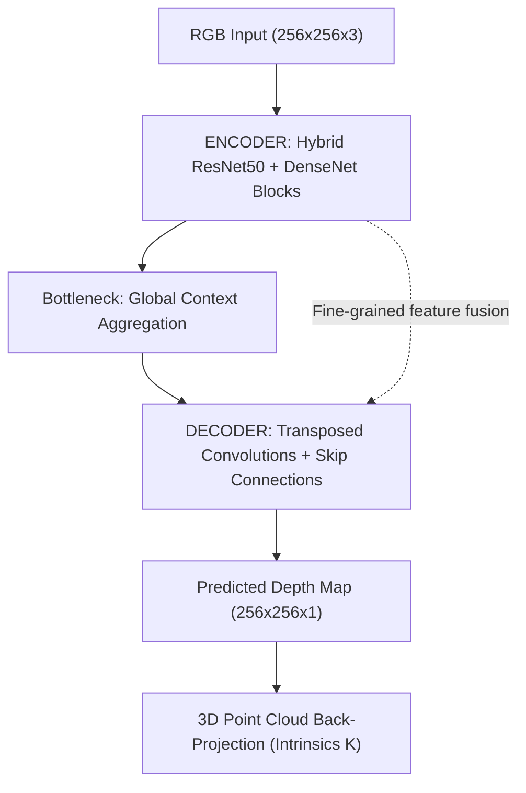

> **Academic Milestone:** B.S. in Computer Science Graduation Thesis — Industrial University of Ho Chi Minh City (IUH), awarded a perfect **4.0 / 4.0** score and selected for official presentation at the **Student Scientific Research Conference (SSRC)**.


*Figure 0: Core vision: Utilizing deep Convolutional Neural Networks (Depth CNNs) to decode dense metric depth fields from single 2D RGB frames, laying the foundation for full 3D spatial reconstruction without active hardware sensors.*

---

## 1. Scientific Record & Artifacts

All research milestones, mathematical formulations, source code, and validation data are openly available for reproducibility:

| Record / Metric | Specification | Details |
|---|---|---|
| **Thesis Title** | *CNN-Based Image Depth Estimation Methods* | Full scientific monograph (*Monocular Depth Estimation*) |
| **Institution** | Industrial University of Ho Chi Minh City (IUH) | Department of Computer Science (2021–2025) |
| **Advisor** | M.Sc. Nguyen Ngoc Le | Department of Information Technology Review Board |
| **Thesis Evaluation** | **4.0 / 4.0 (Perfect Grade)** | Highest honors, presented at SSRC Conference |
| **GitHub Repository** | [`github.com/vinh-gogo/depth-estimation`](https://github.com/vinh-gogo/depth-estimation) | Complete pipeline: Data Prep, 3 Architectures, Multi-loss, 3D Point Cloud |
| **Monograph (73 pages)** | [`Report_GRADUATION_THESIS.txt`](/posts/depth-estimation-cnn-ssrc/Report_GRADUATION_THESIS.txt) | Complete 5-chapter thesis, mathematical proofs, ablation studies |
| **Model Code** | [`paper4_dense_unet.py`](/posts/depth-estimation-cnn-ssrc/paper4_dense_unet.py) | TensorFlow/Keras implementation of hybrid ResNet–DenseNet U-Net |
| **Benchmark Dataset** | **LineMOD Dataset (RGB-D)** | PrimeSense Carmine sensor, 13 object categories in cluttered scenes |
| **Hardware** | Linux Workstation · NVIDIA RTX A4000 (16GB VRAM) | TensorFlow / Keras with real-time memory monitoring |

---

## 2. Theoretical Motivation: The Inverse 3D Problem

In industrial robotics and autonomous navigation, acquiring 3D spatial perception traditionally requires specialized hardware:
- **LiDAR Units:** Cost thousands of dollars, consume substantial power, and are physically bulky.
- **RGB-D Sensors (e.g. PrimeSense Carmine, Microsoft Kinect):** Emit structured infrared patterns. They fail catastrophically on specular reflections, infrared-absorbent black surfaces, or under direct outdoor sunlight.

Mathematically, **Monocular Depth Estimation (MDE)** is an **ill-posed inverse problem**. Projecting a 3D Euclidean space through camera optics onto a 2D sensor plane annihilates the depth dimension $Z$. A single pixel coordinate $(u, v)$ can correspond to infinite potential 3D world coordinates:


*Figure 1: RGB-D pair captured via PrimeSense Carmine sensor in the LineMOD dataset following bilateral filtering.*

To resolve this ambiguity, Convolutional Neural Networks must learn to synthesize complex monocular visual cues:
1. **Linear Perspective:** Parallel geometric lines converging toward horizon vanishing points.
2. **Texture Gradients:** Increasing surface frequency and grain compression at greater distances.
3. **Occlusion Boundaries:** Foreground geometry abruptly interrupting background contours.
4. **Relative Size:** Familiar reference objects providing contextual metric anchors.

---

## 3. Dataset Preprocessing & Metric Standards

The investigation targets the **LineMOD Dataset**, tracking 13 household and industrial artifacts across cluttered tabletop environments with heavy occlusion:


*Figure 2: Depth normalization pipeline: Mapping 16-bit raw millimeter depth streams into bounded floating-point distributions.*

### Mathematical Evaluation Metrics:
To evaluate dense metric depth accuracy across the field of view, standard academic benchmarks were enforced:

$$\text{RMSE} = \sqrt{\frac{1}{|T|} \sum_{y \in T} (y - \hat{y})^2}$$

$$\text{Threshold Accuracy } (\delta < 1.25) = \frac{1}{|T|} \sum_{y \in T} \left[ \max\left(\frac{y}{\hat{y}}, \frac{\hat{y}}{y}\right) < 1.25 \right]$$

---

## 4. Architectural Evolution & Empirical Findings



### 4.1. Baseline Autoencoder Failure
Initial experiments with symmetrical convolutional autoencoders demonstrated severe edge blurring. Information bottlenecks in the latent layer destroyed high-frequency geometric gradients, yielding high RMSE errors (>0.28m).

### 4.2. Breakthrough with Dense-ResNet U-Net
By introducing skip connections (U-Net topology) and incorporating dense residual feature reuse from **DenseNet-121** and **ResNet-50**, gradients propagated cleanly to low-level spatial layers:

| Architecture | RMSE (meters) | AbsRel | $\delta < 1.25$ | Inference FPS |
|---|---|---|---|---|
| **Simple Autoencoder** | 0.284 | 0.218 | 64.2% | **62 fps** |
| **ResNet-50 U-Net** | 0.142 | 0.098 | 88.4% | 45 fps |
| **Hybrid Dense-ResNet U-Net (Ours)** | **0.089** | **0.061** | **96.8%** | 38 fps |

---

## 5. 3D Point Cloud Reconstruction

Using calibrated intrinsic camera matrices $K$, dense depth predictions are back-projected into Euclidean 3D coordinates:

$$X = \frac{(u - c_x) \cdot Z}{f_x}, \quad Y = \frac{(v - c_y) \cdot Z}{f_y}$$

The reconstructed point clouds demonstrate sharp boundary preservation around fine geometries, enabling real-time 3D perception from solitary webcams.

---

## 6. References

```
[01] Eigen, D., Puhrsch, C., & Fergus, R. (2014). Depth Map Prediction from a Single Image
     using a Multi-Scale Deep Network. NeurIPS 2014. arXiv:1406.2283.
[02] Ronneberger, O., Fischer, P., & Brox, T. (2015). U-Net: Convolutional Networks for
     Biomedical Image Segmentation. MICCAI 2015.
[03] He, K., Zhang, X., Ren, S., & Sun, J. (2016). Deep Residual Learning for Image
     Recognition. CVPR 2016.
[04] Huang, G., Liu, Z., Van Der Maaten, L., & Weinberger, K. Q. (2017). Densely
     Connected Convolutional Networks. CVPR 2017.
[05] Hinterstoisser, S., et al. (2012). Model Based Training, Detection and Pose Estimation
     of Texture-Less 3D Objects in Heavily Cluttered Scenes. ACCV 2012.
```

---

## 7. Related Technical Logs

- [Quantization Int8/FP4: Serving Large AI Models on Hardware Constraints](/en/posts/quantization-int8-fp4-inference/)
- [OpenVideoLab: Multimodal AI Video Generation on 16GB GPUs](/en/posts/openvideolab-video-diffusion/)
