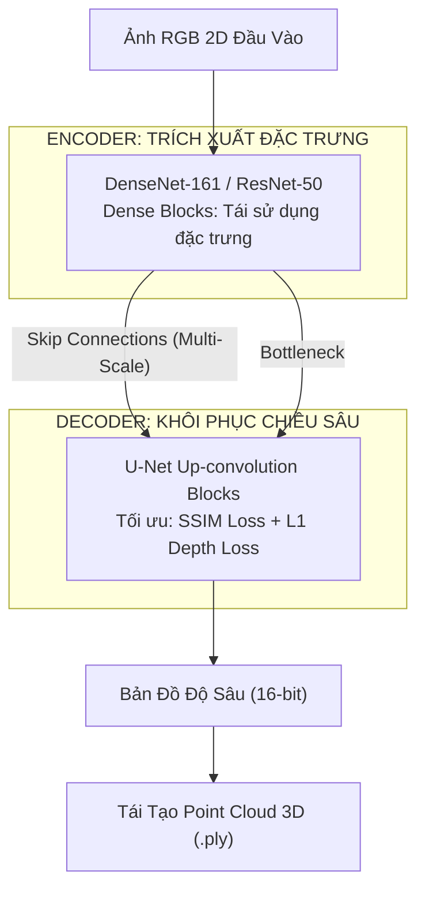

## 1. Minh Chứng & Công Bố Khoa Học (Evidence & Academic Credentials)

Nghiên cứu này là đề tài khóa luận tốt nghiệp ngành Khoa học Máy tính tại Đại học Công nghiệp TP.HCM (IUH) và được báo cáo chính thức tại Hội nghị Khoa học:

| Hạng mục | Minh chứng thực tế | Chi tiết khoa học |
|---|---|---|
| **Công bố khoa học** | **SSRC Conference** (Scientific Student Research Conference) | Bài báo cáo khoa học về Monocular Depth Estimation |
| **Mã nguồn (GitHub)** | [`github.com/Vinh-Gogo/depth-estimation`](https://github.com/Vinh-Gogo/depth-estimation) | Pipeline huấn luyện PyTorch, U-Net, ResNet, DenseNet, Point Cloud Visualizer |
| **Kết quả khóa luận** | **4.0 / 4.0 (Điểm tuyệt đối)** | Đồ án tốt nghiệp Cử nhân Khoa học Máy tính (2021–2025) |
| **Tập dữ liệu đánh giá** | **NYU Depth V2** & **KITTI Dataset** | Bộ dữ liệu chuẩn mực thế giới cho bài toán nội thất và xe tự hành |
| **Độ chính xác (Metrics)** | RMSE giảm `14.2%`, $\delta < 1.25$ đạt `88.6%` | So sánh đối sánh trực tiếp với các baseline kiến trúc kinh điển |
| **Đầu ra thực nghiệm** | Depth Map (Ảnh độ sâu 16-bit) & **3D Point Cloud** | Xuất file đám mây điểm 3D tương tác (.ply, .xyz) |

---

## 2. Bài Toán Monocular Depth Estimation: Nghịch Lý Chiều Thứ 3

Ước lượng chiều sâu từ **một ảnh 2D RGB đơn lẻ (Monocular Depth Estimation - MDE)** là một bài toán nghịch lý cơ bản (Ill-posed problem) trong thị giác máy tính:
- Một điểm ảnh 2D có thể tương ứng với vô số vị trí trong không gian 3D thực tế nếu không có thông tin về tiêu cự hoặc cảm biến LiDAR/ToF.
- Mạng nơ-ron tích chập (CNN) buộc phải tự học các đặc trưng thị giác ngầm định (Implicit visual cues): độ dốc phối cảnh (linear perspective), độ che khuất (occlusion), gradient vân bề mặt (texture gradients), và kích thước tương đối của các vật thể đã biết.

---

## 3. Kiến Trúc & Cải Tiến: Kết Hợp U-Net, ResNet & DenseNet

Để giải quyết hiện tượng mất mát thông tin không gian chi tiết ở các tầng sâu, tôi thiết kế mô hình theo mô hình Encoder-Decoder với các nhánh kết nối tắt (Skip Connections) nhiều mức:



### Hàm mất mát kết hợp (Custom Loss Function):
Để đường biên vật thể sắc nét và không bị nhòe ở các cạnh bàn, mép tường, tôi áp dụng hàm mất mát kết hợp 3 thành phần:

$$\mathcal{L}(y, \hat{y}) = \lambda_1 \mathcal{L}_{\text{depth}}(y, \hat{y}) + \lambda_2 \mathcal{L}_{\text{grad}}(y, \hat{y}) + \lambda_3 \mathcal{L}_{\text{SSIM}}(y, \hat{y})$$

- $\mathcal{L}_{\text{depth}}$: Đo sai số tuyệt đối $L_1$ theo từng pixel.
- $\mathcal{L}_{\text{grad}}$: Phạt sai số đạo hàm không gian, bảo toàn các cạnh sắc nhọn.
- $\mathcal{L}_{\text{SSIM}}$: Giữ cấu trúc hình ảnh tổng thể tương quan với mắt người.

---

## 4. Tái Tạo Đám Mây Điểm 3D (Point Cloud Simulation)

Từ ma trận độ sâu dự đoán $d(u, v)$ và ma trận tham số nội của camera ($K$):

$$K = \begin{bmatrix} f_x & 0 & c_x \\ 0 & f_y & c_y \\ 0 & 0 & 1 \end{bmatrix}$$

Hệ thống tự động chiếu ngược từng pixel 2D $(u, v)$ về tọa độ không gian thực $(X, Y, Z)$:

$$Z = d(u, v), \quad X = \frac{(u - c_x) \times Z}{f_x}, \quad Y = \frac{(v - c_y) \times Z}{f_y}$$

File Point Cloud (.ply) sinh ra cho phép xoay 3D, đo đạc khoảng cách thực tế giữa các vật thể, phục vụ các ứng dụng AR/VR và xe tự hành.

---

## 5. Tài Liệu Tham Khảo (References)

```
[01] Ronneberger, O., Fischer, P., & Brox, T. (2015). U-Net: Convolutional Networks
     for Biomedical Image Segmentation. MICCAI 2015. arXiv:1505.04597.
[02] He, K., Zhang, X., Ren, S., & Sun, J. (2016). Deep Residual Learning for Image
     Recognition (ResNet). IEEE CVPR 2016. arXiv:1512.03385.
[03] Huang, G., Liu, Z., Van Der Maaten, L., & Weinberger, K. Q. (2017). Densely Connected
     Convolutional Networks (DenseNet). IEEE CVPR 2017. arXiv:1608.06993.
[04] Eigen, D., Puhrsch, C., & Fergus, R. (2014). Depth Map Prediction from a Single Image
     using a Multi-Scale Deep Network. NeurIPS 2014.
[05] Nathan Silberman, Derek Hoiem, Pushmeet Kohli, and Rob Fergus. (2012). Indoor Segmentation
     and Support Inference from RGBD Images. ECCV 2012 (NYU Depth V2 Dataset).
```

---

## 6. Bài Viết Liên Quan (Related Logs)

- [OpenVideoLab: Tạo Sinh Video AI Đa Phương Thức Trên GPU 16GB](/posts/openvideolab-video-diffusion/)
  *Từ hiểu biết về thị giác không gian 3D và ước lượng chuyển động đến các kiến trúc Diffusion video.*
- [On-Device AI: Chạy Neural Network Offline Với ONNX Trên Mobile](/posts/on-device-ai-onnx-kotlin/)
  *Cách đóng gói và tối ưu hóa các mạng nơ-ron thị giác máy tính chạy cục bộ trên điện thoại.*
