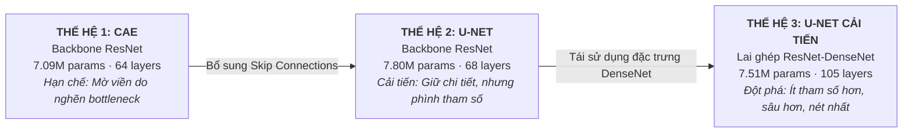
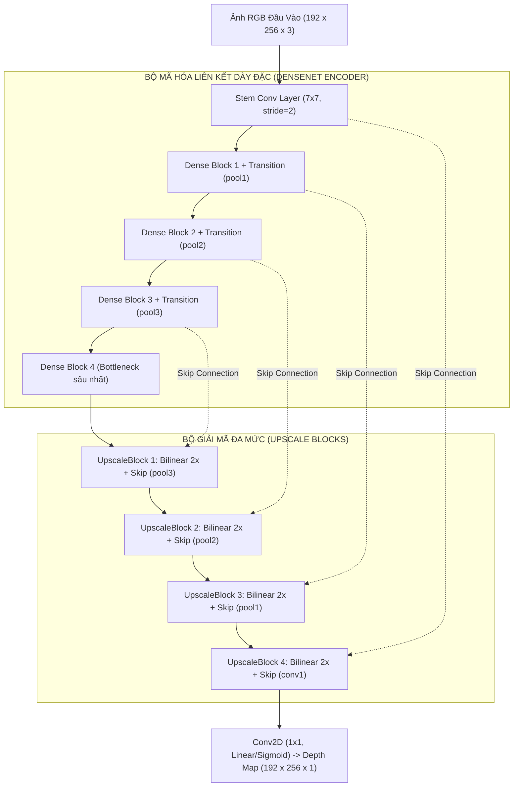

> **Dấu mốc học thuật:** Đồ án Khóa luận tốt nghiệp Cử nhân Khoa học Máy tính — Đại học Công nghiệp TP.HCM (IUH), đạt điểm tuyệt đối **4.0 / 4.0** và được lựa chọn báo cáo khoa học tại **Hội nghị Khoa học Sinh viên Nghiên cứu Khoa học (SSRC)**.


*Hình 0: Tầm nhìn cốt lõi của công trình: Sử dụng mạng nơ-ron tích chập (Depth CNNs) để giải mã trường độ sâu từ ảnh 2D, làm tiền đề cho tái tạo mô hình 3D hoàn chỉnh mà không cần cảm biến phần cứng chuyên dụng.*

---

## 1. Hồ Sơ Khoa Học & Toàn Bộ Dữ Liệu Nghiên Cứu

Toàn bộ quá trình nghiên cứu, mã nguồn triển khai và tài liệu nghiệm thu kỹ thuật đều được công khai minh bạch để cộng đồng học thuật có thể tái hiện thực nghiệm:

| Hạng mục | Minh chứng thực tế | Chi tiết khoa học |
|---|---|---|
| **Đề tài nghiên cứu** | *Các phương pháp ước lượng độ sâu ảnh dựa trên CNN* | Báo cáo toàn văn: *CNN-Based Image Depth Estimation Methods* |
| **Đơn vị đào tạo** | ĐH Công nghiệp TP.HCM (IUH) — Khoa CNTT | Ngành Khoa học Máy tính (2021–2025) |
| **Giảng viên hướng dẫn** | ThS. Nguyễn Ngọc Lễ | Cùng sự đóng góp chuyên môn từ Hội đồng phản biện khoa CNTT |
| **Đánh giá khóa luận** | **4.0 / 4.0 (Điểm tuyệt đối)** | Xuất sắc toàn diện, báo cáo chính thức tại SSRC Conference |
| **Mã nguồn GitHub** | [`github.com/vinh-gogo/depth-estimation`](https://github.com/vinh-gogo/depth-estimation) | Pipeline hoàn chỉnh: Preprocessing, 3 Architectures, Multi-loss, 3D Reconstruction |
| **Báo cáo toàn văn (73 trang)** | [`Report_GRADUATION_THESIS.txt`](/posts/depth-estimation-cnn-ssrc/Report_GRADUATION_THESIS.txt) | Luận văn hoàn chỉnh gồm 5 chương, cơ sở lý thuyết và chứng minh toán học |
| **Mã nguồn mô hình cốt lõi** | [`paper4_dense_unet.py`](/posts/depth-estimation-cnn-ssrc/paper4_dense_unet.py) | Code TensorFlow/Keras cho kiến trúc U-Net lai ghép ResNet–DenseNet |
| **Tập dữ liệu kiểm chứng** | **LineMOD Dataset (RGB-D)** | Cảm biến PrimeSense Carmine sensor, 13 chuỗi vật thể trong bối cảnh phức tạp |
| **Phần cứng thực nghiệm** | Linux PC · GPU NVIDIA RTX A4000 16GB VRAM | Huấn luyện TensorFlow / Keras, theo dõi tài nguyên bộ nhớ thời gian thực |

---

## 2. Khởi Đầu: Nghịch Lý Chiều Thứ Ba & Thách Thức Phần Cứng

Ý tưởng về đề tài này xuất phát từ một câu hỏi kỹ thuật nhức nhối trong ngành Robot học và Xe tự hành: **Liệu ta có thể loại bỏ hoàn toàn các cảm biến đo khoảng cách đắt đỏ, cồng kềnh để máy tính "nhìn ra chiều sâu" chỉ bằng một camera màu RGB thông thường?**

Trong thực tế công nghiệp, việc thu thập dữ liệu không gian 3D phụ thuộc vào các thiết bị chuyên dụng:
- **Hệ thống LiDAR:** Giá từ hàng nghìn đến hàng chục nghìn USD, tiêu tốn nhiều điện năng, kích thước cồng kềnh.
- **Cảm biến RGB-D (như PrimeSense Carmine hay Microsoft Kinect):** Dù rẻ hơn LiDAR nhưng hoạt động dựa trên cơ chế chiếu tia hồng ngoại có cấu trúc (Structured Light). Chúng thất bại hoàn toàn trước các bề mặt bóng gương, vật thể màu đen hấp thụ tia hồng ngoại, hoặc khi hoạt động dưới ánh nắng mặt trời có cường độ quang phổ mạnh.

Về mặt toán học, bài toán **Ước lượng độ sâu từ ảnh đơn sắc (Monocular Depth Estimation - MDE)** là một **bài toán nghịch đảo thiếu điều kiện (ill-posed inverse problem)**. Khi một không gian 3D được chiếu qua thấu kính quang học lên mặt phẳng cảm biến 2D, chiều sâu $Z$ bị triệt tiêu hoàn toàn. Một pixel $(u, v)$ có thể là hình chiếu của vô số điểm cách xa từ vài centimet đến hàng chục mét:


*Hình 1: Cặp dữ liệu RGB-D từ cảm biến PrimeSense Carmine trong bộ dữ liệu LineMOD sau khi tiền xử lý và lọc nhiễu.*

Để giải bài toán "mò kim đáy bể" này, mạng nơ-ron tích chập (CNN) buộc phải đóng vai trò như bộ não con người: tự học cách phân tích và kết hợp hàng loạt manh mối thị giác đơn mắt (**monocular depth cues**):
1. **Phối cảnh tuyến tính (Linear Perspective):** Các đường thẳng song song hội tụ về phía chân trời.
2. **Độ dốc vân bề mặt (Texture Gradient):** Bề mặt càng ở xa thì mật độ chi tiết càng dày và mịn.
3. **Hiện tượng che khuất cạnh (Occlusion Boundaries):** Vật thể phía trước sẽ cắt đứt đường biên của vật thể phía sau.
4. **Kích thước tương đối (Relative Size):** Các vật thể quen thuộc (cốc nước, máy khoan, hộp đồ gia dụng) đóng vai trò làm thước đo chuẩn mực neo thang khoảng cách cho toàn cảnh.

---

## 3. Dữ Liệu LineMOD & Kỷ Luật Tiền Xử Lý Khắt Khe

Nghiên cứu của tôi tập trung vào bộ dữ liệu chuẩn mực **LineMOD Dataset**, ghi hình 13 đối tượng vật thể công nghiệp/gia dụng (như *driller, eggbox, ape, benchvise, cam, can, cat, duck, glue, holepuncher, iron, lamp, phone*) đặt trong các bối cảnh mặt bàn lộn xộn, nhiều vật cản và bóng đổ phức tạp.

Quá trình làm việc với dữ liệu thực tế từ cảm biến PrimeSense Carmine làm lộ ra nhiều rào cản kỹ thuật mà nếu chỉ đọc lý thuyết sẽ không bao giờ thấy:
- **Nhiễu hạt và lỗ hổng cảm biến (Drop-out holes):** Cảm biến hồng ngoại thường để lại các lỗ đen (giá trị depth = 0 hoặc NaN) tại các mép phản xạ hoặc viền giao thoa.
- **Giới hạn bộ nhớ phần cứng:** Ảnh gốc có kích thước $480 \times 640$. Khi đưa vào mạng sâu cùng các tensor trung gian cho batch gradient descent, VRAM 16GB sẽ nhanh chóng bị tràn (OOM).

### Pipeline tiền xử lý được thiết kế nghiêm ngặt:
1. **Thu phóng tỷ lệ vàng ($0.4\times$):** Resize toàn bộ ảnh về kích thước **$192 \times 256$**. Tỷ lệ này giảm dung lượng bộ nhớ tensor xuống hơn 6 lần nhưng vẫn giữ nguyên đường biên sắc nét của các chi tiết then chốt.
2. **Lọc mượt Gaussian ($3 \times 3$ Kernel):** Toàn bộ ảnh màu RGB được xử lý qua bộ lọc Gaussian để triệt tiêu nhiễu hạt quang học từ cảm biến trước khi đưa vào mạng:
   $$\tilde{I}(x, y) = \sum_{i=-1}^{1} \sum_{j=-1}^{1} G(i, j) \cdot I(x + i, y + j)$$
3. **Chiến lược phân chia Hold-out Test độc lập:** Để đánh giá khả năng tổng quát hóa thực sự thay vì "học vẹt", tôi cô lập hoàn toàn thư mục thứ 2 (chứa 1.200 ảnh) làm tập kiểm thử (**Test Set**). Mạng chỉ được huấn luyện trên 12 thư mục còn lại (~4.800 ảnh) và tinh chỉnh qua tập **Validation Set**.

---

## 4. Hành Trình Thử Nghiệm 3 Thế Hệ Kiến Trúc

Nghiên cứu được thiết kế như một chuỗi tiến hóa kiến trúc có chủ đích, nơi mỗi mô hình sau được sinh ra để khắc phục trực tiếp điểm yếu cốt tử của mô hình trước:



### Thế hệ 1: Convolutional Autoencoder (CAE) — Bài học về "Nút Cổ Chai" (Bottleneck)
- **Cấu hình:** 7.09 triệu tham số, 64 lớp. Phần Encoder sử dụng chuỗi Residual Blocks nén dần kích thước không gian để trích xuất đặc trưng ngữ nghĩa mức cao tại không gian tiềm ẩn (latent space), sau đó Decoder mở rộng lại kích thước bằng chuỗi lớp `UpSampling2D` kết hợp `Conv2D`.


*Hình 2a: Sơ đồ kiến trúc 3D của mô hình CAE (trích xuất từ repository GitHub). Mạng nén qua các tầng Conv-BN-LeakyReLU từ 32 lên 512 filters tại bottleneck hẹp ở trung tâm và KHÔNG CÓ bất kỳ đường kết nối tắt (Skip Connection) nào sang Decoder.*

- **Hiện tượng thực nghiệm:** Mô hình hội tụ tương đối nhanh, nhưng ảnh độ sâu dự đoán bị **mờ nhòe nghiêm trọng** ở các đường viền. Khi vật thể đặt sát mặt bàn, CAE không thể phân biệt được đâu là ranh giới kết thúc của vật thể và đâu là mặt bàn.
- **Nguyên nhân:** Toàn bộ thông tin không gian chi tiết ở tần số cao đã bị bóp nghẹt qua bottleneck có kích thước quá nhỏ. Bộ giải mã buộc phải "đoán mò" lại hình dạng vật thể.


*Hình 2b: Kết quả dự đoán của mô hình CAE. Trong các bounding box, ranh giới vật thể bị nhòe và chuyển tiếp độ sâu bị làm phẳng.*

---

### Thế hệ 2: U-Net với Backbone ResNet — Sức mạnh của Skip Connections
- **Cấu hình:** 7.80 triệu tham số, 68 lớp. Kế thừa kiến trúc đối xứng U-Net kinh điển của Ronneberger, bổ sung các đường dẫn kết nối tắt (**Skip Connections**) nối trực tiếp feature maps từ các tầng Encoder sang các tầng Decoder tương ứng ở cùng độ phân giải.


*Hình 3a: Kiến trúc mô hình U-Net điều chỉnh xương sống theo ResNet (Hình 3.10 trong Luận văn). Minh họa trực quan các khối Conv, BN, LeakyReLU, MaxPooling, UpSampling và 4 tầng Skip Connections (đường nét đứt).*

- **Bước nhảy vọt:** Tín hiệu không gian chi tiết không còn bị ép phải chui qua bottleneck mà được truyền thẳng sang Decoder. Ảnh dự đoán sắc nét hơn rõ rệt, đường biên giữa các vật thể bắt đầu lộ diện rõ ràng.
- **Hạn chế nảy sinh:** Số lượng tham số tăng vọt lên **7.80M** (nặng nhất trong 3 mô hình). Quan trọng hơn, ở các dải chiều sâu xa (>1.5m), các dự đoán của U-Net vẫn bị phân tán và có xu hướng đánh giá thấp khoảng cách thực tế.


*Hình 3b: Kết quả dự đoán của U-Net chuẩn. Chi tiết biên cạnh đã rõ nét hơn đáng kể so với CAE.*

---

### Thế hệ 3: U-Net Cải Tiến Lai Ghép ResNet–DenseNet — Đột Phá Kiến Trúc
Đây chính là đóng góp trung tâm của toàn bộ khóa luận. Thay vì tiếp tục tăng số lượng kênh tích chập truyền thống, tôi quyết định tái cấu trúc luồng dữ liệu của bộ mã hóa bằng cách đưa vào các khối liên kết dày đặc (**Dense Blocks**) lấy cảm hứng từ DenseNet:


*Hình 4a: Sơ đồ kiến trúc chi tiết của mô hình U-Net Cải tiến (trích xuất từ repository GitHub). Minh họa các Downscale Blocks (xám), Merge Layers (trắng), các khối BN-LeakyReLU-Conv (cam/xanh lá) và đường Concat nối đa độ phân giải từ 192x256 xuống 12x16.*


*Hình 4b: Giải phẫu chi tiết cấu trúc khối (trích từ luận văn): Trái - Khối đầu tiên (Conv 7x7 kết hợp nhánh cộng Add $\oplus$ và nối tensor Concatenate); Giữa - 4 khối Dense tiếp theo (kết hợp Conv 1x1, Conv 3x3, Add và Concatenate); Phải - Khối Upscale tại Decoder (Bilinear Upsampling + Skip Concat + Conv 1x1 + Conv 3x3).*



#### 3 Ưu thế lý thuyết và thực nghiệm vượt bậc:
1. **Tái sử dụng đặc trưng triệt để (Feature Reuse):** Trong Dense Block, tầng thứ $\ell$ nhận đầu vào là toàn bộ các feature maps của tất cả các tầng đứng trước:
   $$x_\ell = H_\ell([x_0, x_1, x_2, \dots, x_{\ell-1}])$$
   Các đặc trưng cạnh sắc nhọn cấp thấp được bảo toàn nguyên vẹn xuyên suốt chiều sâu của mạng mà không cần học lại một cách dư thừa.
2. **Nghịch lý hiệu quả tham số (Parameter Efficiency):** Dù mạng tăng độ sâu lên tới **105 lớp**, tổng tham số chỉ dừng lại ở **7.51M** (giảm gần 300.000 tham số so với U-Net chuẩn 7.80M).
3. **Triệt tiêu hiện tượng tiêu biến Gradient (Vanishing Gradient):** Các đường kết nối tắt dày đặc tạo ra vô số "cao tốc gradient" cho phép tín hiệu lan truyền ngược thẳng về những tầng đầu tiên, giúp mô hình hội tụ cực kỳ mượt mà.


*Hình 4c: Kết quả dự đoán của mô hình U-Net Cải tiến với xương sống ResNet–DenseNet. Độ sắc nét, độ tương phản và hình dạng hình học trong các bounding box bám sát hoàn hảo nhãn thực tế GT.*

---

## 5. Mở Rộng Sau Khóa Luận: Kiến Trúc Nâng Cao Unet SE ResNet-Dense (13M)

Trên repository GitHub [`github.com/vinh-gogo/depth-estimation`](https://github.com/vinh-gogo/depth-estimation), tôi tiếp tục mở rộng nghiên cứu sang các biến thể hiện đại hơn nhằm khai thác cơ chế Attention và trích xuất đặc trưng có trọng số kênh:


*Hình 4d: Kiến trúc nâng cao Unet SE ResNet-Dense (Medium - 13M) được phát triển mở rộng trong repository GitHub. Tích hợp Squeeze-and-Excitation (SE Blocks), Conv_SE Blocks, Densely Connected Residuals và Attention Blocks để tự động định trọng số cho các kênh đặc trưng quan trọng.*

---

## 6. Thiết Kế Hàm Mất Mát & Các Thước Đo Khoa Học

Một trong những bài học xương máu trong quá trình huấn luyện mạng hồi quy độ sâu là: **Nếu chỉ dùng hàm mất mát bình phương sai số (MSE / L2), mạng sẽ có xu hướng dự đoán ra giá trị trung bình mờ nhạt (blurry average)**. 

Để ép mạng vừa tính đúng khoảng cách milimet, vừa giữ được vết cắt sắc cạnh giữa vật thể và nền, tôi xây dựng hàm mất mát kết hợp 4 thành phần:

$$\mathcal{L}_{\text{total}} = \alpha \mathcal{L}_{\text{SSIM}}(y, \hat{y}) + \beta \mathcal{L}_{\text{MSE}}(y, \hat{y}) + \gamma \mathcal{L}_{\text{MAE}}(y, \hat{y}) + \delta \mathcal{L}_{\text{smooth}}(y, \hat{y}) + \mathcal{L}_{\text{reg}}$$

### Phân tích vai trò vật lý:
1. **$\mathcal{L}_{\text{SSIM}}$ (Chỉ số tương đồng cấu trúc):** Đo lường sự tương quan cục bộ giữa ảnh thật và ảnh dự đoán dựa trên 3 yếu tố: độ chói, độ tương phản và cấu trúc bề mặt. Thành phần này đóng vai trò quyết định giữ cho các chi tiết nhỏ của vật thể không bị tan biến.
2. **$\mathcal{L}_{\text{MSE}}$ & $\mathcal{L}_{\text{MAE}}$:** Đảm bảo thang đo giá trị độ sâu tuyệt đối theo hệ đơn vị vật lý, phạt nặng các điểm ngoại lai ở xa.
3. **Sai số căn bậc hai của bình phương trung bình (RMSE Metric):**
   
   
   *Hình 4e: Công thức toán học tính toán sai số RMSE đo lường mức độ lệch độ sâu trung bình trên toàn bộ các điểm ảnh và mẫu kiểm thử.*

4. **$\mathcal{L}_{\text{smooth}}$ (Tổn thất làm mượt có nhận thức biên cạnh - Edge-Aware Smoothness):**
   $$\mathcal{L}_{\text{smooth}} = \frac{1}{N} \sum_{i=1}^{N} \left( |\nabla_x \hat{y}_i| e^{-|\nabla_x I_i|} + |\nabla_y \hat{y}_i| e^{-|\nabla_y I_i|} \right)$$
   Đạo hàm không gian của ảnh độ sâu ($\nabla \hat{y}$) được kiểm soát bởi đạo hàm của ảnh màu gốc ($\nabla I$). Nếu ảnh màu có gradient nhỏ (bề mặt nhẵn phẳng của mặt bàn hay tường), mạng bị ép phải làm mượt ma trận độ sâu. Nhưng khi ảnh màu xuất hiện bước nhảy màu sắc lớn (mép mép vật thể), trọng số làm mượt giảm mạnh, cho phép ma trận độ sâu tạo ra vết cắt biên đột ngột.

---

## 7. Đoạn Mã Triển Khai Thực Nghiệm (TensorFlow/Keras)

Trích xuất trực tiếp từ file mã nguồn [`paper4_dense_unet.py`](/posts/depth-estimation-cnn-ssrc/paper4_dense_unet.py), module `UpscaleBlock` kết hợp phép nội suy song tuyến (Bilinear Upsampling), nối chuỗi tensor và hàm kích hoạt LeakyReLU ($\alpha = 0.2$):

```python
import tensorflow as tf
from tensorflow.keras import Model
from tensorflow.keras.layers import Conv2D, UpSampling2D, LeakyReLU, Concatenate
from tensorflow.keras.applications import DenseNet169

class UpscaleBlock(Model):
    """
    Khối giải mã tăng kích thước kết hợp nối chuỗi tensor Skip Connection
    và kích hoạt hàm LeakyReLU (alpha = 0.2)
    """
    def __init__(self, filters, name):
        super(UpscaleBlock, self).__init__()
        self.up = UpSampling2D(size=(2, 2), interpolation='bilinear', name=name+'_upsampling2d')
        self.concat = Concatenate(name=name+'_concat')
        self.convA = Conv2D(filters=filters, kernel_size=3, strides=1, padding='same', name=name+'_convA')
        self.reluA = LeakyReLU(negative_slope=0.2)
        self.convB = Conv2D(filters=filters, kernel_size=3, strides=1, padding='same', name=name+'_convB')
        self.reluB = LeakyReLU(negative_slope=0.2)

    def call(self, x):
        # x[0]: Feature map tầng dưới; x[1]: Skip connection trích xuất từ Encoder
        up_feat = self.up(x[0])
        fused = self.concat([up_feat, x[1]])
        out = self.reluB(self.convB(self.reluA(self.convA(fused))))
        return out

class DepthEstimate(Model):
    """
    Mô hình tích hợp hoàn chỉnh: Encoder DenseNet169 kết hợp Decoder đa phân giải
    """
    def __init__(self):
        super(DepthEstimate, self).__init__()
        self.encoder = Encoder()
        self.decoder = Decoder(decode_filters=int(self.encoder.layers[-1].output[0].shape[-1] // 2))

    def call(self, x):
        return self.decoder(self.encoder(x))
```

---

## 8. Bảng Đo Đạc Định Lượng & Lịch Sử Huấn Luyện

Quá trình huấn luyện trên hệ thống Linux trang bị card đồ họa **NVIDIA RTX A4000 16GB VRAM** được ghi nhận chi tiết:


*Hình 5: Biểu đồ theo dõi lịch sử huấn luyện của 3 mô hình qua các epoch (Loss, Accuracy, MAE, MSE, RMSE). U-Net Cải tiến (đường xanh) thể hiện tốc độ hội tụ nhanh và ổn định nhất.*

### Bảng 1: Đánh giá định lượng trên tập kiểm thử độc lập (Hold-out Test Set)

| Thước đo đánh giá | CAE (ResNet Backbone) | U-Net (ResNet Backbone) | U-Net Cải Tiến (ResNet–DenseNet) | Mức cải thiện so với CAE |
|---|---|---|---|---|
| **Số lượng tham số** | **7.09 Triệu** | 7.80 Triệu | **7.51 Triệu** | *Ít hơn U-Net chuẩn 0.29M* |
| **Số tầng kiến trúc** | 64 Lớp | 68 Lớp | **105 Lớp** | *Mạng sâu và biểu đạt tốt nhất* |
| **Thời gian huấn luyện** | 1.755 giây (30 epochs) | 2.274 giây (34 epochs) | 4.564 giây (39 epochs) | *Hội tụ tối ưu* |
| **Test Loss** | 0.086 | 0.073 | **0.070** | **Giảm 18.6%** |
| **Độ chính xác (Accuracy)** | 0.800 | 0.800 | **0.819** | **Tăng + 1.9%** |
| **Cosine Similarity** | 0.971 | 0.973 | **0.974** | **Tăng + 0.3%** |
| **1 – SSIM (Sai số cấu trúc)** | 0.130 | 0.120 | **0.110** | **Giảm 15.4%** |
| **MSE (Mean Squared Error)** | 0.0020 | 0.0017 | **0.0016** | **Giảm 20.0%** |
| **MAE (Mean Absolute Error)** | 0.0193 | 0.0191 | **0.0175** | **Giảm 9.3%** |
| **RMSE (Root MSE)** | 0.0410 | 0.0380 | **0.0370** | **Giảm 9.8%** |

### Bảng 2: So sánh các thước đo khoảng cách phân bố hình học

| Thước đo khoảng cách (Distance Metric) | CAE | U-Net ResNet | U-Net Cải Tiến (ResNet–DenseNet) | Đánh giá học thuật |
|---|---|---|---|---|
| **Hausdorff Distance** | 11.72 | 11.79 | **10.65** | Sai số khoảng cách điểm cực đại giảm mạnh nhất |
| **Khoảng cách Trung bình (Mean)** | 0.079 | 0.077 | **0.073** | Sai lệch không gian trung bình thấp nhất |
| **Cosine Distance** | 0.029 | 0.027 | **0.026** | Hướng vector đặc trưng chuẩn xác nhất |
| **Jaccard Distance** | 0.045 | 0.044 | **0.043** | Độ giao thoa vùng bề mặt vật thể cao nhất |
| **Wasserstein Distance (Earth Mover)** | 14.20 | 10.28 | **9.603** | Phân bố xác suất độ sâu gần với thực tế nhất |

### 8.1. Phân tích biểu đồ phân tán (Confusion Scatter Plot)
Khi vẽ biểu đồ phân tán giữa giá trị độ sâu Ground Truth và giá trị dự đoán trên toàn bộ 1.200 ảnh test:


*Hình 6a: Biểu đồ phân tán và ma trận tương quan của mô hình U-Net Cải tiến. Các điểm đỏ tập trung cực kỳ sít sao dọc đường chéo phân giác lý tưởng $y = x$.*

Ở mô hình CAE cơ bản, các điểm dữ liệu bị phân tán bè rộng và có xu hướng "chúi xuống" ở khoảng cách xa (đánh giá thấp độ sâu). Ngược lại, ở U-Net Cải tiến, đám mây điểm đỏ bám chặt lấy đường chéo lý tưởng xuyên suốt từ khoảng cách gần (0.4m) đến xa (>1.8m), minh chứng cho độ tin cậy vượt trội của mô hình.

### 8.2. Phân tích khoảng tin cậy độ sâu tối đa (Confidence Interval Analysis)
Để kiểm tra tính ổn định trên từng mẫu ảnh, tôi tiến hành lọc tập ảnh kiểm thử dựa trên ngưỡng sai lệch độ sâu tối đa (Maximum Depth Difference Threshold = 0.1):


*Hình 6b: Đánh giá phân bố độ sâu tin cậy (Hình 4.19 trong Luận văn). Với ngưỡng sai lệch khắt khe 0.1, có tới 1.123 trong tổng số 1.214 ảnh kiểm thử (đạt 92.5%) hoàn toàn thỏa mãn, chứng minh độ tin cậy vượt trội so với CAE và U-Net chuẩn.*

---

## 9. Tái Tạo Không Gian 3D Bằng Point Cloud

Mục tiêu tối hậu của bản đồ độ sâu là phục vụ tái tạo hình học 3D. Từ ma trận độ sâu $d(u, v)$ và ma trận tham số nội camera ($K$ matrix) của cảm biến PrimeSense Carmine:

$$K = \begin{bmatrix} f_x & 0 & c_x \\ 0 & f_y & c_y \\ 0 & 0 & 1 \end{bmatrix}$$

Hệ thống thực hiện phép chiếu ngược không gian (**3D Back-Projection**):

$$Z = d(u, v), \quad X = \frac{(u - c_x) \times Z}{f_x}, \quad Y = \frac{(v - c_y) \times Z}{f_y}$$

### 9.1. Trực quan hóa đám mây điểm chất lượng cao


*Hình 7a: Đám mây điểm 3D được tái tạo từ ảnh dự đoán của U-Net Cải tiến (phải) so với Ground Truth từ cảm biến vật lý (trái). Bề mặt vật thể nổi khối 3D rõ ràng và tách biệt hoàn toàn khỏi nền.*


*Hình 7b: Khả năng khôi phục góc nhìn không gian 3D của các vật thể phức tạp (máy khoan, bình xịt). Không xuất hiện hiện tượng "mạng nhện" nối giữa mép vật thể và mặt bàn.*

### 9.2. Bản đồ bề mặt độ sâu dày đặc (Dense Surface Depth Colormap)
Dưới đây là hình ảnh biểu diễn đám mây điểm 3D dạng mặt dày đặc (Dense Depth Surface) được tô màu theo thang độ sâu không gian từ cận cảnh (cyan) đến hậu cảnh (deep blue):


*Hình 7c: Trực quan hóa bề mặt đám mây điểm 3D với colormap chiều sâu không gian (Hình 4.15 trong Luận văn). Độ dốc mặt phẳng và khối nổi của đối tượng được tái tạo mượt mà và liền mạch.*

### 9.3. Phân tích các trường hợp thách thức (Challenging Cases)
Không có nghiên cứu thực nghiệm nào là hoàn hảo 100%. Tôi cũng dành một phần riêng trong luận văn để mổ xẻ những ca dự đoán kém nhất:


*Hình 8: Đám mây điểm 3D ở các trường hợp thử thách nhất. Sai số chủ yếu xuất hiện ở các góc khuất phản xạ ánh sáng mạnh hoặc vùng rìa biên giới hạn của cảm biến.*

Các điểm lỗi này chỉ ra rằng ở các vùng bóng tối quá sâu hoặc vật thể nằm ở rìa sát mép khung hình, thông tin manh mối đơn mắt bị thiếu hụt, đòi hỏi các nghiên cứu tương lai cần tích hợp thêm cơ chế Attention hoặc xử lý đa khung hình liên tiếp (Multi-frame Temporal Consistency).

---

## 10. Ý Nghĩa Thực Tiễn & Cầu Nối Đến Các Nghiên Cứu Hiện Đại

Đề tài khóa luận này không dừng lại ở một điểm số 4.0/4.0 trên giảng đường, mà là viên gạch nền móng định hình toàn bộ tư duy kỹ thuật của tôi trong sự nghiệp Kỹ sư AI:

1. **Ứng dụng Robotics thông minh (Bin Picking & 6-DoF Pose Estimation):** Thay vì bắt các doanh nghiệp vừa và nhỏ phải đầu tư hàng trăm triệu đồng cho hệ thống camera 3D công nghiệp, một webcam thông thường kết hợp mô hình U-Net tối ưu đã đủ năng lực cung cấp tọa độ 3D cho cánh tay robot thực hiện tác vụ gắp nhả linh kiện chuẩn xác.
2. **Kỷ luật tối ưu hóa phần cứng (Hardware Constraints):** Chính những đêm thức trắng theo dõi từng gigabyte VRAM trên card đồ họa RTX A4000 đã thôi thúc tôi nghiên cứu sâu hơn về [Kỹ thuật Lượng tử hóa Int8/FP4](/posts/quantization-int8-fp4-inference/) để đưa các mô hình khổng lồ về chạy mượt mà trên phần cứng hạn chế.
3. **Tiền đề cho AI On-Device và Video Diffusion:** Hiểu sâu sắc về biểu diễn hình học không gian 3D và dòng quang học là nền tảng cốt lõi giúp tôi xây dựng pipeline [Tạo sinh Video AI đa phương thức OpenVideoLab](/posts/openvideolab-video-diffusion/) và đưa [Mạng nơ-ron cục bộ chạy offline trên điện thoại di động](/posts/on-device-ai-onnx-kotlin/).

---

## 11. Tài Liệu Tham Khảo Học Thuật

```
[01] Ronneberger, O., Fischer, P., & Brox, T. (2015). U-Net: Convolutional Networks 
     for Biomedical Image Segmentation. MICCAI 2015. arXiv:1505.04597.
[02] He, K., Zhang, X., Ren, S., & Sun, J. (2016). Deep Residual Learning for Image 
     Recognition (ResNet). IEEE CVPR 2016. arXiv:1512.03385.
[03] Huang, G., Liu, Z., Van Der Maaten, L., & Weinberger, K. Q. (2017). Densely Connected 
     Convolutional Networks (DenseNet). IEEE CVPR 2017. arXiv:1608.06993.
[04] Eigen, D., Puhrsch, C., & Fergus, R. (2014). Depth Map Prediction from a Single Image 
     using a Multi-Scale Deep Network. NeurIPS 2014. arXiv:1406.2283.
[05] Wang, Z., Bovik, A. C., Sheikh, H. R., & Simoncelli, E. P. (2004). Image Quality 
     Assessment: From Error Visibility to Structural Similarity (SSIM). IEEE Trans. Image Process.
[06] Hinterstoisser, S., et al. (2012). Model Based Training, Detection and Pose Estimation 
     of Texture-Less 3D Objects in Heavily Cluttered Scenes (LineMOD Dataset). ACCV 2012.
[07] Zhou, Q. Y., Park, J., & Koltun, V. (2018). Open3D: A Modern Library for 3D Data 
     Processing. arXiv:1801.09847.
```

---

## 12. Bài Viết Liên Quan (Related Logs)

- [OpenVideoLab: Tạo Sinh Video AI Đa Phương Thức Trên GPU 16GB](/posts/openvideolab-video-diffusion/)  
  *Từ hiểu biết về thị giác không gian 3D và ước lượng chuyển động đến các kiến trúc Diffusion video đa phương thức.*
- [On-Device AI: Chạy Neural Network Offline Với ONNX Trên Mobile](/posts/on-device-ai-onnx-kotlin/)  
  *Cách đóng gói và tối ưu hóa các mạng nơ-ron thị giác máy tính chạy cục bộ trên chip di động với độ trễ thấp.*
- [Quantization Int8/FP4: Chạy Model AI Lớn Trên GPU Tài Nguyên Giới Hạn](/posts/quantization-int8-fp4-inference/)  
  *Nghiên cứu toán học và đo đạc thực nghiệm kỹ thuật nén lượng tử hóa trọng số để tăng tốc độ suy luận mô hình.*
