---
title: "GraphRAG: Kết Hợp Neo4j và Qdrant Để Giảm Hallucination"
date: 2026-08-15T10:00:00+07:00
draft: false
tags: ["agentic-rag", "du-an", "rag"]
description: "Vượt qua giới hạn của Semantic RAG thuần túy bằng cách kết hợp Knowledge Graph (Neo4j) và Vector Search (Qdrant) trên tập tài liệu kỹ thuật >200 trang tại WETEC, đạt 95% Hit@1 và độ trễ <2s."
summary: "Vượt qua giới hạn của Semantic RAG thuần túy bằng cách kết hợp Knowledge Graph (Neo4j) và Vector Search (Qdrant) trên tập tài liệu kỹ thuật >200 trang tại WETEC, đạt 95% Hit@1 và độ trễ <2s."
ShowToc: true
TocOpen: true
---

## 1. Minh Chứng & Bối Cảnh Thực Tế (Evidence & Project Context)

Giải pháp **GraphRAG** này được nghiên cứu và triển khai thực chiến tại **WETEC (Công ty CP Công nghệ Năng lượng & Môi trường Nước)** nhằm giải quyết bài toán tra cứu tài liệu kỹ thuật chuyên ngành cực kỳ phức tạp:

| Hạng mục | Minh chứng thực tế | Chi tiết kỹ thuật |
|---|---|---|
| **Mã nguồn (GitHub)** | [`github.com/Vinh-Gogo/pdf-rag`](https://github.com/Vinh-Gogo/pdf-rag) | Pipeline trích xuất PDF, Neo4j Graph Builder, Qdrant Vector Store, FastAPI |
| **Quy mô dữ liệu** | Tài liệu kỹ thuật chuyên sâu `> 200 trang` | Chứa bảng biểu, sơ đồ quan hệ thiết bị, tiêu chuẩn xử lý nước |
| **Thu thập dữ liệu** | **Firecrawl AI** | Tự động crawl, làm sạch và chuẩn hóa dữ liệu phi cấu trúc từ web/docs |
| **Độ trễ truy xuất (Latency)** | `< 2.0 giây` toàn trình | Bao gồm entity extraction, graph traversal, vector search và LLM response |
| **Độ chính xác (Accuracy)** | `95% Hit@1` và `99% Hit@5` | Đo đạc trên 3.200 câu truy vấn kỹ thuật có kiểm chứng của chuyên gia |
| **Hạ tầng triển khai** | Neo4j, Qdrant, SQLite, LangGraph, FastAPI, Docker, Vercel, Neon | Kiến trúc microservices đóng gói container hoàn chỉnh |

---

## 2. Vì Sao Semantic RAG Thuần Túy Thất Bại Trước Tài Liệu Kỹ Thuật?

Khi xây dựng RAG cho tài liệu kỹ thuật dài (>200 trang), phương pháp truyền thống (Chunking + Vector Embedding) bộc lộ 3 tử huyệt:

1. **Mất đứt gãy ngữ cảnh quan hệ (Relational Context Blindness):** Vector search chỉ tính độ tương đồng cosin giữa câu hỏi và đoạn văn. Khi người dùng hỏi: *"Nếu nồng độ COD vượt 500mg/L thì quy trình vận hành thiết bị bể UASB ở trang 42 cần điều chỉnh theo tiêu chuẩn nào tại trang 180?"*, vector embedding không thể liên kết 2 trang cách xa nhau.
2. **Ảo giác khi suy luận đa bước (Multi-hop Hallucination):** LLM phải đoán mò thông tin nằm rải rác giữa các chunks độc lập, dẫn đến câu trả lời bịa đặt nhưng nghe rất thuyết phục.
3. **Mất cấu trúc phân cấp:** Thông tin dạng danh mục, sơ đồ đấu dây hoặc chuỗi vận hành tuần tự bị cắt vụn thành các đoạn văn vô nghĩa.

---

## 3. Kiến Trúc GraphRAG: Hai Lớp Tri Thức Bổ Trợ

Để khắc phục hoàn toàn, tôi thiết kế kiến trúc kết hợp **Đồ thị tri thức (Knowledge Graph)** và **Không gian vector ngữ nghĩa (Vector Space)**:

```mermaid
flowchart TD
    Q["User Query: Câu hỏi kỹ thuật"] --> NER["Trích xuất Thực thể (NER)"]
    Q --> EMB["Tạo Vector Embedding"]
    
    subgraph RETRIEVAL["TRUY XUẤT HYBRID (GRAPH + VECTOR)"]
        NER --> NEO["Neo4j Graph (Cypher 2–3 hops)"]
        EMB --> QDR["Qdrant DB (Dense Similarity)"]
    end
    
    NEO --> RRF["Reciprocal Rank Fusion (RRF)"]
    QDR --> RRF
    
    RRF --> LLM["Context-Augmented LLM"]
    LLM --> ANS["Câu trả lời chính xác (Độ trễ &lt; 2s)"]
```



### Cách thức hoạt động:
1. **Neo4j (Knowledge Graph):** Lưu trữ các thực thể kỹ thuật (Thiết bị, Thông số, Tiêu chuẩn, Sự cố) và các quan hệ có hướng:
   ```cypher
   (:ThietBi {ten: "Bể UASB"})-[:CO_THONG_SO_KIEM_SOAT]->(:ThongSo {ten: "COD"})
   (:ThongSo {ten: "COD"})-[:QUY_DINH_BOI]->(:TieuChuan {ma: "QCVN 40:2011/BTNMT"})
   ```
2. **Qdrant (Vector Database):** Index các đoạn văn bản giải thích nguyên lý hoạt động, hướng dẫn vận hành chi tiết.
3. **Fusion Engine:** Khi truy vấn, Neo4j cung cấp **bản đồ cấu trúc logic** (các thực thể liên quan), trong khi Qdrant cung cấp **nội dung chi tiết**. LLM chỉ cần tổng hợp dựa trên sự thật vững chắc đã được neo trên đồ thị.

---

## 4. Kết Quả Đo Đạc Thực Nghiệm

So sánh hiệu năng giữa Semantic RAG truyền thống và GraphRAG trên tập kiểm thử 3.200 truy vấn:

| Chỉ số đánh giá | Semantic RAG thuần túy | GraphRAG (Neo4j + Qdrant) | Độ cải thiện |
|---|---|---|---|
| **Hit@1 (Đúng ngay kết quả đầu)** | 78.4% | **95.2%** | **+ 16.8%** |
| **Hit@5 (Nằm trong top 5)** | 89.1% | **99.1%** | **+ 10.0%** |
| **Tỷ lệ ảo giác (Hallucination Rate)** | 14.6% | **< 1.8%** | **Giảm 87.6%** |
| **Thời gian phản hồi trung bình** | ~180 ms | ~210 ms | Tăng nhẹ 30ms |
| **Thời gian xử lý tài liệu kỹ thuật** | 12s | **< 2s** | Rút ngắn 6 lần |

---

## 5. Tài Liệu Tham Khảo (References)

```
[01] Edge, D., Trinh, H., Cheng, N., Bradley, J., Chao, A., Mody, J., Truitt, S., & Larson, J. 
     (2024). From Local to Global: A Graph RAG Approach to Query-Focused Summarization. 
     Microsoft Research. arXiv:2404.16130.
[02] Neo4j Inc. (2024). Integrating Knowledge Graphs with Large Language Models for Advanced RAG. 
     Neo4j Official Whitepaper.
[03] Qdrant Team. (2024). High-Dimensional Vector Search and Dense-Sparse Hybrid Retrieval. 
     Qdrant Architecture Documentation.
[04] Lewis, P., et al. (2020). Retrieval-Augmented Generation for Knowledge-Intensive NLP Tasks. 
     NeurIPS 2020. arXiv:2005.11401.
```

---

## 6. Bài Viết Liên Quan (Related Logs)

- [Multi-Agent Workflow: Tự Động Hóa CSKH Với LangGraph và FastMCP](/posts/multi-agent-workflow-langraph/)  
  *Cách tích hợp GraphRAG làm công cụ tra cứu cho hệ thống Multi-Agent đạt 99% Hit@5 trên vLLM.*
- [Quantization Int8/FP4: Chạy Model AI Lớn Trên GPU Tài Nguyên Giới Hạn](/posts/quantization-int8-fp4-inference/)  
  *Kỹ thuật tối ưu hóa bộ nhớ GPU khi cần tự host LLM và Embedding model cho hệ thống RAG nội bộ.*
