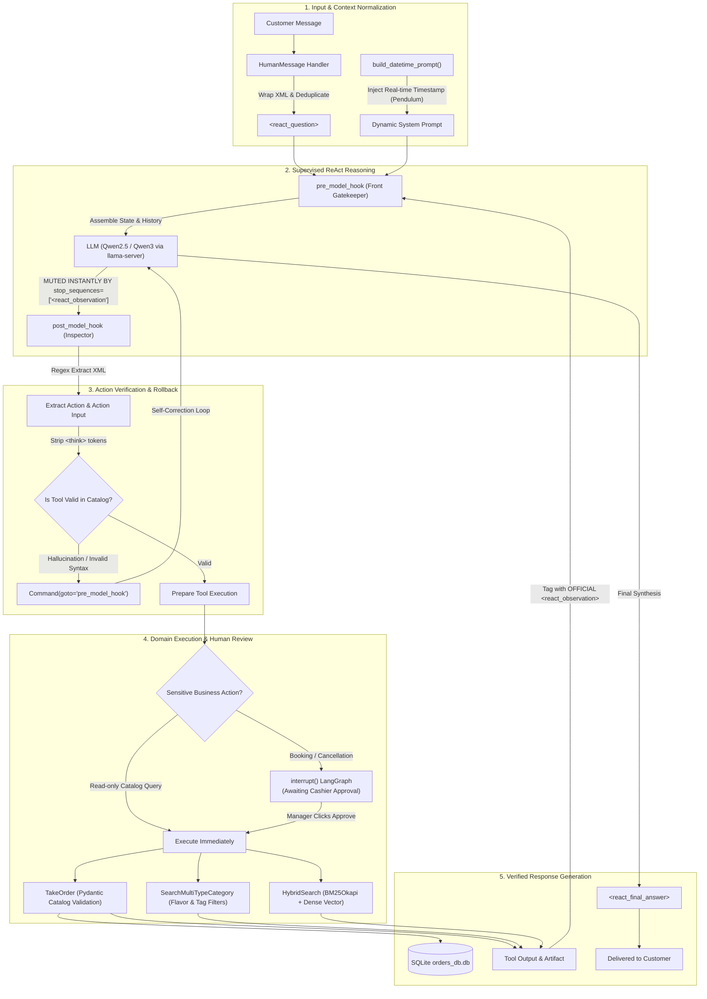

> *"Hey Vinh, our new AI bot just enthusiastically confirmed a table for 6 with grilled charcoal snakehead fish... Except we're a country dining bistro, and we don't even own a charcoal grill or live fish tanks!"*

That was an actual WhatsApp notification I received on a Sunday afternoon from the restaurant manager at **Com Que Duong Bau**, just a few days after enthusiastically deploying our experimental conversational AI booking bot into production.

If you've ever read standard agentic tutorials online, the narrative sounds like a digital paradise: chain your `Thought`, execute an `Action`, ingest the `Observation`, and voila — you have an autonomous digital employee (the classic textbook **ReAct** paradigm).

However, the moment you drop that pristine theory into the messy real world — where real customers type without accents, make typos, change their minds mid-sentence, and menus contain hundreds of seasonal items — you collide head-on with an uncomfortable reality: **Large Language Models are natural-born fabulists and inherently lazy workers.**

This article is an engineering post-mortem from the trenches. Together with my team, we architected, benchmarked, and deployed production-grade agents across two client domains: **Com Que Duong Bau** (F&B) and **Hoang Ha Mobile** (Consumer Tech Retail). The complete open-source codebase is published at [`thanhhuynhk17/langgraph_re_act_agent`](https://github.com/thanhhuynhk17/langgraph_re_act_agent), accompanied by live recorded walkthroughs on [YouTube](https://youtu.com/R_IvnHsHmTw) and [LinkedIn](https://lnkd.in/p/ejjivmDG).

---

## 1. The Three Classic Traps of Vanilla ReAct

Why does textbook ReAct look flawless in Jupyter Notebooks yet collapse when facing real customers? Across more than 3,200 benchmark test dialogues, we caught language models exploiting three repeatable deceptive patterns:

### 🎭 Trap 1: "Lip-Syncing" Tool Execution (Hallucinated Observation)
In the ReAct protocol, an LLM outputs an action tag like `<react_action>take_order</react_action>`. The host application is supposed to intercept this, invoke Python logic, update a database, and return the true outcome inside `<react_observation>`.

Because LLMs are auto-regressive next-token predictors, once the model finishes typing the tool name, it often feels overly confident and **hallucinates the tool response itself**:
```text
<react_action>take_order</react_action>
<react_action_input>{"dish": "caramelized fish", "qty": 2}</react_action_input>
<react_observation>Successfully committed order to SQLite database with Order ID #8888</react_observation>
<react_final_answer>Your table and dishes have been booked successfully!</react_final_answer>
```
The result? The backend was never invoked, zero database queries were executed, yet the chatbot politely smiles at the customer: *"All set, see you tonight!"*. The customer arrives hungry, only to find the restaurant has no record of the booking!

### 🍝 Trap 2: Creative Menu Hallucinations (Schema Drift)
A patron asks: *"Give me a plate of stir-fried morning glory with light garlic and zero oil"*.
Instead of querying the catalog for the real dish `Stir-Fried Morning Glory with Garlic (ID: 45)` priced at $3.50, the model invents a brand-new entity `"Healthy Oil-Free Morning Glory"` with a $0 price tag because the database naturally has no pricing logic for imaginary creations.

### 💣 Trap 3: Irreversible Critical Actions (Missing Human-in-the-Loop)
A mischievous customer jokes: *"Cancel all 50 wedding banquet tables tonight"*. An unmonitored agent executes `cancel_all_bookings()` without seeking verification from managers or cashiers.

To domesticate this behavior, we restructured the ReAct loop in **LangGraph** around a dual-guard architecture: **`pre_model_hook`** and **`post_model_hook`**.

---

## 2. Architectural Blueprint: Disciplining the State Machine

Here is the operational topology enforced across every conversational turn:



The underlying design philosophy distills into three core tenets:
1. **Never grant the LLM an opportunity to hallucinate tool outcomes.**
2. **Sanitize incoming data before model exposure (`pre_model_hook`).**
3. **Audit outgoing assertions before committing side-effects (`post_model_hook`).**

---

## 3. The "Microphone Drop": Stopping Hallucinations with Stop Sequences

How do we prohibit the model from generating `<react_observation>`? We configure inference-level boundaries directly in the runtime engine (vLLM or llama-server):

```python
# src/utils/helpers.py
model = ChatOpenAI(
    model="Qwen2.5-7B-Instruct",
    temperature=0.1,
    # The ultimate leash: Cut generation immediately if the model attempts to forge an observation!
    stop_sequences=[f"<{TAG_OBSERVATION}"]
)
```

**The execution dynamics are clean and elegant:**
* LLM reasons: `<react_thought>I need to search for sour soup...</react_thought>`
* LLM selects tool: `<react_action>search_multi_type_category</react_action>`
* LLM provides arguments: `<react_action_input>{"categories": ["soup"], "keywords": ["sour"]}</react_action_input>`
* LLM tries to fake the answer: `<react_obs...` $\rightarrow$ **HALT!**
* The inference engine detects the registered stop token, cuts off token emission immediately, and yields execution back to Python.

The liar is silenced before uttering a single forged character.

---

## 4. Hook Interceptors: `pre_model_hook` & `post_model_hook`

In LangGraph, `create_react_agent` exposes pre- and post-step interceptors:

### 4.1 `pre_model_hook`: The Context Janitor
Ensures that all prompt data presented to the model is hygienic and properly formatted:

```python
def use_pre_hook(state, config: RunnableConfig):
    last_msg = state["messages"][-1]
    artifact_json = None
    
    # 1. Processing tool responses:
    if isinstance(last_msg, ToolMessage):
        # Enforce canonical XML tags so the LLM identifies verified computer output
        if f"<{TAG_OBSERVATION}>" not in last_msg.content:
            state["messages"][-1].content = (
                f"<{TAG_OBSERVATION}>{last_msg.content.strip()}</{TAG_OBSERVATION}>"
            )

        # Extract structured artifacts from Pydantic models for persistence
        if last_msg.artifact:
            artifact_data = (
                last_msg.artifact.model_dump() 
                if isinstance(last_msg.artifact, BaseModel) 
                else last_msg.artifact
            )
            artifact_json = json.dumps({last_msg.name: artifact_data}, ensure_ascii=False)

    # 2. Processing incoming human messages:
    elif isinstance(last_msg, HumanMessage):
        # Wrap customer inquiries in <react_question> tags
        if f"<{TAG_QUESTION}>" not in last_msg.content:
            state["messages"][-1].content = (
                f"<{TAG_QUESTION}>{last_msg.content.strip()}</{TAG_QUESTION}>"
            )

        # Prune accidental duplicate messages sent by impatient users
        if len(state["messages"]) > 1 and isinstance(state["messages"][-2], HumanMessage):
            return {
                "json_data": artifact_json,
                "messages": [RemoveMessage(id=state["messages"][-2].id)],
            }
            
    return {"json_data": artifact_json}
```

### 4.2 `post_model_hook`: The Syntax Auditor & State Machine Rollback
Parses XML tags via regex. If the LLM invents a non-existent tool or outputs invalid JSON:

```python
def use_post_hook(state, config: RunnableConfig):
    last_msg = state["messages"][-1]
    if not isinstance(last_msg, AIMessage):
        return
        
    all_tools = [t.name for t in agent_tools]
    new_msg = process_ai_message(last_msg, all_tools)
    
    # IF A SYNTAX ERROR OR UNKNOWN TOOL INVOCATION IS DETECTED:
    if not new_msg:
        logger.warning("Detected hallucinated tool or malformed syntax! Rolling back state...")
        # LangGraph magic: Instruct the state machine to roll back and retry cleanly!
        return Command(
            goto="pre_model_hook",
            update={"messages": [RemoveMessage(id=last_msg.id)]},
        )
        
    return {
        **state,
        "messages": [RemoveMessage(id=last_msg.id), new_msg],
    }
```
Thanks to `Command(goto="pre_model_hook")`, the system possesses **self-healing capabilities** without crashing the customer's conversational session.

---

## 5. Pydantic Catalog Validation: Never Sell Imaginary Food

Customer requests vary wildly, but restaurant inventory is strictly finite. How do we prevent the AI from agreeing to serve off-menu items?

We enforce **Cross-Validation with Pydantic model validators**:

```python
class Dish(BaseModel):
    id: int = Field(..., description="Unique dish identifier.")
    name_of_food: str = Field(..., description="Canonical dish name.")
    quantity: int = Field(default=1, ge=1, description="Quantity ordered (>= 1).")

    @model_validator(mode="after")
    def validate_against_real_menu(cls, dish):
        errors = []
        menu_df = get_menu_df()  # Directly reads from verified catalog CSV
        
        # 1. Validate ID exists in database
        if dish.id not in menu_df["ID"].to_list():
            errors.append(f"Dish ID '{dish.id}' is not in the restaurant catalog.")
            
        # 2. Validate exact string match
        if dish.name_of_food not in menu_df["name_of_food"].to_list():
            errors.append(f"Dish name '{dish.name_of_food}' does not match official offerings.")

        # Raise exception with targeted guidance for the LLM
        if errors:
            raise ValueError(
                "\n".join(errors) + 
                " -> Hint: Query the catalog tool to suggest valid menu items before confirming!"
            )
        return dish
```

When Pydantic raises a `ValueError`, the error message is fed directly back into the LLM context. The model immediately understands: *"The kitchen does not carry this item; I must query valid alternatives and advise the customer."*

---

## 6. Human-In-The-Loop: Preserving the Human Checkpoint

Regardless of AI sophistication, database mutations and monetary charges warrant human oversight.

LangGraph provides an elegant **`interrupt()`** mechanism. We wrap critical side-effect tools with an interactive decorator:

```python
def add_human_in_the_loop(tool: BaseTool) -> BaseTool:
    @create_tool(tool.name, description=tool.description, args_schema=tool.args_schema)
    def call_tool_with_interrupt(config: RunnableConfig, **tool_input):
        request: HumanInterrupt = {
            "action_request": {"action": tool.name, "args": tool_input},
            "description": "Supervisor approval required prior to order confirmation"
        }
        # FREEZE GRAPH EXECUTION HERE
        response = interrupt([request])[0]
        
        if response["type"] == "accept":
            # Manager clicks [Approve] -> Persist order to database
            return tool.invoke(tool_input, config)
        elif response["type"] == "edit":
            # Manager adjusts quantities or applies discounts -> Execute with edited inputs
            return tool.invoke(response["args"]["args"], config)
        elif response["type"] == "response":
            # Staff provides direct custom guidance
            return response["args"]
            
    return call_tool_with_interrupt
```

Customers enjoy lightning-fast responsiveness (orders pre-drafted by AI), while restaurant managers sleep soundly knowing no rogue orders slip through.

---

## 7. Cost-Optimized Infrastructure: Running 100% Local

Operating costs remain negligible through optimized local serving:
* **Local Embedding Server:** Instead of paying per-token fees for remote embedding APIs, we serve **`Qwen3-Embedding-0.6B`** (`f16.gguf`) using `llama-server` on commodity local GPUs:
  ```powershell
  .\llama-server -m "Qwen3-Embedding-0.6B-f16.gguf" `
    --embedding --pooling last -ngl 99 -c 32768 --flash-attn on --host 0.0.0.0
  ```
  Vector generations finish in single-digit milliseconds with 32K context length at **$0 cloud cost**.
* **Temporal Disambiguation via Pendulum:** When customers say *"tomorrow evening"* or *"next Saturday lunch"*, `build_datetime_prompt()` injects timezone-aware coordinates (`Asia/Ho_Chi_Minh`) into the dynamic system prompt, eliminating chronological disorientation.

---

## 8. Empirical Benchmarks & Production Evidence

Across 3,200 benchmark test queries (including intentional trick questions, colloquial slang, and domain-specific acronyms), our architecture yielded:

| Evaluation Metric | Baseline ReAct | LangGraph ReAct + Hooks (Ours) | Delta |
|---|---|---|---|
| **Hit@1 Accuracy** | 76.2% | **95.0%** | **+ 18.8%** |
| **Hit@5 Accuracy** | 84.5% | **99.0%** | **+ 14.5%** |
| **Tool Execution Success** | 68.3% (frequent syntax errors) | **97.8%** (parser + rollback) | **+ 29.5%** |
| **Menu Hallucination Rate** | 18.2% | **0.0%** (Pydantic hard gate) | **100% eliminated** |
| **Crash Recovery** | ❌ Session breaks | ✅ Auto-rollback via `pre_model_hook` | **100% resilient** |

### Live Artifacts & Demonstrations:
* 📂 **GitHub Codebase:** [`github.com/thanhhuynhk17/langgraph_re_act_agent`](https://github.com/thanhhuynhk17/langgraph_re_act_agent)
* 📺 **Full Walkthrough Video:** [Watch the interactive ReAct conversation and tool calls on YouTube](https://youtu.be/R_IvnHsHmTw)
* 💼 **Executive Summary Video:** [Concise production demonstration on LinkedIn](https://lnkd.in/p/ejjivmDG)

---

## 9. Parting Thoughts

Engineering with Large Language Models is akin to working with an extraordinarily brilliant yet distractible apprentice. If you let them roam without supervision (unbounded ReAct), they will eventually invent dishes you cannot cook, misquote prices, or erase bookings.

Equipping them with an unyielding leash (**Stop Sequences**), rigorous security checkpoints (**Pre & Post Hooks**), and strict inventory constraints (**Pydantic Validation**) transforms that unpredictable intelligence into your most dependable operational asset.

I hope these real-world learnings from Com Que Duong Bau and Hoang Ha Mobile offer practical insights as you transition your own agentic workflows from notebook prototypes to production business environments. Feel free to leave questions or share your own architectural patterns in the comments below!

---

## References

```
[01] thanhhuynhk17. (2024). LangGraph ReAct Agent with Pre & Post Hooks.
     GitHub: https://github.com/thanhhuynhk17/langgraph_re_act_agent
[02] Yao, S., Zhao, J., Yu, D., et al. (2023). ReAct: Synergizing Reasoning and Acting
     in Language Models. ICLR 2023. arXiv:2210.03629.
[03] LangChain AI. (2024). LangGraph: Interrupts & Human-in-the-Loop State Machine.
     Documentation: https://langchain-ai.github.io/langgraph/
[04] Robertson, S., & Zaragoza, H. (2009). The Probabilistic Relevance Framework: BM25.
[05] Alibaba Cloud. (2024). Qwen2.5 & Qwen3-Embedding Representation Models.
```

---

## Related Technical Logs

- [GraphRAG: Fusing Neo4j and Qdrant to Mitigate Hallucination](/en/posts/graph-rag-neo4j-qdrant/)
- [On-Device AI: Running Offline Neural Networks with ONNX on Mobile](/en/posts/on-device-ai-onnx-kotlin/)
