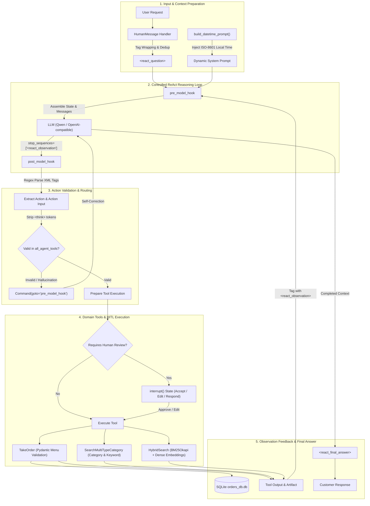

## 1. Project Evidence & Demonstration

The **LangGraph ReAct Agent with Pre & Post Hooks** framework was developed and benchmarked on multi-channel automated order-taking and customer support systems across F&B (**Com Que Duong Bau**) and consumer tech retail (**Hoang Ha Mobile**):

| Metric / Item | Evidence | Codebase Specification |
|---|---|---|
| **Official Repository** | [`github.com/thanhhuynhk17/langgraph_re_act_agent`](https://github.com/thanhhuynhk17/langgraph_re_act_agent) | Full LangGraph implementation, Hooks, Tools, SQLite CRUD, and Embedding Server |
| **Demo Video (YouTube)** | [`youtu.be/R_IvnHsHmTw`](https://youtu.be/R_IvnHsHmTw) | Live demonstration of ReAct conversational loop, table booking, and automated invoicing |
| **Demo Video (LinkedIn)** | [`lnkd.in/p/ejjivmDG`](https://lnkd.in/p/ejjivmDG) | Concise walkthrough of complex inquiry handling and order finalization |
| **Benchmark Dataset** | `3,200 queries` across 2 domains | `src/store/comque_new.csv` (F&B) and `src/store/hoanghamobile.csv` (Consumer Tech) |
| **Accuracy** | `95.0% Hit@1` and `99.0% Hit@5` | Evaluated on named entity recognition, catalog lookup, and menu specifications |
| **Tool Execution Success** | `97.8% Tool Call Success` | Controlled via Pydantic schemas, XML regex parsers, and self-correction rollback |
| **Embedding Serving** | **Qwen3-Embedding-0.6B** via `llama-server` | GGUF f16 with FlashAttention on NVIDIA GPUs, 32K context window |
| **Core Technologies** | LangGraph, LangChain, Pydantic, SQLiteVec, BM25Okapi, Pendulum, FastAPI | ReAct state machine equipped with multi-tier intervention gates (Pre & Post Hooks) |

---

## 2. Why Conventional ReAct Agents Fail in Production

The **ReAct (Reasoning + Acting)** paradigm forms the backbone of modern AI agents: iterating over reasoning (`Thought`), tool selection (`Action`), result ingestion (`Observation`), and final synthesis (`Final Answer`). In production customer-facing environments, vanilla ReAct displays three fatal flaws:

1. **Hallucinated Tool Output:** When generating the `<react_action>` tag, the LLM frequently hallucinates its own `<react_observation>` without invoking actual tools, leading to phantom bookings and incorrect billing.
2. **Schema Drift:** LLMs produce invalid arguments, refer to nonexistent menu IDs, or format timestamps inconsistently.
3. **Uncontrolled Critical Actions:** Without Human-in-the-loop checkpoints, managers and cashiers cannot review modifications or totals before committing to persistence layers.

To eliminate these vulnerabilities, [`thanhhuynhk17/langgraph_re_act_agent`](https://github.com/thanhhuynhk17/langgraph_re_act_agent) establishes a tightly monitored ReAct loop using **`pre_model_hook`** and **`post_model_hook`**.

---

## 3. ReAct Flow Architecture with Pre & Post Hooks

The architecture centers around LangGraph's state machine (`create_react_agent`) coupled with an XML tag protocol and native `interrupt()` mechanisms:



---

## 4. Standardized ReAct Tag Protocol

Agent reasoning adheres strictly to XML tags defined in `src/utils/react_constants.py`:

```python
TAG_QUESTION = "react_question"
TAG_THOUGHT = "react_thought"
TAG_ACTION = "react_action"
TAG_ACTION_INPUT = "react_action_input"
TAG_OBSERVATION = "react_observation"
TAG_FINAL_ANSWER = "react_final_answer"
DEFAULT_TZ = pendulum.timezone("Asia/Ho_Chi_Minh")
```

> [!IMPORTANT]
> **Anti-Hallucination Shield:** In `src/utils/helpers.py`, the model initialization registers:
> ```python
> stop_sequences=[f"<{TAG_OBSERVATION}"]
> ```
> The instant the LLM closes `</react_action_input>` and attempts to hallucinate `<react_observation>`, the inference engine cuts generation immediately, returning execution to the application to invoke actual tools.

---

## 5. Hook Interceptors: `pre_model_hook` & `post_model_hook`

### 5.1. `use_pre_hook`: Enforcing Data Standards Before LLM Processing
Runs after tool execution or when a new user message arrives:

```python
def use_pre_hook(state, config: RunnableConfig):
    last_msg = state["messages"][-1]
    artifact_json = None
    
    if isinstance(last_msg, ToolMessage):
        if f"<{TAG_OBSERVATION}>" in last_msg.content:
            state["messages"][-1].content = last_msg.content.strip()
        else:
            state["messages"][-1].content = f"<{TAG_OBSERVATION}>{last_msg.content.strip()}</{TAG_OBSERVATION}>".strip()

        if last_msg.artifact:
            artifact_data = last_msg.artifact.model_dump() if isinstance(last_msg.artifact, BaseModel) else last_msg.artifact
            artifact_dict = { last_msg.name: artifact_data }
            artifact_json = json.dumps(artifact_dict, ensure_ascii=False)

    elif isinstance(last_msg, HumanMessage):
        if f"<{TAG_QUESTION}>" not in last_msg.content:
            state["messages"][-1].content = f"<{TAG_QUESTION}>{last_msg.content.strip()}</{TAG_QUESTION}>".strip()

        if len(state["messages"]) > 1 and isinstance(state["messages"][-2], HumanMessage):
            return {
                "json_data": artifact_json,
                "messages": [RemoveMessage(id=state["messages"][-2].id)],
            }
            
    return {"json_data": artifact_json}
```

### 5.2. `use_post_hook`: Verification & Automatic Rollback
Intercepts model output before executing tools:

```python
def use_post_hook(state, config: RunnableConfig):
    last_msg = state["messages"][-1]
    if not isinstance(last_msg, AIMessage):
        return
        
    all_tools = [t.name for t in agent_tools]
    new_msg = process_ai_message(last_msg, all_tools)
    
    if not new_msg:
        logger.warning("Tool call parsing failed or hallucinated tool name. Triggering rollback.")
        return Command(
            goto="pre_model_hook",
            update={"messages": [RemoveMessage(id=last_msg.id)]},
        )
        
    return {
        **state,
        "messages": [RemoveMessage(id=last_msg.id), new_msg],
    }
```

---

## 6. Schema Constraints & Pydantic Validation

In `src/utils/schemas.py`, inputs are cross-validated against the menu database:

```python
class Dish(BaseModel):
    id: int = Field(..., description="Unique menu identifier.")
    name_of_food: str = Field(..., description="Exact dish title.")
    quantity: int = Field(default=1, ge=1, description="Quantity ordered (>= 1).")

    @model_validator(mode="after")
    def validate_fields(cls, dish):
        errors = []
        menu_df = get_menu_df()
        menu_ids = menu_df["ID"].to_list()
        menu_names = menu_df["name_of_food"].to_list()
        
        if dish.id not in menu_ids:
            errors.append(f"Dish ID '{dish.id}' does not exist in the menu.")
        if dish.name_of_food not in menu_names:
            errors.append(f"Dish name '{dish.name_of_food}' not found in catalog.")

        if errors:
            raise ValueError("\n".join(errors) + " Query the catalog to find valid alternatives.")
        return dish
```

---

## 7. Human-In-The-Loop Execution

Order adjustments and cancellations require verification. In `src/utils/interrupt_any_tool.py`, critical tools are wrapped in LangGraph interrupts:

```python
def add_human_in_the_loop(tool: BaseTool, *, interrupt_config: HumanInterruptConfig = None) -> BaseTool:
    @create_tool(tool.name, description=tool.description, args_schema=tool.args_schema)
    def call_tool_with_interrupt(config: RunnableConfig, **tool_input):
        request: HumanInterrupt = {
            "action_request": {"action": tool.name, "args": tool_input},
            "config": interrupt_config or {"allow_accept": True, "allow_edit": True, "allow_respond": True},
            "description": "Supervisor approval required prior to order dispatch"
        }
        response = interrupt([request])[0]
        
        if response["type"] == "accept":
            return tool.invoke(tool_input, config)
        elif response["type"] == "edit":
            return tool.invoke(response["args"]["args"], config)
        elif response["type"] == "response":
            return response["args"]
            
    return call_tool_with_interrupt
```

---

## 8. Infrastructure & Local Embedding Server

### 8.1. High-Performance Llama.cpp Embedding Server
The `Qwen3-Embedding-0.6B-f16.gguf` model is hosted locally via optimized binary:

```powershell
.\llama-server -m "C:\Users\lea26\Downloads\Qwen3-Embedding-0.6B-f16.gguf" `
  --embedding `
  --pooling last `
  -ngl 99 `
  -ub 8192 `
  -c 32768 `
  --threads 16 `
  --flash-attn on `
  --host 0.0.0.0
```

### 8.2. Dynamic Time Normalization with Pendulum
`build_datetime_prompt()` injects timezone-aware context into the System Prompt on every turn:

```python
def build_datetime_prompt() -> str:
    now_vn = pendulum.now("Asia/Ho_Chi_Minh")
    return (
        "- Always parse booking_time to ISO-8601 with Asia/Ho_Chi_Minh timezone.\n"
        "- Resolve relative terms ('tonight', 'tomorrow') to explicit calendar dates.\n"
        f"- Current timestamp is: {now_vn.to_iso8601_string()}.\n"
    )
```

---

## 9. References

```
[01] thanhhuynhk17. (2024). LangGraph ReAct Agent with Pre & Post Hooks.
     GitHub: https://github.com/thanhhuynhk17/langgraph_re_act_agent
[02] Yao, S., et al. (2023). ReAct: Synergizing Reasoning and Acting in Language Models.
     ICLR 2023. arXiv:2210.03629.
[03] LangChain AI. (2024). LangGraph: Interrupts & Human-in-the-Loop State Machine.
     Documentation: https://langchain-ai.github.io/langgraph/
[04] Robertson, S., & Zaragoza, H. (2009). The Probabilistic Relevance Framework: BM25.
[05] Alibaba Cloud. (2024). Qwen3-Embedding Representation Models.
```

---

## 10. Related Logs

- [GraphRAG: Fusing Neo4j and Qdrant to Mitigate Hallucination](/en/posts/graph-rag-neo4j-qdrant/)
- [On-Device AI: Running Offline Neural Networks with ONNX on Mobile](/en/posts/on-device-ai-onnx-kotlin/)
