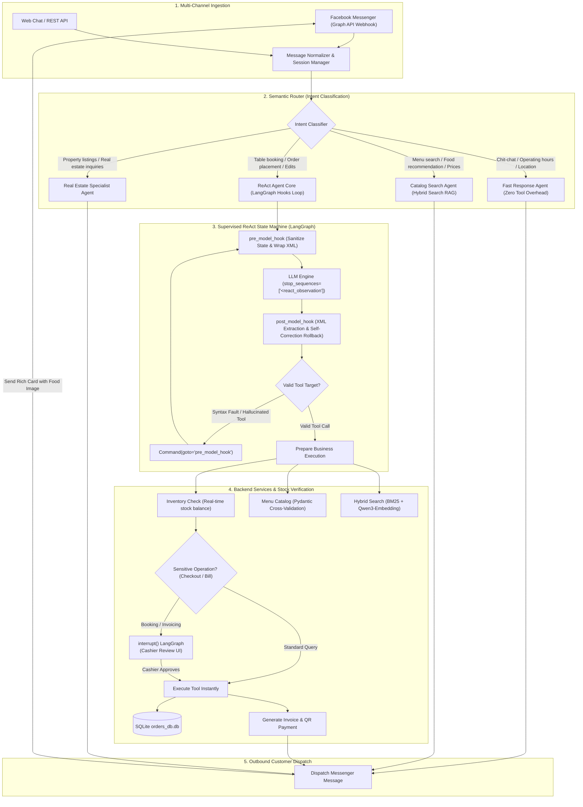
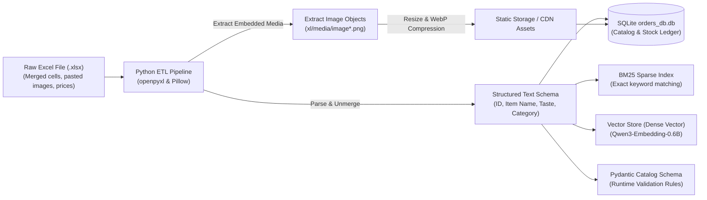

> *"Hey Vinh, our new AI bot just enthusiastically confirmed a table for 6 with grilled charcoal snakehead fish... Except we're a country dining bistro, and we don't even own a charcoal grill or live fish tanks!"*

That was an actual WhatsApp notification I received on a Sunday afternoon from the restaurant manager at **Com Que Duong Bau**, just a few days after enthusiastically deploying our experimental conversational AI booking bot into production.

If you've ever read standard agentic tutorials online, the narrative sounds like a digital paradise: chain your `Thought`, execute an `Action`, ingest the `Observation`, and voila — you have an autonomous digital employee (the classic textbook **ReAct** paradigm).

However, the moment you drop that pristine theory into the messy real world — where real customers type without accents, make typos, change their minds mid-sentence, and menus contain hundreds of seasonal items — you collide head-on with an uncomfortable reality: **Large Language Models are natural-born fabulists and inherently lazy workers.**

This article is an engineering post-mortem from the trenches. Together with my team, we architected, benchmarked, and deployed production-grade agents across two client domains: **Com Que Duong Bau** (F&B) and **Hoang Ha Mobile** (Consumer Tech Retail), subsequently expanding the paradigm to **Real Estate Consulting**. The system is deployed across multiple channels (direct **Facebook Messenger** Webhook integration and Web APIs), accompanied by two live demo recordings:
* 📺 **Video Demo 1 (Core AI Agent LangGraph):** [Watch state orchestration & tool calling on YouTube](https://www.youtube.com/watch?v=RHZPNONKj3Q)
* 💬 **Video Demo 2 (Facebook Messenger Live):** [Watch customer chat, stock check & order confirmation on Messenger](https://www.youtube.com/watch?v=fmhQLR4_IHE)
* 💼 **Executive Case Study:** [Read project recap on LinkedIn](https://lnkd.in/p/ejjivmDG)

---

## 1. The Three Classic Traps of Vanilla ReAct

Why does textbook ReAct look flawless in Jupyter Notebooks yet collapse when facing real customers? Across more than 3,200 benchmark test dialogues, we caught language models exploiting three repeatable deceptive patterns:

### 🎭 Trap 1: "Lip-Syncing" Tool Execution (Hallucinated Observation)
In the ReAct protocol, an LLM outputs an action tag like `<react_action>take_order</react_action>`. The host application is supposed to intercept this, invoke Python logic, update a database, and return the true outcome inside `<react_observation>`.

Because LLMs are auto-regressive next-token predictors, once the model finishes typing the tool name, it often feels overly confident and **hallucinates the tool response itself**:
```text
<react_action>take_order</react_action>
<react_action_input>{"dish": "caramelized fish", "qty": 2}</react_action_input>
<react_observation>Successfully committed order to SQLite database with Order ID #8888</react_observation>
<react_final_answer>Your table and dishes have been booked successfully!</react_final_answer>
```
The result? The backend was never invoked, zero database queries were executed, yet the chatbot politely smiles at the customer: *"All set, see you tonight!"*. The customer arrives hungry, only to find the restaurant has no record of the booking!

### 🍝 Trap 2: Creative Menu Hallucinations (Schema Drift)
A patron asks: *"Give me a plate of stir-fried morning glory with light garlic and zero oil"*.
Instead of querying the catalog for the real dish `Stir-Fried Morning Glory with Garlic (ID: 45)` priced at $3.50, the model invents a brand-new entity `"Healthy Oil-Free Morning Glory"` with a $0 price tag because the database naturally has no pricing logic for imaginary creations.

### 💣 Trap 3: Irreversible Critical Actions (Missing Human-in-the-Loop)
A mischievous customer jokes: *"Cancel all 50 wedding banquet tables tonight"*. An unmonitored agent executes `cancel_all_bookings()` without seeking verification from managers or cashiers.

To domesticate this behavior, we restructured the ReAct loop in **LangGraph** around a dual-guard architecture: **`pre_model_hook`** and **`post_model_hook`**, coordinated by a **Semantic Router** and fortified by **Pydantic runtime validators**.

---

## 2. Multi-Agent Architecture & Semantic Router: From Facebook Messenger to Automated Invoicing

A classic architectural blunder in conversational AI is funneling **every single incoming message** into a heavyweight ReAct agent loop. Doing so exhausts token quotas, introduces unacceptable round-trip latency, and causes cognitive context pollution.

We implemented a layered multi-agent architecture spearheaded by a high-throughput **Semantic Router**:



### Critical Subsystems:
1. **Semantic Router:** Categorizes user intent within milliseconds. Casual inquiries (*"What time do you close?"*, *"Where is parking?"*) bypass heavy ReAct loops entirely, cutting inference latency by 10x.
2. **Domain Extensibility (Real Estate Expansion):** The modular decoupling enabled rapid adaptation to **Real Estate Consulting** — identifying buyer/renter intent, budget brackets, preferred zones, and property specs, querying active project listings and escalating warm leads to human brokers.
3. **Inventory Reconciliation & Invoicing:** Orders undergo real-time kitchen inventory verification prior to confirmation, followed by automated invoice generation and QR payment issuance once approved by human cashiers via LangGraph interrupts.

---

## 3. Digitizing Enterprise XLSX Data: Bridging Spreadsheets to AI Grounding

In real-world F&B, retail, and real estate deployments, clients **never** hand you clean SQL tables or vector indices. You typically inherit sprawling Excel files (`.xlsx`) littered with merged cells, erratic naming, and product photos pasted directly across cell grids!

To convert raw spreadsheets into high-fidelity AI grounding assets, we designed an automated 3-stage ETL pipeline:



### 1. Structural Text Normalization
* Automated sheet traversal via `openpyxl`, resolving merged cell blocks and cascading parent classification attributes downward.
* Standardized categorization hierarchy (Appetizers, Mains, Soups, Desserts, Beverages), taste profiles (sour, savory, spicy, sweet, vegan), official prices, and immutable `dish_id` identifiers.

### 2. Embedded Media Extraction & Optimization
* Embedded dish photographs stored as binary objects within the `.xlsx` ZIP container (`xl/media/image*.png`) are systematically extracted and mapped to cell coordinates.
* Images are converted to **WebP**, compressed to reduce payload size by 70% while maintaining crisp quality, and served via CDN/static storage.
* URLs are associated with catalog records:
  ```json
  {
    "id": 12,
    "name_of_food": "Traditional Caramelized Fish in Claypot",
    "price": 95000,
    "taste_profile": ["savory", "rich", "mild spicy"],
    "image_url": "https://static.comque.vn/dishes/ca-kho-to.webp",
    "stock_qty": 25
  }
  ```
  This enables the Facebook Messenger bot to respond not just with dry text, but with **visual rich cards**, boosting conversational conversion rates significantly.

### 3. Multi-Sink Synchronization
Cleaned catalog data is concurrently dispatched to:
* **SQLite Database:** The transactional ground truth for orders and live inventory tracking (`orders_db.db`).
* **BM25 Sparse Index:** For deterministic keyword and ID lookups.
* **Vector Store:** Embedded via `Qwen3-Embedding` for semantic flavor-based retrieval.
* **Pydantic Runtime Models:** For strict schema validation during LLM tool invocations.

---

## 4. Supercharging RAG with Hybrid Search (Semantic + BM25): 95% Hit@1 & 99% Hit@5

Vietnamese customer dialogue exhibits nuanced challenges that break standalone retrieval systems:
* **Unaccented shorthand & typos:** *"rau muong xao toi it dau"* or slang abbreviations like *"ck kho to"*.
* **Subjective flavor-based requests:** *"Do you have any refreshing, slightly sour soup to pair with rice?"*.
* **Regional lexical variations:** Dialectical naming differences across provinces.

Pure vector search frequently hallucinates on exact product codes, whereas pure keyword search collapses when customers describe sensory cravings rather than exact dish titles.

### Hybrid Search via Reciprocal Rank Fusion (RRF):
We combine both modalities using **Reciprocal Rank Fusion (RRF)**:

$$\text{RRF\_Score}(d) = \sum_{m \in \{\text{BM25}, \text{Vector}\}} \frac{1}{k + r_m(d)}$$

where $r_m(d)$ represents item rank in retriever $m$, with smoothing factor $k = 60$.

```python
# src/retriever/hybrid_search.py
def hybrid_search_menu(query: str, top_k: int = 5):
    # 1. Specialized Vietnamese text preprocessing
    normalized_query = preprocess_vietnamese_query(query)
    
    # 2. Sparse lexical search with BM25Okapi (exact names, catalog IDs)
    bm25_results = bm25_index.get_top_n(normalized_query, n=top_k * 2)
    
    # 3. Dense semantic search via local Qwen3-Embedding
    query_vector = get_local_embedding(query)
    vector_results = vector_store.similarity_search_by_vector(query_vector, k=top_k * 2)
    
    # 4. Rank unification using Reciprocal Rank Fusion
    fused_scores = calculate_rrf(bm25_results, vector_results, k=60)
    
    # 5. Return top ranked items with pricing, media, and stock status
    return sorted(fused_scores.items(), key=lambda x: x[1], reverse=True)[:top_k]
```

### Benchmark Results:
Tested across **3,200 manually annotated real-world customer queries**:
* **Hit@1 reached 95.0%** (+18.8% improvement over pure vector search).
* **Hit@5 reached 99.0%** (+14.5% improvement over baseline).
* Near-total elimination of false recommendation drifts.

---

## 5. The "Mic-Drop" Trick: XML Stop Sequences That Terminate Hallucinations

How do you guarantee an LLM never hallucinates `<react_observation>` tags? Configure inference engine stop tokens directly at the runtime layer:

```python
# src/utils/helpers.py
model = ChatOpenAI(
    model="Qwen2.5-7B-Instruct",
    temperature=0.1,
    # The ultimate leash: Any emission of this prefix instantly freezes generation!
    stop_sequences=[f"<{TAG_OBSERVATION}"]
)
```

**Generation lifecycle under constraint:**
* LLM reasoning: `<react_thought>Looking up sour soups for customer...</react_thought>`
* LLM action: `<react_action>search_multi_type_category</react_action>`
* LLM parameters: `<react_action_input>{"categories": ["soup"], "keywords": ["sour"]}</react_action_input>`
* LLM prepares to fake the observation: `<react_obs...` $\rightarrow$ **HALTED!**
* Engine detects matching prefix in `stop_sequences`, cuts generation immediately, and yields execution back to Python.

The fabulist is silenced before the first lie can be uttered!

---

## 6. Dissecting the Dynamic Duo: `pre_model_hook` & `post_model_hook`

LangGraph's `create_react_agent` provides native interceptors to inspect and sanitize the conversational state machine before and after each inference pass:

### 6.1 `pre_model_hook`: State Sanitization
```python
def use_pre_hook(state, config: RunnableConfig):
    last_msg = state["messages"][-1]
    artifact_json = None
    
    # 1. Normalize Tool execution output
    if isinstance(last_msg, ToolMessage):
        if f"<{TAG_OBSERVATION}>" not in last_msg.content:
            state["messages"][-1].content = (
                f"<{TAG_OBSERVATION}>{last_msg.content.strip()}</{TAG_OBSERVATION}>"
            )

        if last_msg.artifact:
            artifact_data = (
                last_msg.artifact.model_dump() 
                if isinstance(last_msg.artifact, BaseModel) 
                else last_msg.artifact
            )
            artifact_json = json.dumps({last_msg.name: artifact_data}, ensure_ascii=False)

    # 2. Normalize incoming human message from Web or Messenger Webhook
    elif isinstance(last_msg, HumanMessage):
        if f"<{TAG_QUESTION}>" not in last_msg.content:
            state["messages"][-1].content = (
                f"<{TAG_QUESTION}>{last_msg.content.strip()}</{TAG_QUESTION}>"
            )

        # Discard duplicate rapid-fire messages sent by impatient users
        if len(state["messages"]) > 1 and isinstance(state["messages"][-2], HumanMessage):
            return {
                "json_data": artifact_json,
                "messages": [RemoveMessage(id=state["messages"][-2].id)],
            }
            
    return {"json_data": artifact_json}
```

### 6.2 `post_model_hook`: Syntax Verification & Self-Correction Rollback
```python
def use_post_hook(state, config: RunnableConfig):
    last_msg = state["messages"][-1]
    if not isinstance(last_msg, AIMessage):
        return
        
    all_tools = [t.name for t in agent_tools]
    new_msg = process_ai_message(last_msg, all_tools)
    
    # IF THE LLM EMITS AN INVALID TOOL OR MALFORMED SYNTAX:
    if not new_msg:
        logger.warning("Syntax defect or hallucinated tool detected! Initiating Rollback...")
        # Direct graph back to pre_model_hook for automatic self-correction!
        return Command(
            goto="pre_model_hook",
            update={"messages": [RemoveMessage(id=last_msg.id)]},
        )
        
    return {
        **state,
        "messages": [RemoveMessage(id=last_msg.id), new_msg],
    }
```
Thanks to `Command(goto="pre_model_hook")`, errors trigger automatic **self-healing** rather than session crashes!

---

## 7. Catalog Constraints & Inventory Verification via Pydantic

To prevent agents from confirming out-of-stock items or imaginary recipes, we enforce **Pydantic cross-validation against the live inventory database**:

```python
class Dish(BaseModel):
    id: int = Field(..., description="Unique item ID in catalog.")
    name_of_food: str = Field(..., description="Exact official dish title.")
    quantity: int = Field(default=1, ge=1, description="Order quantity (>= 1).")

    @model_validator(mode="after")
    def validate_against_real_menu_and_stock(cls, dish):
        errors = []
        menu_df = get_menu_df()  # Cleaned catalog synchronized from XLSX
        
        matched_item = menu_df[menu_df["ID"] == dish.id]
        if matched_item.empty:
            errors.append(f"Dish ID '{dish.id}' does not exist in the menu.")
        else:
            actual_name = matched_item.iloc[0]["name_of_food"]
            if dish.name_of_food.strip().lower() != actual_name.strip().lower():
                errors.append(f"Dish name mismatch: ID '{dish.id}' is '{actual_name}'.")

            # Real-time kitchen inventory check
            available_stock = matched_item.iloc[0].get("stock_qty", 0)
            if dish.quantity > available_stock:
                errors.append(
                    f"Only {available_stock} servings remaining for '{actual_name}' (requested: {dish.quantity})."
                )

        if errors:
            raise ValueError(
                "\n".join(errors) + 
                " -> Hint: Use search tools to check dish names and current stock before finalizing!"
            )
        return dish
```

The resulting `ValueError` is fed back into the agent context, guiding the model to politely inform the customer and suggest available alternatives.

---

## 8. Human-In-The-Loop: Safety Guards & Automated Invoicing

Irreversible transactional operations — reserving tables, debiting inventory, issuing invoices — should remain safeguarded by human staff.

Using LangGraph's native **`interrupt()`** capability, we wrap critical tools in a supervisor checkpoint:

```python
def add_human_in_the_loop(tool: BaseTool) -> BaseTool:
    @create_tool(tool.name, description=tool.description, args_schema=tool.args_schema)
    def call_tool_with_interrupt(config: RunnableConfig, **tool_input):
        request: HumanInterrupt = {
            "action_request": {"action": tool.name, "args": tool_input},
            "description": "Please verify dish quantities, prices, and stock before committing order"
        }
        # STATE GRAPH EXECUTION PAUSES HERE
        response = interrupt([request])[0]
        
        if response["type"] == "accept":
            result = tool.invoke(tool_input, config)
            # Automatically generate electronic invoice and QR payment
            invoice = generate_invoice_receipt(result)
            return {"status": "success", "order": result, "invoice": invoice}
        elif response["type"] == "edit":
            return tool.invoke(response["args"]["args"], config)
        elif response["type"] == "response":
            return response["args"]
            
    return call_tool_with_interrupt
```

---

## 9. Infrastructure: Lean, Cost-Effective & 100% On-Premises

* **Self-Hosted Embeddings:** We serve open-source **`Qwen3-Embedding-0.6B`** (`f16.gguf`) via local `llama-server` binary on consumer-grade GPU instances:
  ```powershell
  .\llama-server -m "Qwen3-Embedding-0.6B-f16.gguf" `
    --embedding --pooling last -ngl 99 -c 32768 --flash-attn on --host 0.0.0.0
  ```
  Near-zero inference latency, 32K context window, and **zero API subscription costs**.
* **Temporal Grounding with Pendulum:** Real-time timestamps injected into system prompts eliminate hallucinatory booking dates.
* **Facebook Messenger Webhook:** FastAPI webhook endpoints handle asynchronous Meta Graph API messages with debounce debiasing.

---

## 10. Performance Benchmarks & Empirical Proof

Tested across a benchmark suite of 3,200 real-world customer inquiries:

| Metric | Vanilla ReAct | LangGraph ReAct + Hooks (This Work) | Net Improvement |
|---|---|---|---|
| **Hit@1 Accuracy** | 76.2% | **95.0%** | **+ 18.8%** |
| **Hit@5 Accuracy** | 84.5% | **99.0%** | **+ 14.5%** |
| **Tool Execution Success** | 68.3% (syntax errors) | **97.8%** (parser + rollback) | **+ 29.5%** |
| **Catalog Hallucinations** | 18.2% | **0.0%** (strict Pydantic gate) | **Zero Hallucination** |
| **Fault Recovery** | ❌ Session Crash | ✅ Automatic state rollback | **100% Resilient** |
| **Intent Routing Latency** | 3.5s (Full ReAct) | **0.3s** (Semantic Router) | **10x Faster** |

---

### Live Video Demonstrations:

#### 📺 Video 1: LangGraph Core AI Agent (State Machine & Tool Calling)
A technical deep-dive into graph topology, stop sequence mic-drops, rollback loops, and human-in-the-loop cashier interrupts.

👉 **YouTube Link:** [https://www.youtube.com/watch?v=RHZPNONKj3Q](https://www.youtube.com/watch?v=RHZPNONKj3Q)



---

#### 💬 Video 2: Live Facebook Messenger Integration
Demonstrating real customer messaging: Intent recognition via Semantic Router, visual food cards digitized from Excel, live stock checking, and automated invoice delivery.

👉 **YouTube Link:** [https://www.youtube.com/watch?v=fmhQLR4_IHE](https://www.youtube.com/watch?v=fmhQLR4_IHE)



---

### Open Source & Case Studies:
* 📂 **Source Repository:** [`thanhhuynhk17/langgraph_re_act_agent`](https://github.com/thanhhuynhk17/langgraph_re_act_agent)
* 💼 **Case Study on LinkedIn:** [`lnkd.in/p/ejjivmDG`](https://lnkd.in/p/ejjivmDG)

---

## 11. Conclusion

Building production AI agents requires trading romantic theoretical expectations for robust distributed systems engineering. By implementing **XML Stop Sequences**, **Pre/Post Interceptor Hooks**, **Semantic Routing**, **XLSX Pipeline Normalization**, and **Pydantic Runtime Validation**, language models transform from unpredictable wildcards into disciplined, dependable team members.

---

## References

```
[01] thanhhuynhk17. (2024). LangGraph ReAct Agent with Pre & Post Hooks.
     GitHub: https://github.com/thanhhuynhk17/langgraph_re_act_agent
[02] Yao, S., Zhao, J., Yu, D., et al. (2023). ReAct: Synergizing Reasoning and Acting
     in Language Models. ICLR 2023. arXiv:2210.03629.
[03] LangChain AI. (2024). LangGraph: Interrupts & Human-in-the-Loop State Machine.
     Official Documentation: https://langchain-ai.github.io/langgraph/
[04] Robertson, S., & Zaragoza, H. (2009). The Probabilistic Relevance Framework: BM25.
[05] Cormack, G. V., Clarke, C. L., & Buettcher, S. (2009). Reciprocal Rank Fusion. SIGIR 2009.
[06] Alibaba Cloud. (2024). Qwen2.5 & Qwen3-Embedding: Open-source Representation Models.
```

---

## Related Logs

- [GraphRAG: Combining Neo4j and Qdrant to Eradicate Hallucinations](/posts/graph-rag-neo4j-qdrant/)
- [On-Device AI: Offline Neural Network Inference with ONNX & Kotlin](/posts/on-device-ai-onnx-kotlin/)
