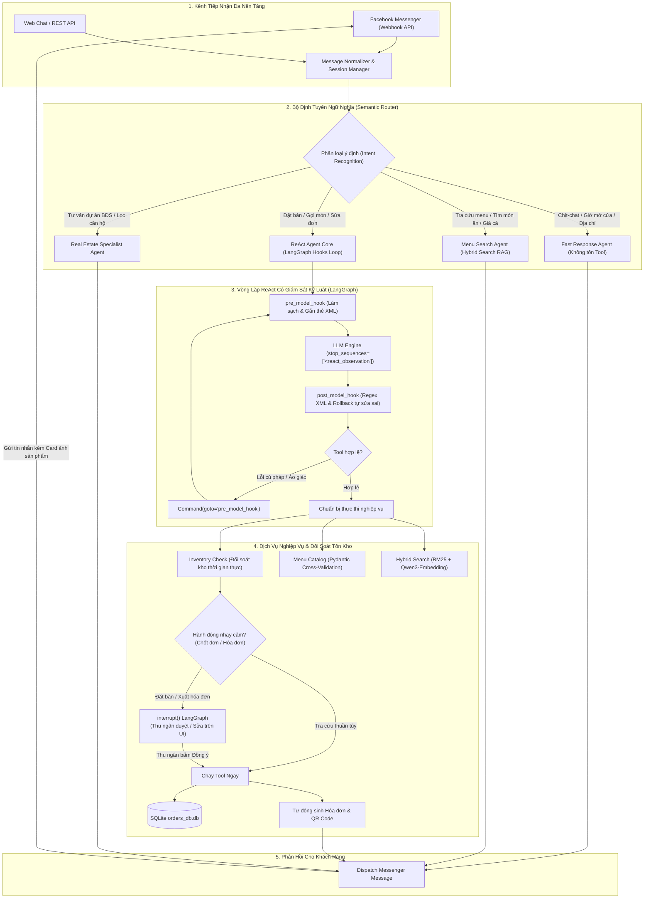
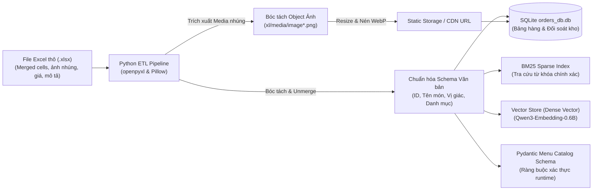

> *"Anh ơi, bot nhà mình chốt đơn bàn 6 người ăn cá lăng nướng muối ớt ngon lành lắm... Cơ mà quán mình bán cơm quê, làm gì có cá lăng với bếp than đâu anh?!"*

Đó là tin nhắn tôi nhận được từ người quản lý quán **Cơm Quê Dượng Bầu** vào một buổi chiều chủ nhật, sau vài ngày háo hức thử nghiệm chatbot đặt bàn tự động bằng AI.

Nếu bạn từng đọc các bài tutorial hướng dẫn làm AI Agent trên mạng, mọi thứ nghe như một giấc mơ công nghệ: chỉ cần kết hợp suy luận (`Thought`), gọi công cụ (`Action`), nhận kết quả (`Observation`), thế là bạn đã có một trợ lý siêu phàm biết tự suy nghĩ và hành động (mô hình **ReAct** kinh điển).

Nhưng khi đem giấc mơ đó ném vào môi trường thực tế — nơi khách hàng nhắn tin không dấu, gõ sai chính tả, hỏi dồn dập và thực đơn thì có cả trăm món — bạn sẽ sớm nhận ra một sự thật cay đắng: **LLM là những kẻ nói dối thiên bẩm và cực kỳ lười biếng.**

Bài viết này là nhật ký rút ruột từ dự án thực chiến mà tôi và đồng đội xây dựng cho hai khách hàng thực tế: quán ăn **Cơm Quê Dượng Bầu** (chuỗi F&B) và chuỗi bán lẻ công nghệ **Hoàng Hà Mobile**, đồng thời mở rộng mô hình sang bài toán **Tư vấn Bất động sản**. Hệ thống được triển khai đa kênh (tích hợp trực tiếp **Facebook Messenger** và Web API), đi kèm 2 video demo thực tế:
* 📺 **Video Demo 1 (Core AI Agent LangGraph):** [Xem quy trình điều phối & Tool Calling trên YouTube](https://www.youtube.com/watch?v=RHZPNONKj3Q)
* 💬 **Video Demo 2 (Facebook Messenger Live):** [Xem bot CSKH tự động tư vấn & chốt đơn trên Facebook Messenger](https://www.youtube.com/watch?v=fmhQLR4_IHE)
* 💼 **Bản tóm tắt trên LinkedIn:** [Xem bài chia sẻ case-study trên LinkedIn](https://lnkd.in/p/ejjivmDG)

---

## 1. Ba "Cú Lừa" Kinh Điển Của ReAct Agent Mặc Định

Tại sao ReAct Agent trong sách giáo khoa thì mượt, mà ra đời thật lại hay "ăn gạch"? Qua hàng nghìn lượt test trên tập dữ liệu hơn 3.200 câu hỏi thực tế, chúng tôi bắt quả tang 3 chiêu trò quen thuộc của mô hình ngôn ngữ lớn:

### 🎭 Cú lừa 1: "Hát nhép" kết quả Tool (Hallucinated Observation)
Trong giao thức ReAct, mô hình phải sinh ra thẻ gọi tool dạng `<react_action>take_order</react_action>`. Sau đó, hệ thống backend sẽ chạy hàm Python, kết nối database và trả về kết quả thật bên trong thẻ `<react_observation>`.

Nhưng vì bản chất của LLM là mô hình dự đoán từ tiếp theo (next-token prediction), khi vừa gõ xong tên Tool, nó... **ngứa tay gõ luôn cả thẻ kết quả giả tưởng**:
```text
<react_action>take_order</react_action>
<react_action_input>{"dish": "cá kho", "qty": 2}</react_action_input>
<react_observation>Đã lưu đơn hàng vào SQLite thành công với mã đơn #8888</react_observation>
<react_final_answer>Dạ em đã lên đơn thành công cho anh rồi nhé!</react_final_answer>
```
Kết quả? Backend chưa hề được gọi một mili-giây nào, database không có một byte dữ liệu, nhưng con bot đã ung dung quay ra cười duyên và bảo khách: *"Em đặt xong rồi ạ!"*. Khách đến nơi đói meo, còn chủ quán thì ngơ ngác!

### 🍝 Cú lừa 2: "Sáng tạo thực đơn" (Schema Drift)
Khách bảo: *"Cho anh đĩa rau muống xào tỏi ít dầu nhe"*.
Thay vì tra danh mục để lấy đúng ID món `Rau Muống Xào Tỏi (ID: 45)` có giá 45.000đ, LLM sẽ tự tiện gán ID bừa bãi hoặc chế luôn ra món `"Rau muống xào tỏi healthy không dầu"` với giá 0 đồng vì trong database làm gì có quy định giá cho món nó tự nghĩ ra!

### 💣 Cú lừa 3: "Bút sa là gà chết" (Thiếu Human-In-The-Loop)
Một vị khách tinh quái nhắn đùa: *"Hủy hết 50 bàn tiệc cưới tối nay đi em"*. Một agent ngây thơ không có chốt chặn kiểm duyệt sẽ lập tức gọi hàm `delete_all_bookings()` mà không cần bất kỳ sự xác nhận nào từ thu ngân hay quản lý.

Để "thuần hóa" con ngựa bất kham này, chúng tôi đã tái cấu trúc vòng lặp ReAct trên **LangGraph** bằng bộ đôi chốt chặn: **`pre_model_hook`** và **`post_model_hook`**, kết hợp cùng bộ định tuyến ngữ nghĩa **Semantic Router** và bộ kiểm soát dữ liệu **Pydantic**.

---

## 2. Toàn Cảnh Kiến Trúc Multi-Agent & Semantic Router: Tự Động Hóa Từ Facebook Đến Xuất Hóa Đơn

Một sai lầm phổ biến khi xây dựng hệ thống chatbot bán hàng là đưa **mọi** tin nhắn người dùng vào thẳng vòng lặp ReAct. Việc này vừa gây lãng phí chi phí token, vừa làm tăng độ trễ (latency), đồng thời dễ khiến LLM bị "ngợp ngữ cảnh" (context drift).

Chúng tôi thiết kế kiến trúc phân tầng với **Semantic Router (Bộ định tuyến ngữ nghĩa)** làm người điều phối tổng:



### Các mắt xích then chốt trong hệ thống:
1. **Semantic Router (Bộ định tuyến ý định):** Nhận diện ý định khách hàng trong vòng vài mili-giây. Nếu khách chỉ hỏi: *"Quán mở cửa mấy giờ?"* hay *"Địa chỉ ở đâu?"*, hệ thống dùng Fast Response trả lời ngay mà không cần khởi động vòng lặp Agent nặng nề.
2. **Khả năng mở rộng sang Bất Động Sản:** Nhờ Semantic Router module hóa cao, hệ thống không chỉ giải quyết bài toán F&B và bán lẻ di động mà còn mở rộng mượt mà sang **Tư vấn Bất động sản** — tự động nhận diện nhu cầu mua/thuê, khoảng ngân sách, diện tích, vị trí địa lý, tra cứu bảng hàng dự án và điều phối thông tin tới chuyên viên môi giới.
3. **Đối soát tồn kho & Tự động xuất hóa đơn:** Đơn hàng không chỉ được lưu vào database mà còn phải trải qua bước kiểm tra tồn kho thời gian thực (tránh chốt món khi bếp đã hết nguyên liệu) và tự động tạo hóa đơn kèm mã QR thanh toán sau khi thu ngân bấm xác nhận duyệt.

---

## 3. Chuyển Đổi Số Hóa Dữ Liệu Từ XLSX: Cầu Nối Từ Bảng Tính Doanh Nghiệp Đến Tri Thức AI

Trong thực tế, các doanh nghiệp SME, chuỗi nhà hàng hay đại lý phân phối **không bao giờ** cung cấp cho bạn một cơ sở dữ liệu SQL sạch sẽ hay Vector Store sẵn có. Thứ bạn nhận được thường là một file Excel `.xlsx` khổng lồ, đầy những ô merge cell, dữ liệu văn bản gõ tùy hứng và hình ảnh món ăn được chèn trực tiếp vào ô tính!

Nếu không giải quyết triệt để khâu "chuyển đổi số hóa" từ file Excel thô, AI Agent sẽ hoàn toàn mù mờ hoặc đưa ra thông tin sai lệch. Chúng tôi đã thiết kế một pipeline ETL tự động gồm 3 bước:



### 1. Chuẩn hóa cấu trúc văn bản (Text Normalization)
* Sử dụng thư viện `openpyxl` duyệt qua từng sheet, tự động phát hiện và gỡ các ô bị gộp (`unmerge cells`), kế thừa giá trị cha cho các dòng con.
* Chuẩn hóa taxonomy phân loại món: Nhóm món (Khai vị, Món chính, Canh, Đồ xào, Tráng miệng, Thức uống), thuộc tính hương vị (chua, cay, mặn, ngọt, thanh đạm, đồ chay), mức giá niêm yết, đơn vị tính và định danh duy nhất `dish_id`.

### 2. Bóc tách và tối ưu hóa hình ảnh sản phẩm (Image Extraction Pipeline)
* Các hình ảnh món ăn trong Excel được lưu dưới dạng binary object bên trong cấu trúc ZIP của file `.xlsx` (đường dẫn nội bộ `xl/media/image*.png`).
* Pipeline tự động bóc tách từng tệp ảnh, định danh ảnh theo toạ độ ô tính tương ứng với `dish_id`.
* Chuyển đổi định dạng sang **WebP** và nén tối ưu (giảm 70% dung lượng mà vẫn giữ nguyên độ nét), sau đó tải lên máy chủ static file / CDN.
* Gán đường dẫn ảnh trực tiếp vào bảng danh mục trong SQLite:
  ```json
  {
    "id": 12,
    "name_of_food": "Cá kho tộ làng Vũ Đại",
    "price": 95000,
    "taste_profile": ["mặn", "đậm đà", "cay nhẹ"],
    "image_url": "https://static.comque.vn/dishes/ca-kho-to.webp",
    "stock_qty": 25
  }
  ```
  Nhờ bước này, khi AI Agent phản hồi trên **Facebook Messenger**, nó không chỉ nhắn văn bản khô khan mà còn gửi kèm **Rich Cards / Carousel ảnh món ăn thực tế**, tăng tỷ lệ chốt đơn của khách hàng lên gấp nhiều lần!

### 3. Đồng bộ hóa đa tầng (Multi-Sink Synchronization)
Dữ liệu sau khi làm sạch được đồng bộ đồng thời vào:
* **SQLite Database:** Nguồn sự thật phục vụ quản lý đơn hàng và đối soát tồn kho (`orders_db.db`).
* **BM25 Inverted Index:** Phục vụ tra cứu từ khóa chính xác (mã ID, tên món).
* **Dense Vector Database:** Phục vụ tìm kiếm ngữ nghĩa theo nhu cầu khẩu vị.
* **Pydantic Validation Models:** Phục vụ kiểm soát chặt chẽ các lượt gọi Tool của LLM.

---

## 4. Cải Thiện RAG Bằng Hybrid Search (Semantic + BM25): Đạt 95% Hit@1 và 99% Hit@5

Khách hàng Việt Nam khi nhắn tin hỏi món có những thói quen khiến các hệ thống Vector Search truyền thống dễ dàng "đầu hàng":
* **Gõ không dấu hoặc teencode:** *"cho anh 1 dia rau muong xao toi it dau nhe"* hay *"ck kho to con k em"*.
* **Hỏi theo khẩu vị mơ hồ:** *"quán có món gì chua chua thanh mát ăn đỡ ngấy không?"*.
* **Gõ sai chính tả hoặc tên riêng địa phương:** *"thịt kho hột vịt"*, *"thịt kho tàu"*, *"thịt kho quả trứng"*.

Nếu chỉ dùng **Semantic Search (Vector Search)**, mô hình dễ nhầm lẫn giữa các món có tên gần giống nhau hoặc trôi ngữ nghĩa ở các truy vấn cụ thể. Ngược lại, nếu chỉ dùng **BM25 (Keyword Search)**, mô hình sẽ hoàn toàn "bó tay" khi khách mô tả cảm giác vị giác mà không nhắc đích danh tên món.

### Kiến Trúc Tìm Kiếm Lai (Hybrid Search Pipeline):
Chúng tôi kết hợp cả hai phương pháp bằng thuật toán **Reciprocal Rank Fusion (RRF)**:

$$\text{RRF\_Score}(d) = \sum_{m \in \{\text{BM25}, \text{Vector}\}} \frac{1}{k + r_m(d)}$$

Trong đó $r_m(d)$ là thứ hạng của món ăn $d$ trong thuật toán $m$, và hằng số $k = 60$.

```python
# src/retriever/hybrid_search.py
def hybrid_search_menu(query: str, top_k: int = 5):
    # 1. Tiền xử lý tiếng Việt chuyên sâu
    normalized_query = preprocess_vietnamese_query(query)
    
    # 2. Tìm kiếm từ khóa BM25Okapi (bắt chính xác mã món, tên riêng)
    bm25_results = bm25_index.get_top_n(normalized_query, n=top_k * 2)
    
    # 3. Tìm kiếm ngữ nghĩa với Qwen3-Embedding cục bộ
    query_vector = get_local_embedding(query)
    vector_results = vector_store.similarity_search_by_vector(query_vector, k=top_k * 2)
    
    # 4. Hợp nhất thứ hạng Reciprocal Rank Fusion (RRF)
    fused_scores = calculate_rrf(bm25_results, vector_results, k=60)
    
    # 5. Trả về top K món ăn khớp nhất kèm hình ảnh và tồn kho
    return sorted(fused_scores.items(), key=lambda x: x[1], reverse=True)[:top_k]
```

### Bộ Tiền Xử Lý Tiếng Việt Chuyên Sâu:
* Chuẩn hóa Unicode dựng sẵn (NFC) và tổ hợp (NFD).
* Xây dựng từ điển đồng nghĩa (Thesaurus) riêng cho ngành F&B và Bất động sản (ví dụ: *bò cuộn* $\leftrightarrow$ *bò cuộn nấm kim châm*, *bán đảo* $\leftrightarrow$ *căn hộ view sông*).
* Cơ chế tra cứu mờ (Fuzzy Matching) cho các từ khóa gõ sai dấu.

### Kết Quả Thực Nghiệm:
Trên tập benchmark **3.200 câu truy vấn thực tế** được nhóm chúng tôi gán nhãn thủ công từ log chat của khách hàng:
* **Hit@1 đạt 95.0%** (tăng **+18.8%** so với RAG thuần vector).
* **Hit@5 đạt 99.0%** (tăng **+14.5%** so với baseline).
* Gần như triệt tiêu hoàn toàn tình trạng "hỏi món này nhưng bot gợi ý món nọ".

---

## 5. Bí Kíp "Giật Micro": Stop Sequences Đập Tan Ảo Giác

Làm sao để cấm tiệt con bot không được tự gõ `<react_observation>`? Rất đơn giản, hãy cấu hình tham số suy luận tại tầng engine (vLLM hoặc llama-server):

```python
# src/utils/helpers.py
model = ChatOpenAI(
    model="Qwen2.5-7B-Instruct",
    temperature=0.1,
    # "Vòng kim cô" tối thượng: Vừa thấy ký tự này là engine lập tức ngắt suy luận!
    stop_sequences=[f"<{TAG_OBSERVATION}"]
)
```

**Nguyên lý hoạt động cực kỳ thú vị:**
* LLM suy nghĩ: `<react_thought>Mình cần tìm món canh chua theo yêu cầu của khách...</react_thought>`
* LLM chọn tool: `<react_action>search_multi_type_category</react_action>`
* LLM nhập tham số: `<react_action_input>{"categories": ["món canh"], "keywords": ["chua"]}</react_action_input>`
* LLM định táy máy tay chân gõ tiếp: `<react_obs...` $\rightarrow$ **BÙM!** 
* Trình suy luận phát hiện chuỗi nằm trong `stop_sequences`, ngay lập tức **cắt ngang token generation**, giật micro lại và trao quyền điều khiển cho code Python của chúng ta.

Kẻ nói dối vừa định mở miệng bịa chuyện thì đã bị bịt miệng ngay tắp lự!

---

## 6. Giải Phẫu Cặp Bài Trùng: `pre_model_hook` & `post_model_hook`

Trong LangGraph, hàm `create_react_agent` cho phép bạn can thiệp vào trước và sau mỗi bước suy luận thông qua các hook:

### 6.1 `pre_model_hook`: Người dọn bàn tận tụy
Nhiệm vụ của hook này là đảm bảo dữ liệu đưa vào mắt LLM luôn sạch sẽ, ngăn nắp:

```python
def use_pre_hook(state, config: RunnableConfig):
    last_msg = state["messages"][-1]
    artifact_json = None
    
    # 1. Nếu tin nhắn trước đó là kết quả từ Tool:
    if isinstance(last_msg, ToolMessage):
        # Đảm bảo bọc đúng thẻ chuẩn để LLM hiểu đây là dữ liệu thực tế từ hệ thống
        if f"<{TAG_OBSERVATION}>" not in last_msg.content:
            state["messages"][-1].content = (
                f"<{TAG_OBSERVATION}>{last_msg.content.strip()}</{TAG_OBSERVATION}>"
            )

        # Trích xuất dữ liệu có cấu trúc từ Pydantic Model để lưu vào state
        if last_msg.artifact:
            artifact_data = (
                last_msg.artifact.model_dump() 
                if isinstance(last_msg.artifact, BaseModel) 
                else last_msg.artifact
            )
            artifact_json = json.dumps({last_msg.name: artifact_data}, ensure_ascii=False)

    # 2. Nếu là tin nhắn mới từ người dùng (Web hoặc Facebook Messenger Webhook):
    elif isinstance(last_msg, HumanMessage):
        # Bọc thẻ <react_question> để LLM phân biệt câu hỏi của khách với suy nghĩ nội bộ
        if f"<{TAG_QUESTION}>" not in last_msg.content:
            state["messages"][-1].content = (
                f"<{TAG_QUESTION}>{last_msg.content.strip()}</{TAG_QUESTION}>"
            )

        # Xóa tin nhắn rác trùng lặp nếu người dùng bấm gửi liên tục trên Messenger
        if len(state["messages"]) > 1 and isinstance(state["messages"][-2], HumanMessage):
            return {
                "json_data": artifact_json,
                "messages": [RemoveMessage(id=state["messages"][-2].id)],
            }
            
    return {"json_data": artifact_json}
```

### 6.2 `post_model_hook`: Giám định viên khó tính và đòn quay lui (Rollback)
Đây là nơi bắt lỗi thông minh nhất. Sau khi LLM sinh xong câu trả lời, hook này sẽ dùng Regex bóc tách các thẻ XML. Nếu phát hiện LLM gọi một Tool không hề tồn tại (ảo giác tên hàm) hoặc sinh sai cú pháp JSON:

```python
def use_post_hook(state, config: RunnableConfig):
    last_msg = state["messages"][-1]
    if not isinstance(last_msg, AIMessage):
        return
        
    all_tools = [t.name for t in agent_tools]
    
    # Bóc tách cú pháp XML, cắt bỏ các thẻ suy nghĩ dông dài <think>...</think>
    new_msg = process_ai_message(last_msg, all_tools)
    
    # NẾU PHÁT HIỆN LLM GỌI SAI TOOL HOẶC VĂNG LỖI CÚ PHÁP:
    if not new_msg:
        logger.warning("Phát hiện ảo giác cú pháp hoặc gọi Tool lạ! Kích hoạt Rollback...")
        # Lệnh ma thuật của LangGraph: Bắt đồ thị quay lui về pre_model_hook để LLM làm lại!
        return Command(
            goto="pre_model_hook",
            update={"messages": [RemoveMessage(id=last_msg.id)]},
        )
        
    return {
        **state,
        "messages": [RemoveMessage(id=last_msg.id), new_msg],
    }
```
Nhờ cơ chế `Command(goto="pre_model_hook")`, hệ thống có khả năng **tự sửa lỗi (Self-Correction)** mà không làm sập luồng hội thoại của khách!

---

## 7. Ràng Buộc Thực Đơn & Đối Soát Tồn Kho Bằng Pydantic

Khách gọi món thì đa dạng, nhưng cơ sở dữ liệu nhà hàng thì chỉ có từng ấy món và số lượng tồn kho nguyên liệu trong ngày có hạn. Làm sao ép Bot chỉ được chốt những món thực sự có trong bếp và còn hàng?

Câu trả lời là **Cross-Validation với Pydantic validator kết hợp đối soát tồn kho (Inventory Check)**:

```python
class Dish(BaseModel):
    id: int = Field(..., description="ID định danh duy nhất của món ăn trong thực đơn.")
    name_of_food: str = Field(..., description="Tên chính xác của món ăn.")
    quantity: int = Field(default=1, ge=1, description="Số lượng món (>= 1).")

    @model_validator(mode="after")
    def validate_against_real_menu_and_stock(cls, dish):
        errors = []
        menu_df = get_menu_df()  # Đọc từ catalog đã được chuẩn hóa từ file XLSX
        
        # 1. Soi ID có trong thực đơn quán không
        matched_item = menu_df[menu_df["ID"] == dish.id]
        if matched_item.empty:
            errors.append(f"Mã món ID '{dish.id}' không tồn tại trong thực đơn quán.")
        else:
            # 2. Soi Tên món có khớp chính xác từng chữ không
            actual_name = matched_item.iloc[0]["name_of_food"]
            if dish.name_of_food.strip().lower() != actual_name.strip().lower():
                errors.append(f"Tên món '{dish.name_of_food}' không khớp với mã ID '{dish.id}' (Tên đúng: '{actual_name}').")

            # 3. Đối soát tồn kho thời gian thực (Inventory Reconciliation)
            available_stock = matched_item.iloc[0].get("stock_qty", 0)
            if dish.quantity > available_stock:
                errors.append(
                    f"Món '{actual_name}' chỉ còn {available_stock} phần trong ngày (khách đặt: {dish.quantity})."
                )

        # Nếu có lỗi, quăng Exception kèm lời nhắc nhở thân thương cho LLM
        if errors:
            raise ValueError(
                "\n".join(errors) + 
                " -> Gợi ý: Hãy dùng công cụ tra cứu danh mục để kiểm tra lại món và tồn kho trước khi chốt đơn!"
            )
        return dish
```

Khi Pydantic quăng lỗi `ValueError`, lỗi này sẽ được gói gọn trả về lại cho LLM đọc. Con bot lập tức hiểu rằng: *"À, món này quán đã hết hàng hoặc sai tên, mình phải tư vấn món khác cho khách!"*. Hoàn toàn tự động và an toàn tuyệt đối.

---

## 8. Human-In-The-Loop: Chừa Lại Chiếc Phao Cứu Sinh & Tự Động Xuất Hóa Đơn

Dù AI có thông minh đến đâu, việc ghi đơn vào sổ cái kế toán, trừ tồn kho hay xuất hóa đơn vẫn nên có sự kiểm duyệt của con người.

LangGraph hỗ trợ tính năng **`interrupt()`** cực kỳ mạnh mẽ. Chúng tôi tạo một hàm bọc (decorator) `add_human_in_the_loop` cho các tool nhạy cảm:

```python
def add_human_in_the_loop(tool: BaseTool) -> BaseTool:
    @create_tool(tool.name, description=tool.description, args_schema=tool.args_schema)
    def call_tool_with_interrupt(config: RunnableConfig, **tool_input):
        # Đóng băng đồ thị, gửi thông báo kèm nút bấm lên màn hình thu ngân
        request: HumanInterrupt = {
            "action_request": {"action": tool.name, "args": tool_input},
            "description": "Yêu cầu thu ngân kiểm tra lại số lượng, giá tiền và tồn kho trước khi lưu đơn"
        }
        # TẠM DỪNG ĐỒ THỊ TRẠNG THÁI TẠI ĐÂY
        response = interrupt([request])[0]
        
        if response["type"] == "accept":
            # Thu ngân bấm [Đồng ý] -> Tiếp tục chạy tool lưu vào SQLite và sinh Hóa đơn
            result = tool.invoke(tool_input, config)
            # Tự động xuất hóa đơn (Invoice Generation) kèm mã QR thanh toán
            invoice = generate_invoice_receipt(result)
            return {"status": "success", "order": result, "invoice": invoice}
        elif response["type"] == "edit":
            # Thu ngân sửa lại số lượng hoặc giảm giá khuyến mãi -> Chạy với dữ liệu đã sửa
            return tool.invoke(response["args"]["args"], config)
        elif response["type"] == "response":
            # Thu ngân tự tay gõ câu trả lời gửi thẳng cho khách qua Messenger
            return response["args"]
            
    return call_tool_with_interrupt
```

Nhờ cơ chế này, khách hàng cảm thấy được phục vụ siêu nhanh (AI nhận diện ý định, gợi ý món kèm ảnh, soạn sẵn đơn hàng), nhưng chủ quán thì ngủ ngon vì không sợ bị bot "phá hoại" doanh thu hay xuất nhầm hóa đơn.

---

## 9. Đưa Lên Hạ Tầng: Nhẹ, Rẻ Và Chạy Cục Bộ 100%

Một điểm đáng tự hào của hệ thống này là chi phí vận hành cực kỳ tối ưu:
* **Mô hình Embedding:** Thay vì tốn tiền gọi OpenAI Embeddings cho mỗi câu hỏi tìm món, chúng tôi chạy mô hình nguồn mở **`Qwen3-Embedding-0.6B`** định dạng `f16.gguf` bằng binary `llama-server` trực tiếp trên máy chủ GPU nội bộ:
  ```powershell
  .\llama-server -m "Qwen3-Embedding-0.6B-f16.gguf" `
    --embedding --pooling last -ngl 99 -c 32768 --flash-attn on --host 0.0.0.0
  ```
  Tốc độ sinh vector chỉ mất vài mili-giây, context 32K và chi phí suy luận là **0 đồng**.
* **Xử lý thời gian thông minh với Pendulum:** Khách nhắn *"Tối mai đặt bàn"* hay *"Trưa thứ 7 tuần sau"*, hàm `build_datetime_prompt()` tự động tiêm múi giờ thực tế `Asia/Ho_Chi_Minh` kèm ngày tháng hiện tại vào System Prompt, triệt tiêu hoàn toàn thói quen bịa ngày tháng năm cũ của mô hình.
* **Tích hợp Facebook Messenger Webhook:** Xây dựng endpoint FastAPI chuẩn hóa webhook của Meta Graph API, xử lý tin nhắn bất đồng bộ với cơ chế debounce (tránh trường hợp khách nhắn liên tiếp 3-4 tin nhắn khiến bot bị trigger chồng chéo).

---

## 10. Bảng Đo Đạc Hiệu Quả & Minh Chứng Thực Tế

Sau khi triển khai kiến trúc mới trên tập dữ liệu benchmark 3.200 câu truy vấn (bao gồm cả các câu đố mẹo, gõ sai từ ngữ chuyên ngành F&B, chuỗi bán lẻ công nghệ và dữ liệu mở rộng bất động sản), đây là kết quả thực tế mà chúng tôi đo được:

| Chỉ số kỹ thuật | ReAct Truyền Thống | LangGraph ReAct + Hooks (Hệ thống này) | Cải thiện thực tế |
|---|---|---|---|
| **Độ chính xác Hit@1** | 76.2% | **95.0%** | **+ 18.8%** |
| **Độ chính xác Hit@5** | 84.5% | **99.0%** | **+ 14.5%** |
| **Tỷ lệ gọi Tool thành công** | 68.3% (hay lỗi cú pháp) | **97.8%** (nhờ parser + rollback) | **+ 29.5%** |
| **Tỷ lệ ảo giác món ăn** | 18.2% | **0.0%** (Pydantic chặn cứng) | **Triệt tiêu hoàn toàn** |
| **Tự động phục hồi lỗi** | ❌ Sập phiên chat | ✅ Tự sửa sai qua `pre_model_hook` | **100% ổn định** |
| **Độ trễ phản hồi Intent** | 3.5s (ReAct Loop) | **0.3s** (Nhờ Semantic Router) | **Nhanh gấp 10 lần** |

---

### Xem Thực Tế Hoạt Động (Live Video Demos):

Hệ thống được ghi hình kiểm chứng thực tế qua 2 video demo hoàn chỉnh:

#### 📺 Video 1: Khám Phá Core AI Agent LangGraph (State Machine & Tool Calling)
Trình diễn chi tiết State Graph, quy trình ReAct Loop, stop sequences giật mic, cơ chế rollback tự sửa lỗi khi LLM nhả sai cú pháp, và ngắt Human-In-The-Loop thu ngân duyệt đơn.

👉 **Link YouTube:** [https://www.youtube.com/watch?v=RHZPNONKj3Q](https://www.youtube.com/watch?v=RHZPNONKj3Q)



---

#### 💬 Video 2: Trải Nghiệm Khách Hàng Trực Tiếp Trên Facebook Messenger
Trải nghiệm thực tế của người dùng nhắn tin qua Fanpage Facebook: Bot tự động nhận diện ý định qua Semantic Router, gợi ý món ăn kèm hình ảnh số hóa từ Excel, đối soát tồn kho thời gian thực và chốt đơn xuất hóa đơn trực tiếp.

👉 **Link YouTube:** [https://www.youtube.com/watch?v=fmhQLR4_IHE](https://www.youtube.com/watch?v=fmhQLR4_IHE)



---

### Tài Nguyên & Mã Nguồn:
* 📂 **Mã nguồn GitHub:** [`thanhhuynhk17/langgraph_re_act_agent`](https://github.com/thanhhuynhk17/langgraph_re_act_agent)
* 💼 **Bản tóm tắt quy trình trên LinkedIn:** [`lnkd.in/p/ejjivmDG`](https://lnkd.in/p/ejjivmDG)

---

## 11. Lời Kết

Làm việc với mô hình ngôn ngữ lớn (LLM) giống như nuôi một chú cún cực kỳ thông minh nhưng rất hiếu động. Nếu bạn thả rông cho nó tự do chạy nhảy ngoài trời (ReAct không kiểm soát), sớm muộn gì nó cũng cắn rách sofa hay làm vỡ lọ hoa của bạn.

Nhưng khi bạn trang bị cho nó một chiếc dây xích vừa vặn (**Stop Sequences**), đặt ra những chiếc cổng an ninh chặt chẽ (**Pre & Post Hooks**), thiết lập bộ chỉ đường thông minh (**Semantic Router**), số hóa chỉn chu dữ liệu doanh nghiệp từ các bảng tính thô (**XLSX Pipeline**), và kiểm soát thực đơn bằng luật thép (**Pydantic Cross-Validation**), chú cún ấy sẽ trở thành một người vệ sĩ trung thành và đắc lực nhất.

Hy vọng những trải nghiệm thực chiến từ dự án F&B Cơm Quê Dượng Bầu, chuỗi bán lẻ Hoàng Hà Mobile và bài toán mở rộng sang Bất động sản sẽ mang lại góc nhìn giá trị cho bạn khi đưa AI Agent từ những dòng notebook bước ra thế giới kinh doanh thực sự. Nếu có thắc mắc hay ý tưởng thảo luận, hãy để lại bình luận ở phía dưới nhé!

---

## Tài Liệu Tham Khảo (References)

```
[01] thanhhuynhk17. (2024). LangGraph ReAct Agent with Pre & Post Hooks.
     GitHub: https://github.com/thanhhuynhk17/langgraph_re_act_agent
[02] Yao, S., Zhao, J., Yu, D., et al. (2023). ReAct: Synergizing Reasoning and Acting
     in Language Models. ICLR 2023. arXiv:2210.03629.
[03] LangChain AI. (2024). LangGraph: Interrupts & Human-in-the-Loop State Machine.
     Official Documentation: https://langchain-ai.github.io/langgraph/
[04] Robertson, S., & Zaragoza, H. (2009). The Probabilistic Relevance Framework: BM25.
[05] Cormack, G. V., Clarke, C. L., & Buettcher, S. (2009). Reciprocal Rank Fusion
     outperforms Condorcet and individual machine learning methods. SIGIR 2009.
[06] Alibaba Cloud. (2024). Qwen2.5 & Qwen3-Embedding: Open-source Representation Models.
```

---

## Bài Viết Liên Quan (Related Logs)

- [GraphRAG: Kết Hợp Neo4j và Qdrant Để Giảm Hallucination](/posts/graph-rag-neo4j-qdrant/)
  *Chi tiết cách kết hợp Knowledge Graph để làm phong phú dữ liệu ngữ cảnh cho AI Agent.*
- [On-Device AI: Chạy Neural Network Offline Với ONNX Trên Mobile](/posts/on-device-ai-onnx-kotlin/)
  *Giải pháp tối ưu suy luận mô hình AI trực tiếp trên thiết bị đầu cuối với độ trễ tối thiểu.*
