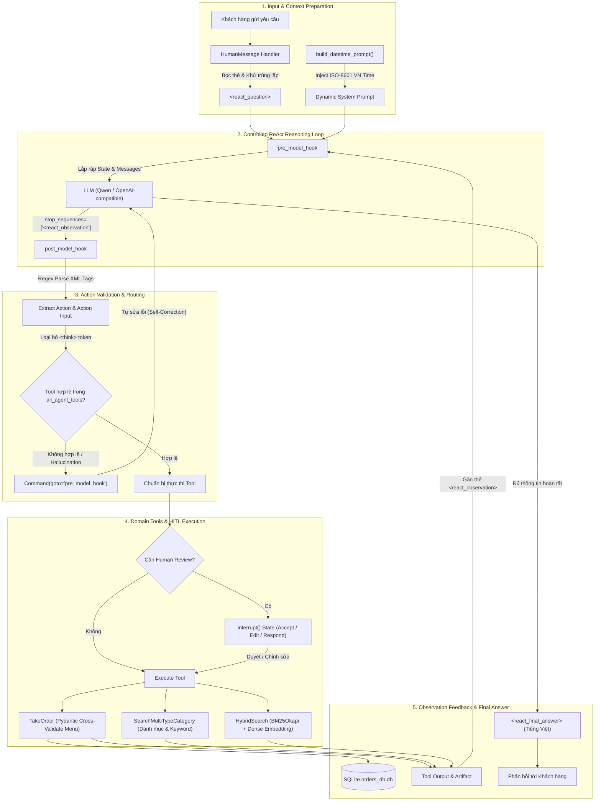

## 1. Minh Chứng & Video Demo Thực Tế (Evidence & Demos)

Dự án **LangGraph ReAct Agent với Pre & Post Hooks** được phát triển và kiểm nghiệm trực tiếp trên hệ thống tự động hóa đặt bàn và chăm sóc khách hàng đa kênh cho ngành F&B (**Cơm Quê Dượng Bầu**) và bán lẻ công nghệ (**Hoàng Hà Mobile**):

| Hạng mục | Minh chứng thực tế | Chi tiết kỹ thuật trong Codebase |
|---|---|---|
| **Mã nguồn chính thức** | [`github.com/thanhhuynhk17/langgraph_re_act_agent`](https://github.com/thanhhuynhk17/langgraph_re_act_agent) | Toàn bộ source code LangGraph, Hooks, Tools, SQLite CRUD và Embedding Server |
| **Video Demo (YouTube)** | [`youtu.be/R_IvnHsHmTw`](https://youtu.be/R_IvnHsHmTw) | Trình diễn luồng hội thoại ReAct, gọi Tool đặt bàn và xuất hóa đơn tự động |
| **Video Demo (LinkedIn)** | [`lnkd.in/p/ejjivmDG`](https://lnkd.in/p/ejjivmDG) | Bản demo ngắn gọn quy trình Agent xử lý câu hỏi phức tạp và chốt đơn |
| **Tập dữ liệu kiểm thử** | `3.200 queries` trên 2 domains | `src/store/comque_new.csv` (Ẩm thực) và `src/store/hoanghamobile.csv` (Thiết bị) |
| **Độ chính xác (Accuracy)** | `95.0% Hit@1` và `99.0% Hit@5` | Đo lường trên bài toán trích xuất thực thể, tra cứu danh mục và thông số món ăn |
| **Tỷ lệ Tool Call thành công** | `97.8% Tool Call Success` | Kiểm soát qua schema Pydantic, regex XML parser và cơ chế retry tự sửa lỗi |
| **Embedding Serving** | **Qwen3-Embedding-0.6B** qua `llama-server` | GGUF f16, chạy FlashAttention trên GPU NVIDIA với context length 32K |
| **Công nghệ cốt lõi** | LangGraph, LangChain, Pydantic, SQLiteVec, BM25Okapi, Pendulum, FastAPI | Kiến trúc ReAct Agent có chốt chặn can thiệp đa tầng (Pre & Post Hooks) |

---

## 2. Vì Sao ReAct Agent Truyền Thống Thường Thất Bại Trong Thực Tế?

Mô hình **ReAct (Reasoning + Acting)** là nền tảng của hầu hết các AI Agent hiện đại: mô hình lần lượt suy luận (`Thought`), chọn công cụ (`Action`), chờ kết quả (`Observation`) và trả lời (`Final Answer`). Tuy nhiên, khi đưa vào môi trường bán hàng và CSKH thực tế, ReAct mặc định bộc lộ 3 lỗi chí mạng:

1. **Ảo giác Observation (Hallucinated Tool Output):** Khi sinh thẻ `<react_action>`, LLM thường có xu hướng "tự biên tự diễn" luôn nội dung `<react_observation>` giả tưởng mà không thực sự gọi tool, dẫn đến việc xác nhận đơn hàng ảo hoặc báo giá sai.
2. **Sai lệch định dạng tham số (Schema Drift):** LLM sinh thiếu trường bắt buộc, điền ID món ăn không có trong thực đơn, hoặc sai định dạng thời gian đặt bàn.
3. **Mất kiểm soát hành động nhạy cảm:** Không có cơ chế can thiệp thủ công (Human-in-the-loop) để quản lý hoặc thu ngân kiểm tra lại số lượng, giá tiền trước khi ghi vào cơ sở dữ liệu.

Để giải quyết triệt để các vấn đề trên, repo [`thanhhuynhk17/langgraph_re_act_agent`](https://github.com/thanhhuynhk17/langgraph_re_act_agent) thiết kế vòng lặp ReAct có kiểm soát nghiêm ngặt với bộ đôi **`pre_model_hook`** và **`post_model_hook`**.

---

## 3. Kiến Trúc Luồng ReAct Với Pre & Post Hooks

Hệ thống được tổ chức xoay quanh đồ thị trạng thái của LangGraph (`create_react_agent`) kết hợp hệ thống thẻ XML độc quyền và cơ chế ngắt trạng thái (Interrupt):



---

## 4. Giao Thức Thẻ ReAct Chuẩn Hóa (ReAct Tag Protocol)

Toàn bộ quá trình suy luận của Agent tuân theo cấu trúc thẻ XML chặt chẽ được định nghĩa trong `src/utils/react_constants.py`:

```python
TAG_QUESTION = "react_question"
TAG_THOUGHT = "react_thought"
TAG_ACTION = "react_action"
TAG_ACTION_INPUT = "react_action_input"
TAG_OBSERVATION = "react_observation"
TAG_FINAL_ANSWER = "react_final_answer"
DEFAULT_TZ = pendulum.timezone("Asia/Ho_Chi_Minh")
```

### Chuẩn dữ liệu đầu ra:
```text
<react_question>
Khách hỏi: Cho mình đặt bàn 4 người tối nay lúc 19h ăn cá kho tộ và canh chua nhé.
</react_question>

<react_thought>
Khách muốn đặt bàn 4 người vào 19h hôm nay và gọi 2 món: cá kho tộ, canh chua.
Mình cần kiểm tra thực đơn xem có các món này không và lấy ID chính xác.
</react_thought>

<react_action>
search_multi_type_category
</react_action>

<react_action_input>
{"categories": ["món cá", "món canh"], "keywords": ["kho tộ", "chua"]}
</react_action_input>

<react_observation>
(Hệ thống tự động chèn kết quả thực thi công cụ vào đây — LLM BỊ CẤM TỰ SINH)
</react_observation>

<react_thought>
Đã tìm thấy món Cá Lóc Kho Tộ (ID: 102) và Canh Chua Cá Hú (ID: 205). Giờ mình sẽ gọi tool take_order.
</react_thought>

<react_action>
take_order
</react_action>
...
<react_final_answer>
Dạ em đã lên đơn đặt bàn cho 4 người vào lúc 19:00 tối nay với 2 món: Cá Lóc Kho Tộ và Canh Chua Cá Hú rồi ạ!
</react_final_answer>
```

> [!IMPORTANT]
> **Vũ khí chống ảo giác tối thượng:** Trong `src/utils/helpers.py`, hàm khởi tạo model cấu hình:
> ```python
> stop_sequences=[f"<{TAG_OBSERVATION}"]
> ```
> Khi LLM vừa sinh xong thẻ đóng `</react_action_input>` và định gõ tiếp `<react_observation>`, cơ chế Stop Sequence của vLLM / llama-server sẽ **cắt ngang quá trình sinh từ ngay lập tức**. Việc này ép quyền kiểm soát quay trở lại hệ thống để gọi Tool thực tế!

---

## 5. Giải Phẫu Hai "Chốt Chặn": `pre_model_hook` & `post_model_hook`

Trọng tâm đột phá của codebase nằm tại hai hàm hook được truyền vào `create_react_agent` trong `src/agent.py`:

### 5.1. `use_pre_hook`: Định Chuẩn Dữ Liệu Trước Khi LLM Xử Lý
Hàm này chạy sau khi một Tool vừa hoàn tất hoặc khi người dùng gửi tin nhắn mới:

```python
def use_pre_hook(state, config: RunnableConfig):
    last_msg = state["messages"][-1]
    artifact_json = None
    
    if isinstance(last_msg, ToolMessage):
        # Đảm bảo nội dung tool luôn được bọc trong <react_observation>
        if f"<{TAG_OBSERVATION}>" in last_msg.content:
            state["messages"][-1].content = last_msg.content.strip()
        else:
            state["messages"][-1].content = f"<{TAG_OBSERVATION}>{last_msg.content.strip()}</{TAG_OBSERVATION}>".strip()

        # Trích xuất Artifact có cấu trúc từ Pydantic Model
        if last_msg.artifact:
            if isinstance(last_msg.artifact, BaseModel):
                artifact_data = last_msg.artifact.model_dump()
            else:
                artifact_data = last_msg.artifact

            artifact_dict = { last_msg.name: artifact_data }
            artifact_json = json.dumps(artifact_dict, ensure_ascii=False)

    elif isinstance(last_msg, HumanMessage):
        # Tự động chuẩn hóa câu hỏi người dùng vào <react_question>
        if f"<{TAG_QUESTION}>" not in last_msg.content:
            state["messages"][-1].content = f"<{TAG_QUESTION}>{last_msg.content.strip()}</{TAG_QUESTION}>".strip()

        # Loại bỏ tin nhắn người dùng trùng lặp trong lịch sử
        if len(state["messages"]) > 1 and isinstance(state["messages"][-2], HumanMessage):
            return {
                "json_data": artifact_json,
                "messages": [RemoveMessage(id=state["messages"][-2].id)],
            }
            
    return {"json_data": artifact_json}
```

### 5.2. `use_post_hook`: Kiểm Duyệt & Tự Sửa Lỗi (Self-Correction)
Hàm này chặn bắt phản hồi của LLM trước khi gọi bất kỳ công cụ nào:

```python
def use_post_hook(state, config: RunnableConfig):
    last_msg = state["messages"][-1]
    if not isinstance(last_msg, AIMessage):
        return
        
    all_tools = [t.name for t in agent_tools]
    # Phân tách XML bằng Regex & loại bỏ thẻ suy luận <think> từ Qwen/DeepSeek
    new_msg = process_ai_message(last_msg, all_tools)
    
    # NẾU LLM GỌI SAI TOOL HOẶC SINH SAI CÚ PHÁP:
    if not new_msg:
        logger.warning("Tool call parsing failed or hallucinated tool name. Triggering rollback.")
        # Quay lui đồ thị về pre_model_hook để LLM sinh lại
        return Command(
            goto="pre_model_hook",
            update={"messages": [RemoveMessage(id=last_msg.id)]},
        )
        
    return {
        **state,
        "messages": [RemoveMessage(id=last_msg.id), new_msg],
    }
```

---

## 6. Thiết Kế Công Cụ & Ràng Buộc Schema Pydantic Khắt Khe

Trong file `src/utils/schemas.py` và `src/utils/tools.py`, mọi dữ liệu đầu vào của tool đều được kiểm tra chéo (Cross-Validation) với cơ sở dữ liệu thực đơn thực tế (`src/store/comque_new.csv`):

```python
class Dish(BaseModel):
    id: int = Field(..., description="ID định danh duy nhất của món ăn trong thực đơn.")
    name_of_food: str = Field(..., description="Tên chính xác của món ăn.")
    quantity: int = Field(default=1, ge=1, description="Số lượng món (>= 1).")

    @model_validator(mode="after")
    def validate_fields(cls, dish):
        errors = []
        menu_df = get_menu_df()  # Đọc từ comque_new.csv
        menu_ids = menu_df["ID"].to_list()
        menu_names = menu_df["name_of_food"].to_list()
        
        # Bắt buộc ID và Tên món phải trùng khớp 100% với database
        if dish.id not in menu_ids:
            errors.append(f"Mã món ID '{dish.id}' không tồn tại trong thực đơn quán.")
        if dish.name_of_food not in menu_names:
            errors.append(f"Tên món '{dish.name_of_food}' không có trong thực đơn quán.")

        if errors:
            raise ValueError("\n".join(errors) + " Hãy dùng công cụ tra cứu để tìm món hợp lệ thay thế.")
        return dish
```

### Các công cụ nghiệp vụ chính:
1. **`TakeOrder`:** Tiếp nhận thông tin khách hàng (`CustomerInfo`), danh sách món ăn đã xác thực (`List[Dish]`), thời gian đặt bàn dạng ISO-8601, tự động tính tổng tiền và lưu vào SQLite (`src/store/orders_db.db`).
2. **`SearchMultiTypeCategoryTool`:** Tìm kiếm đồng thời trên 15 danh mục ẩm thực (`món cá`, `món canh`, `món xào`, `lẩu`,...) kết hợp từ khóa thuộc tính (chua, cay, mặn, thanh đạm).
3. **`HybridSearchTool`:** Kết hợp thuật toán xếp hạng từ khóa **BM25Okapi** (đã tách từ và loại bỏ từ dừng `stopwords-vietnamese.txt`) với tìm kiếm ngữ nghĩa Dense Vector thông qua **SQLiteVec** / **FAISS**.

---

## 7. Human-In-The-Loop: Kiểm Soát Hành Động Nhạy Cảm

Các hành vi sửa đổi đơn hàng hoặc hủy đơn đều có nguy cơ gây thất thoát doanh thu. Trong `src/utils/interrupt_any_tool.py`, hệ thống bọc các công cụ nhạy cảm qua cơ chế `interrupt()` của LangGraph:

```python
def add_human_in_the_loop(tool: BaseTool, *, interrupt_config: HumanInterruptConfig = None) -> BaseTool:
    @create_tool(tool.name, description=tool.description, args_schema=tool.args_schema)
    def call_tool_with_interrupt(config: RunnableConfig, **tool_input):
        request: HumanInterrupt = {
            "action_request": {"action": tool.name, "args": tool_input},
            "config": interrupt_config or {"allow_accept": True, "allow_edit": True, "allow_respond": True},
            "description": "Yêu cầu thu ngân / quản lý xác nhận trước khi chốt đơn"
        }
        # Tạm dừng đồ thị, trả quyền kiểm soát cho nhân viên
        response = interrupt([request])[0]
        
        if response["type"] == "accept":
            return tool.invoke(tool_input, config)
        elif response["type"] == "edit":
            return tool.invoke(response["args"]["args"], config)
        elif response["type"] == "response":
            return response["args"]  # Gửi trực tiếp phản hồi của nhân viên cho khách
            
    return call_tool_with_interrupt
```

---

## 8. Hạ Tầng Phục Vụ & Local Embedding Server

Nhằm tối ưu chi phí và bảo mật dữ liệu khách hàng, dự án tự triển khai cụm phục vụ cục bộ:

### 8.1. Server Embedding với Llama.cpp Cực Nhanh
Mô hình `Qwen3-Embedding-0.6B-f16.gguf` được host nội bộ thông qua binary `llama-server` tối ưu phần cứng:

```powershell
.\llama-server -m "C:\Users\lea26\Downloads\Qwen3-Embedding-0.6B-f16.gguf" `
  --embedding `
  --pooling last `
  -ngl 99 `
  -ub 8192 `
  -c 32768 `
  --threads 16 `
  --flash-attn on `
  --host 0.0.0.0
```

### 8.2. Xử Lý Mốc Thời Gian Tự Động Với Pendulum
Hàm `build_datetime_prompt()` tiêm trực tiếp thời gian thực của múi giờ `Asia/Ho_Chi_Minh` vào System Prompt ở mỗi lượt hội thoại:

```python
def build_datetime_prompt() -> str:
    now_vn = pendulum.now("Asia/Ho_Chi_Minh")
    return (
        "- Luôn parse thời gian đặt bàn (booking_time) thành ISO datetime với timezone Asia/Ho_Chi_Minh.\n"
        "- Nếu khách nói 'tối nay', 'ngày mai', hãy chuyển thành ngày giờ cụ thể theo lịch hiện tại.\n"
        f"- Hiện tại là: {now_vn.to_iso8601_string()} (tức {now_vn.format('HH:mm ngày DD/MM/YYYY')}).\n"
    )
```

---

## 9. Tài Liệu Tham Khảo (References)

```
[01] thanhhuynhk17. (2024). LangGraph ReAct Agent with Pre & Post Hooks.
     GitHub Repository: https://github.com/thanhhuynhk17/langgraph_re_act_agent
[02] Yao, S., Zhao, J., Yu, D., Du, N., Shafran, I., Narasimhan, K., & Cao, Y. (2023).
     ReAct: Synergizing Reasoning and Acting in Language Models. ICLR 2023. arXiv:2210.03629.
[03] LangChain AI. (2024). LangGraph: Interrupts & Human-in-the-Loop State Machine.
     Official Documentation: https://langchain-ai.github.io/langgraph/
[04] Robertson, S., & Zaragoza, H. (2009). The Probabilistic Relevance Framework: BM25
     and Beyond. Foundations and Trends in Information Retrieval.
[05] Alibaba Cloud. (2024). Qwen2.5 & Qwen3-Embedding: Open-source Multilingual
     Representation Models. https://github.com/QwenLM/Qwen
```

---

## 10. Bài Viết Liên Quan (Related Logs)

- [GraphRAG: Kết Hợp Neo4j và Qdrant Để Giảm Hallucination](/posts/graph-rag-neo4j-qdrant/)
  *Chi tiết cách kết hợp Knowledge Graph để làm phong phú dữ liệu ngữ cảnh cho AI Agent.*
- [On-Device AI: Chạy Neural Network Offline Với ONNX Trên Mobile](/posts/on-device-ai-onnx-kotlin/)
  *Giải pháp tối ưu suy luận mô hình AI trực tiếp trên thiết bị đầu cuối với độ trễ tối thiểu.*
