---
title: "Multi-Agent Workflow: Tự Động Hóa CSKH Với LangGraph và FastMCP"
date: 2026-08-28T10:00:00+07:00
draft: false
tags: ["agentic-rag", "du-an"]
description: "Kiến trúc Multi-Agent tự động hóa CSKH (tra cứu & xuất hóa đơn tự động) với LangGraph state machine, FastMCP tool calling và vLLM trên GPU A100, đạt 95% Hit@1 và 99% Hit@5 trên 3.200 queries."
summary: "Kiến trúc Multi-Agent tự động hóa CSKH (tra cứu & xuất hóa đơn tự động) với LangGraph state machine, FastMCP tool calling và vLLM trên GPU A100, đạt 95% Hit@1 và 99% Hit@5 trên 3.200 queries."
ShowToc: true
TocOpen: true
---

## 1. Minh Chứng & Video Demo Thực Tế (Evidence & Demos)

Hệ thống **AI Agentic Automation** được phát triển và kiểm thử thực tế trong dự án tự động hóa quy trình chăm sóc khách hàng và bán hàng đa kênh:

| Hạng mục | Minh chứng thực tế | Chi tiết kỹ thuật |
|---|---|---|
| **Video Demo (YouTube)** | [`youtu.be/R_IvnHsHmTw`](https://youtu.be/R_IvnHsHmTw) | Trình diễn luồng hội thoại, tool calling và xuất hóa đơn tự động |
| **Video Demo (LinkedIn)** | [`lnkd.in/p/ejjivmDG`](https://lnkd.in/p/ejjivmDG) | Bản demo ngắn gọn quy trình Multi-Agent xử lý đồng thời |
| **Tập dữ liệu kiểm thử** | `3.200 queries` trên 2 domains | Domain 1: Thực đơn & chuỗi ẩm thực; Domain 2: Bán lẻ điện thoại di động |
| **Độ chính xác (Accuracy)** | `95.0% Hit@1` và `99.0% Hit@5` | Đo lường trên bài toán trích xuất thực thể và truy vấn thông số sản phẩm |
| **Tỷ lệ gọi Tool thành công** | `97.8% Tool Call Success` | Xử lý qua giao thức FastMCP có schema validation chặt chẽ |
| **Hạ tầng LLM Serving** | **vLLM** trên GPU NVIDIA A100 | Phục vụ suy luận song song (PagedAttention), độ trễ phản hồi ~320ms |
| **Công nghệ cốt lõi** | FastMCP, LangGraph, LangChain, FastAPI, Neo4j, FAISS, PostgreSQL, Docker | Kiến trúc Multi-Agent hướng sự kiện (Event-driven) |

---

## 2. Vì Sao Chatbot Đơn Lẻ (Single-Agent) Thất Bại?

Các chatbot bán hàng truyền thống dựa trên một prompt khổng lồ ("Mega-prompt") gom tất cả hướng dẫn vào một LLM duy nhất thường gặp 3 lỗi chí mạng:

1. **Nhiễm bẩn ngữ cảnh (Context Pollution):** Khi prompt chứa cả quy tắc tra cứu, quy tắc tính thuế hóa đơn và xử lý khiếu nại, LLM dễ nhầm lẫn chức năng.
2. **Ảo giác khi thực thi tác vụ nhạy cảm:** LLM tự ý sinh mã hóa đơn hoặc tính sai tổng tiền do không có lớp kiểm soát độc lập.
3. **Không có khả năng phục hồi lỗi (Fault Tolerance):** Nếu một bước tra cứu bị timeout, toàn bộ phiên trò chuyện bị gián đoạn.

---

## 3. Kiến Trúc Multi-Agent Phân Tách Trách Nhiệm

Tôi thiết kế hệ thống theo mô hình đồ thị trạng thái (**StateGraph**) phân rã hệ thống thành các Agent chuyên biệt, độc lập:

```mermaid
flowchart TD
    USER["Khách hàng gửi yêu cầu"] --> R1
    
    subgraph ROUTER["ROUTER AGENT"]
        R1["Phân loại Intent & Điều phối luồng"]
    end
    
    R1 -->|"Tra cứu"| C1
    R1 -->|"Hóa đơn"| I1
    R1 -->|"Hỗ trợ"| E1
    
    subgraph WORKERS["AGENTS CHUYÊN BIỆT"]
        C1["Catalog Agent (Search/MCP)"]
        I1["Invoice Agent (Billing/MCP)"]
        E1["Escalation Agent (Human-in-the-loop)"]
    end
    
    C1 --> S1
    I1 --> S1
    E1 --> S1
    
    subgraph SYNTH["SYNTHESIZER AGENT"]
        S1["Tổng hợp & Định dạng phản hồi"]
    end
    
    S1 --> OUT["Khách hàng nhận kết quả"]
```



### Các Agent thành phần:
- **Router Agent:** Phân tích câu hỏi người dùng, quyết định kích hoạt Agent nào mà không trực tiếp trả lời.
- **Catalog Agent (Tra cứu):** Kết hợp GraphRAG và Hybrid Search (BM25 + Dense vector) với tiền xử lý tiếng Việt chuyên sâu để tìm đúng sản phẩm/món ăn.
- **Invoice Agent (Nghiệp vụ tài chính):** Chỉ chịu trách nhiệm tính toán, gọi tool kiểm tra tồn kho và xuất file hóa đơn chuẩn qua API.
- **Escalation Agent:** Cơ chế Human-in-the-loop tự động chuyển giao cho nhân viên khi khách hàng có dấu hiệu bức xúc hoặc yêu cầu đặc biệt.

---

## 4. LangGraph: Quản Lý State Machine & Bộ Nhớ Phiên

LangGraph cho phép biểu diễn toàn bộ vòng đời tác vụ như một State Machine xác định (deterministic):

```python
from langgraph.graph import StateGraph, END
from typing import TypedDict, Annotated, Sequence

class AgentState(TypedDict):
    messages: Sequence[str]
    current_intent: str
    selected_items: list[dict]
    invoice_id: str | None
    requires_human: bool

workflow = StateGraph(AgentState)
workflow.add_node("router", router_node)
workflow.add_node("catalog", catalog_node)
workflow.add_node("invoice", invoice_node)
workflow.add_node("escalation", escalation_node)

workflow.add_conditional_edges(
    "router",
    intent_router,
    {
        "search": "catalog",
        "order": "invoice",
        "complain": "escalation"
    }
)
```

Ưu điểm lớn nhất là **khả năng duy trì State qua nhiều lượt hội thoại** và rollback trạng thái nếu việc gọi API bên ngoài gặp sự cố mạng.

---

## 5. Tối Ưu Phục Vụ Với FastMCP & vLLM Trên A100

- **FastMCP (Model Context Protocol):** Toàn bộ các công cụ (DB query, tồn kho, tính giá) được đóng gói thành các tool có schema type-safe bằng Pydantic. LLM tự động trích xuất đúng tham số với tỷ lệ chính xác **97.8%**.
- **vLLM Inference Engine:** Chạy model mã nguồn mở trên GPU NVIDIA A100 với thuật toán **PagedAttention**. Cơ chế quản lý bộ nhớ KV-Cache thông minh cho phép hệ thống phục vụ **đồng thời hơn 50 phiên hội thoại** với độ trễ mỗi token dưới 15ms.

---

## 6. Tài Liệu Tham Khảo (References)

```
[01] LangChain AI. (2024). LangGraph: Building Language Agents as Stateful Graphs. 
     Official Architectural Guide.
[02] Anthropic. (2024). The Model Context Protocol (MCP) Specification. 
     Anthropic Standards Documentation.
[03] Kwon, W., Li, Z., Zhuang, S., Sheng, Y., Zheng, L., Yu, C. H., Gonzalez, J. E., 
     Zhang, H., & Stoica, I. (2023). Efficient Memory Management for Large Language 
     Model Serving with PagedAttention (vLLM). SOSP 2023. arXiv:2309.06180.
[04] Robertson, S., & Zaragoza, H. (2009). The Probabilistic Relevance Framework: BM25 
     and Beyond. Foundations and Trends in Information Retrieval.
[05] Cormack, G. V., Clarke, C. L., & Buettcher, S. (2009). Reciprocal Rank Fusion 
     Outperforms Condorcet and Individual Rank Learning Methods. SIGIR 2009.
```

---

## 7. Bài Viết Liên Quan (Related Logs)

- [GraphRAG: Kết Hợp Neo4j và Qdrant Để Giảm Hallucination](/posts/graph-rag-neo4j-qdrant/)  
  *Tìm hiểu sâu về cách xây dựng Knowledge Graph để làm công cụ tra cứu cho Catalog Agent.*
- [On-Device AI: Chạy Neural Network Offline Với ONNX Trên Mobile](/posts/on-device-ai-onnx-kotlin/)  
  *Cách đưa các mô hình AI nhỏ gọn xuống chạy trực tiếp trên thiết bị đầu cuối mà không tốn chi phí server.*
