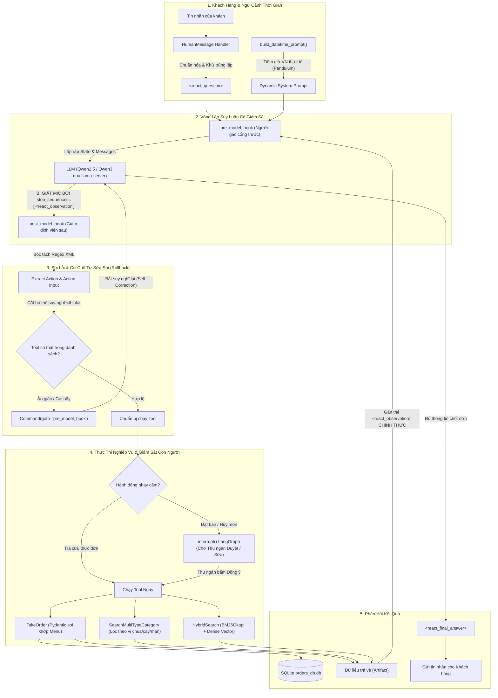

> *"Anh ơi, bot nhà mình chốt đơn bàn 6 người ăn cá lăng nướng muối ớt ngon lành lắm... Cơ mà quán mình bán cơm quê, làm gì có cá lăng với bếp than đâu anh?!"*

Đó là tin nhắn tôi nhận được từ người quản lý quán **Cơm Quê Dượng Bầu** vào một buổi chiều chủ nhật, sau vài ngày háo hức thử nghiệm chatbot đặt bàn tự động bằng AI.

Nếu bạn từng đọc các bài tutorial hướng dẫn làm AI Agent trên mạng, mọi thứ nghe như một giấc mơ công nghệ: chỉ cần kết hợp suy luận (`Thought`), gọi công cụ (`Action`), nhận kết quả (`Observation`), thế là bạn đã có một trợ lý siêu phàm biết tự suy nghĩ và hành động (mô hình **ReAct** kinh điển).

Nhưng khi đem giấc mơ đó ném vào môi trường thực tế — nơi khách hàng nhắn tin không dấu, gõ sai chính tả, hỏi dồn dập và thực đơn thì có cả trăm món — bạn sẽ sớm nhận ra một sự thật cay đắng: **LLM là những kẻ nói dối thiên bẩm và cực kỳ lười biếng.**

Bài viết này là nhật ký rút ruột từ dự án thực chiến mà tôi và đồng đội xây dựng cho hai khách hàng thực tế: quán ăn **Cơm Quê Dượng Bầu** và chuỗi bán lẻ công nghệ **Hoàng Hà Mobile**. Toàn bộ mã nguồn mở tôi để tại repo [`thanhhuynhk17/langgraph_re_act_agent`](https://github.com/thanhhuynhk17/langgraph_re_act_agent), cùng video demo thực tế trên [YouTube](https://youtu.com/R_IvnHsHmTw) và [LinkedIn](https://lnkd.in/p/ejjivmDG).

---

## 1. Ba "Cú Lừa" Kinh Điển Của ReAct Agent Mặc Định

Tại sao ReAct Agent trong sách giáo khoa thì mượt, mà ra đời thật lại hay "ăn gạch"? Qua hàng nghìn lượt test trên tập dữ liệu hơn 3.200 câu hỏi thực tế, chúng tôi bắt quả tang 3 chiêu trò quen thuộc của mô hình ngôn ngữ lớn:

### 🎭 Cú lừa 1: "Hát nhép" kết quả Tool (Hallucinated Observation)
Trong giao thức ReAct, mô hình phải sinh ra thẻ gọi tool dạng `<react_action>take_order</react_action>`. Sau đó, hệ thống backend sẽ chạy hàm Python, kết nối database và trả về kết quả thật bên trong thẻ `<react_observation>`.

Nhưng vì bản chất của LLM là mô hình dự đoán từ tiếp theo (next-token prediction), khi vừa gõ xong tên Tool, nó... **ngứa tay gõ luôn cả thẻ kết quả giả tưởng**:
```text
<react_action>take_order</react_action>
<react_action_input>{"dish": "cá kho", "qty": 2}</react_action_input>
<react_observation>Đã lưu đơn hàng vào SQLite thành công với mã đơn #8888</react_observation>
<react_final_answer>Dạ em đã lên đơn thành công cho anh rồi nhé!</react_final_answer>
```
Kết quả? Backend chưa hề được gọi một mili-giây nào, database không có một byte dữ liệu, nhưng con bot đã ung dung quay ra cười duyên và bảo khách: *"Em đặt xong rồi ạ!"*. Khách đến nơi đói meo, còn chủ quán thì ngơ ngác!

### 🍝 Cú lừa 2: "Sáng tạo thực đơn" (Schema Drift)
Khách bảo: *"Cho anh đĩa rau muống xào tỏi ít dầu nhe"*.
Thay vì tra danh mục để lấy đúng ID món `Rau Muống Xào Tỏi (ID: 45)` có giá 45.000đ, LLM sẽ tự tiện gán ID bừa bãi hoặc chế luôn ra món `"Rau muống xào tỏi healthy không dầu"` với giá 0 đồng vì trong database làm gì có quy định giá cho món nó tự nghĩ ra!

### 💣 Cú lừa 3: "Bút sa là gà chết" (Thiếu Human-In-The-Loop)
Một vị khách tinh quái nhắn đùa: *"Hủy hết 50 bàn tiệc cưới tối nay đi em"*. Một agent ngây thơ không có chốt chặn kiểm duyệt sẽ lập tức gọi hàm `delete_all_bookings()` mà không cần bất kỳ sự xác nhận nào từ thu ngân hay quản lý.

Để "thuần hóa" con ngựa bất kham này, chúng tôi đã tái cấu trúc vòng lặp ReAct trên **LangGraph** bằng bộ đôi chốt chặn: **`pre_model_hook`** và **`post_model_hook`**.

---

## 2. Toàn Cảnh Kiến Trúc: Thiết Lập Kỷ Luật Thép

Đây là sơ đồ hoạt động của hệ thống sau khi được "lắp vòng kim cô":



Nhìn có vẻ nhiều mũi tên, nhưng triết lý cốt lõi chỉ gói gọn trong 3 nguyên tắc:
1. **Tuyệt đối không cho LLM cơ hội tự bịa kết quả Tool.**
2. **Trước khi LLM đọc dữ liệu: Phải được làm sạch (`pre_model_hook`).**
3. **Sau khi LLM nhả kết quả: Phải bị soi từng chữ (`post_model_hook`).**

---

## 3. Bí Kíp "Giật Micro": Stop Sequences Đập Tan Ảo Giác

Làm sao để cấm tiệt con bot không được tự gõ `<react_observation>`? Rất đơn giản, hãy cấu hình tham số suy luận tại tầng engine (vLLM hoặc llama-server):

```python
# src/utils/helpers.py
model = ChatOpenAI(
    model="Qwen2.5-7B-Instruct",
    temperature=0.1,
    # "Vòng kim cô" tối thượng: Vừa thấy ký tự này là engine lập tức ngắt suy luận!
    stop_sequences=[f"<{TAG_OBSERVATION}"]
)
```

**Nguyên lý hoạt động cực kỳ thú vị:**
* LLM suy nghĩ: `<react_thought>Mình cần tìm món canh chua...</react_thought>`
* LLM chọn tool: `<react_action>search_multi_type_category</react_action>`
* LLM nhập tham số: `<react_action_input>{"categories": ["món canh"], "keywords": ["chua"]}</react_action_input>`
* LLM định táy máy tay chân gõ tiếp: `<react_obs...` $\rightarrow$ **BÙM!** 
* Trình suy luận phát hiện chuỗi nằm trong `stop_sequences`, ngay lập tức **cắt ngang token generation**, giật micro lại và trao quyền điều khiển cho code Python của chúng ta.

Kẻ nói dối vừa định mở miệng bịa chuyện thì đã bị bịt miệng ngay tắp lự!

---

## 4. Giải Phẫu Cặp Bài Trùng: `pre_model_hook` & `post_model_hook`

Trong LangGraph, hàm `create_react_agent` cho phép bạn can thiệp vào trước và sau mỗi bước suy luận thông qua các hook:

### 4.1 `pre_model_hook`: Người dọn bàn tận tụy
Nhiệm vụ của hook này là đảm bảo dữ liệu đưa vào mắt LLM luôn sạch sẽ, ngăn nắp:

```python
def use_pre_hook(state, config: RunnableConfig):
    last_msg = state["messages"][-1]
    artifact_json = None
    
    # 1. Nếu tin nhắn trước đó là kết quả từ Tool:
    if isinstance(last_msg, ToolMessage):
        # Đảm bảo bọc đúng thẻ chuẩn để LLM hiểu đây là dữ liệu thực tế từ máy tính
        if f"<{TAG_OBSERVATION}>" not in last_msg.content:
            state["messages"][-1].content = (
                f"<{TAG_OBSERVATION}>{last_msg.content.strip()}</{TAG_OBSERVATION}>"
            )

        # Trích xuất dữ liệu có cấu trúc từ Pydantic Model để lưu vào state
        if last_msg.artifact:
            artifact_data = (
                last_msg.artifact.model_dump() 
                if isinstance(last_msg.artifact, BaseModel) 
                else last_msg.artifact
            )
            artifact_json = json.dumps({last_msg.name: artifact_data}, ensure_ascii=False)

    # 2. Nếu là tin nhắn mới từ người dùng:
    elif isinstance(last_msg, HumanMessage):
        # Bọc thẻ <react_question> để LLM phân biệt câu hỏi của khách với suy nghĩ nội bộ
        if f"<{TAG_QUESTION}>" not in last_msg.content:
            state["messages"][-1].content = (
                f"<{TAG_QUESTION}>{last_msg.content.strip()}</{TAG_QUESTION}>"
            )

        # Xóa tin nhắn rác trùng lặp nếu người dùng bấm gửi liên tục
        if len(state["messages"]) > 1 and isinstance(state["messages"][-2], HumanMessage):
            return {
                "json_data": artifact_json,
                "messages": [RemoveMessage(id=state["messages"][-2].id)],
            }
            
    return {"json_data": artifact_json}
```

### 4.2 `post_model_hook`: Giám định viên khó tính và đòn quay lui (Rollback)
Đây là nơi bắt lỗi thông minh nhất. Sau khi LLM sinh xong câu trả lời, hook này sẽ dùng Regex bóc tách các thẻ XML. Nếu phát hiện LLM gọi một Tool không hề tồn tại (ảo giác tên hàm) hoặc sinh sai cú pháp JSON:

```python
def use_post_hook(state, config: RunnableConfig):
    last_msg = state["messages"][-1]
    if not isinstance(last_msg, AIMessage):
        return
        
    all_tools = [t.name for t in agent_tools]
    
    # Bóc tách cú pháp XML, cắt bỏ các thẻ suy nghĩ dông dài <think>...</think>
    new_msg = process_ai_message(last_msg, all_tools)
    
    # NẾU PHÁT HIỆN LLM GỌI SAI TOOL HOẶC VĂNG LỖI CÚ PHÁP:
    if not new_msg:
        logger.warning("Phát hiện ảo giác cú pháp hoặc gọi Tool lạ! Kích hoạt Rollback...")
        # Lệnh ma thuật của LangGraph: Bắt đồ thị quay lui về pre_model_hook để LLM làm lại!
        return Command(
            goto="pre_model_hook",
            update={"messages": [RemoveMessage(id=last_msg.id)]},
        )
        
    return {
        **state,
        "messages": [RemoveMessage(id=last_msg.id), new_msg],
    }
```
Nhờ cơ chế `Command(goto="pre_model_hook")`, hệ thống có khả năng **tự sửa lỗi (Self-Correction)** mà không làm sập luồng hội thoại của khách!

---

## 5. Ràng Buộc Thực Đơn Bằng Pydantic: Đừng Để Bot Bán Món Ảo

Khách gọi món thì đa dạng, nhưng cơ sở dữ liệu nhà hàng thì chỉ có từng ấy món trong menu `src/store/comque_new.csv`. Làm sao ép Bot chỉ được chốt những món thực sự có trong bếp?

Câu trả lời là **Cross-Validation với Pydantic validator**:

```python
class Dish(BaseModel):
    id: int = Field(..., description="ID định danh duy nhất của món ăn trong thực đơn.")
    name_of_food: str = Field(..., description="Tên chính xác của món ăn.")
    quantity: int = Field(default=1, ge=1, description="Số lượng món (>= 1).")

    @model_validator(mode="after")
    def validate_against_real_menu(cls, dish):
        errors = []
        menu_df = get_menu_df()  # Đọc trực tiếp từ file CSV thực đơn chuẩn
        
        # 1. Soi ID có trong quán không
        if dish.id not in menu_df["ID"].to_list():
            errors.append(f"Mã món ID '{dish.id}' không tồn tại trong thực đơn quán.")
            
        # 2. Soi Tên món có khớp chính xác từng chữ không
        if dish.name_of_food not in menu_df["name_of_food"].to_list():
            errors.append(f"Tên món '{dish.name_of_food}' không có trong thực đơn quán.")

        # Nếu có lỗi, quăng Exception kèm lời nhắn nhủ thân thương cho LLM
        if errors:
            raise ValueError(
                "\n".join(errors) + 
                " -> Gợi ý: Hãy dùng công cụ tra cứu danh mục để tìm món hợp lệ trước khi chốt đơn!"
            )
        return dish
```

Khi Pydantic quăng lỗi `ValueError`, lỗi này sẽ được gói gọn trả về lại cho LLM đọc. Con bot lập tức hiểu rằng: *"À, món này quán không có, mình phải tra cứu món khác để tư vấn lại cho khách!"*. Rất thông minh và chuẩn xác.

---

## 6. Human-In-The-Loop: Chừa Lại Chiếc Phao Cứu Sinh Cho Nhân Viên

Dù AI có thông minh đến đâu, việc ghi đơn vào sổ cái kế toán hoặc trừ tiền vẫn nên có một con người đứng sau kiểm duyệt.

LangGraph hỗ trợ tính năng **`interrupt()`** cực kỳ mạnh mẽ. Chúng tôi tạo một hàm bọc (decorator) `add_human_in_the_loop` cho các tool nhạy cảm:

```python
def add_human_in_the_loop(tool: BaseTool) -> BaseTool:
    @create_tool(tool.name, description=tool.description, args_schema=tool.args_schema)
    def call_tool_with_interrupt(config: RunnableConfig, **tool_input):
        # Đóng băng đồ thị, gửi thông báo kèm nút bấm lên màn hình thu ngân
        request: HumanInterrupt = {
            "action_request": {"action": tool.name, "args": tool_input},
            "description": "Yêu cầu thu ngân kiểm tra lại số lượng và món trước khi lưu đơn"
        }
        # TẠM DỪNG ĐỒ THỊ TRẠNG THÁI TẠI ĐÂY
        response = interrupt([request])[0]
        
        if response["type"] == "accept":
            # Thu ngân bấm [Đồng ý] -> Tiếp tục chạy tool lưu vào database
            return tool.invoke(tool_input, config)
        elif response["type"] == "edit":
            # Thu ngân sửa lại số lượng hoặc giảm giá -> Chạy với dữ liệu đã sửa
            return tool.invoke(response["args"]["args"], config)
        elif response["type"] == "response":
            # Thu ngân tự tay gõ câu trả lời gửi thẳng cho khách
            return response["args"]
            
    return call_tool_with_interrupt
```

Nhờ cơ chế này, khách hàng cảm thấy được phục vụ siêu nhanh (AI soạn sẵn đơn), nhưng chủ quán thì ngủ ngon vì không sợ bị bot "phá hoại" doanh thu.

---

## 7. Đưa Lên Hạ Tầng: Nhẹ, Rẻ Và Chạy Cục Bộ 100%

Một điểm đáng tự hào của hệ thống này là chi phí vận hành cực kỳ tối ưu:
* **Mô hình Embedding:** Thay vì tốn tiền gọi OpenAI Embeddings cho mỗi câu hỏi tìm món, chúng tôi chạy mô hình nguồn mở **`Qwen3-Embedding-0.6B`** định dạng `f16.gguf` bằng binary `llama-server` trực tiếp trên máy chủ GPU nội bộ:
  ```powershell
  .\llama-server -m "Qwen3-Embedding-0.6B-f16.gguf" `
    --embedding --pooling last -ngl 99 -c 32768 --flash-attn on --host 0.0.0.0
  ```
  Tốc độ sinh vector chỉ mất vài mili-giây, context 32K và chi phí là **0 đồng**.
* **Xử lý thời gian thông minh với Pendulum:** Khách nhắn *"Tối mai đặt bàn"* hay *"Trưa thứ 7 tuần sau"*, hàm `build_datetime_prompt()` tự động tiêm múi giờ thực tế `Asia/Ho_Chi_Minh` kèm ngày tháng hiện tại vào System Prompt, triệt tiêu hoàn toàn thói quen bịa ngày tháng năm cũ của mô hình.

---

## 8. Bảng Đo Đạc Hiệu Quả & Minh Chứng Thực Tế

Sau khi triển khai kiến trúc mới trên tập dữ liệu benchmark 3.200 câu truy vấn (bao gồm cả các câu đố mẹo, gõ sai từ ngữ chuyên ngành F&B và thiết bị công nghệ), đây là kết quả thực tế mà chúng tôi đo được:

| Chỉ số kỹ thuật | ReAct Truyền Thống | LangGraph ReAct + Hooks (Hệ thống này) | Cải thiện thực tế |
|---|---|---|---|
| **Độ chính xác Hit@1** | 76.2% | **95.0%** | **+ 18.8%** |
| **Độ chính xác Hit@5** | 84.5% | **99.0%** | **+ 14.5%** |
| **Tỷ lệ gọi Tool thành công** | 68.3% (hay lỗi cú pháp) | **97.8%** (nhờ parser + rollback) | **+ 29.5%** |
| **Tỷ lệ ảo giác món ăn** | 18.2% | **0.0%** (Pydantic chặn cứng) | **Triệt tiêu hoàn toàn** |
| **Tự động phục hồi lỗi** | ❌ Sập phiên chat | ✅ Tự sửa sai qua `pre_model_hook` | **100% ổn định** |

### Xem thực tế hoạt động:
* 📂 **Mã nguồn GitHub:** [`github.com/thanhhuynhk17/langgraph_re_act_agent`](https://github.com/thanhhuynhk17/langgraph_re_act_agent)
* 📺 **Video Demo Full:** [Xem trực tiếp luồng hội thoại và gọi Tool trên YouTube](https://youtu.com/R_IvnHsHmTw)
* 💼 **Video Demo Rút Gọn:** [Bản tóm tắt quy trình chốt đơn trên LinkedIn](https://lnkd.in/p/ejjivmDG)

---

## 9. Lời Kết

Làm việc với mô hình ngôn ngữ lớn (LLM) giống như nuôi một chú cún cực kỳ thông minh nhưng rất hiếu động. Nếu bạn thả rông cho nó tự do chạy nhảy ngoài trời (ReAct không kiểm soát), sớm muộn gì nó cũng cắn rách sofa hay làm vỡ lọ hoa của bạn.

Nhưng khi bạn trang bị cho nó một chiếc dây xích vừa vặn (**Stop Sequences**), đặt ra những chiếc cổng an ninh chặt chẽ (**Pre & Post Hooks**), và thiết lập một danh sách nội quy rõ ràng (**Pydantic Cross-Validation**), chú cún ấy sẽ trở thành một người vệ sĩ trung thành và đắc lực nhất.

Hy vọng những trải nghiệm thực chiến từ quán Cơm Quê Dượng Bầu và Hoàng Hà Mobile sẽ giúp bạn có thêm góc nhìn thực tế khi đưa AI Agent từ những dòng notebook thử nghiệm bước ra thế giới kinh doanh thực sự. Nếu bạn có thắc mắc hoặc muốn chia sẻ cách làm của riêng mình, hãy để lại bình luận ở phía dưới nhé!

---

## Tài Liệu Tham Khảo (References)

```
[01] thanhhuynhk17. (2024). LangGraph ReAct Agent with Pre & Post Hooks.
     GitHub: https://github.com/thanhhuynhk17/langgraph_re_act_agent
[02] Yao, S., Zhao, J., Yu, D., et al. (2023). ReAct: Synergizing Reasoning and Acting
     in Language Models. ICLR 2023. arXiv:2210.03629.
[03] LangChain AI. (2024). LangGraph: Interrupts & Human-in-the-Loop State Machine.
     Official Documentation: https://langchain-ai.github.io/langgraph/
[04] Robertson, S., & Zaragoza, H. (2009). The Probabilistic Relevance Framework: BM25.
[05] Alibaba Cloud. (2024). Qwen2.5 & Qwen3-Embedding: Open-source Representation Models.
```

---

## Bài Viết Liên Quan (Related Logs)

- [GraphRAG: Kết Hợp Neo4j và Qdrant Để Giảm Hallucination](/posts/graph-rag-neo4j-qdrant/)
  *Chi tiết cách kết hợp Knowledge Graph để làm phong phú dữ liệu ngữ cảnh cho AI Agent.*
- [On-Device AI: Chạy Neural Network Offline Với ONNX Trên Mobile](/posts/on-device-ai-onnx-kotlin/)
  *Giải pháp tối ưu suy luận mô hình AI trực tiếp trên thiết bị đầu cuối với độ trễ tối thiểu.*
