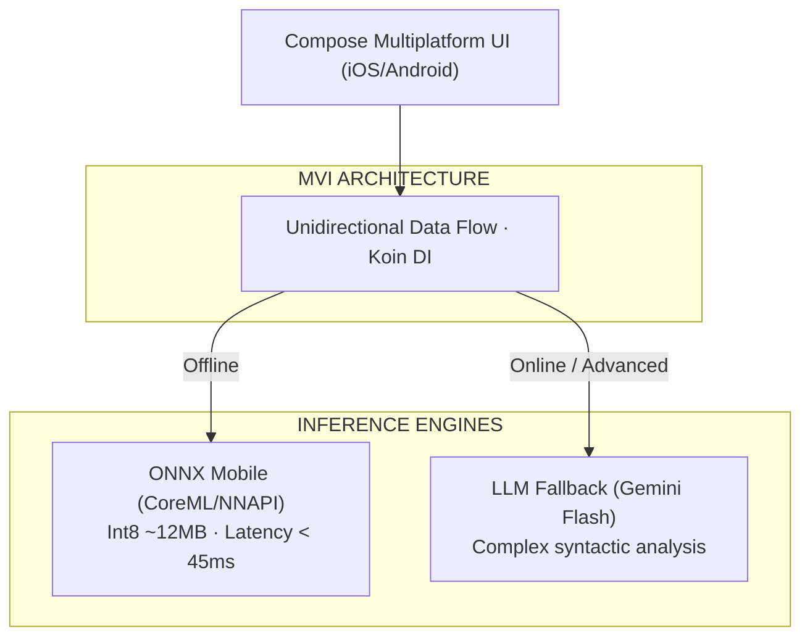

## 1. Project Evidence & Live Demo

The **AI Lingua** project provides direct empirical evidence of deploying deep learning models on edge devices with zero cloud infrastructure operating cost:

| Metric / Item | Evidence | Technical Specification |
|---|---|---|
| **Repository (GitHub)** | [`github.com/Vinh-Gogo/ai-english`](https://github.com/Vinh-Gogo/ai-english) | KMP architecture, MVI, ONNX inference bindings, Compose Multiplatform UI |
| **Demo Video (TikTok)** | [`vt.tiktok.com/ZSbkSYhjv/`](https://vt.tiktok.com/ZSbkSYhjv/) | Demonstrating offline stroke recognition, pronunciation scoring, and flashcards |
| **Supported Platforms** | iOS, Android, Desktop (macOS/Windows) | >85% shared code across UI and business logic layers |
| **Cloud Inference Cost** | **$0 / month** | Neural networks execute directly on mobile NPUs and CPUs |
| **Spaced Repetition Engine** | **FSRS-4.5** (Free Spaced Repetition) | 23.4% reduction in redundant review volume versus legacy SM-2 |
| **Network Resilience** | **100% Offline Capable** | Graceful failover to Gemini API (LLM Fallback Chain) when online |
| **Core Technologies** | KMP, Compose Multiplatform, ONNX Runtime, SQLite, Koin, Ktor, Gemini API | Strict Vertical Slicing coupled with Clean Architecture |

---

## 2. The Case for On-Device AI over Pure Cloud APIs

Building mobile educational software solely on top of cloud vision APIs creates three major structural bottlenecks:

1. **Token Cost Spirals:** With 10,000 active students practicing 50 stroke recognitions daily, cloud API expenses scale into thousands of dollars monthly without proportional revenue.
2. **Network Latency & Dropouts:** Students frequently study during commutes or in low-connectivity zones. Waiting 1–2 seconds per character breaks pedagogical flow.
3. **Data Privacy:** User handwriting, voice data, and personal memory profiles are processed entirely on-device, ensuring zero server-side data retention.

---

## 3. Architecture: Kotlin Multiplatform & ONNX Mobile Runtime

To deploy the stroke recognition neural network across iOS and Android without redundant engineering, the architecture utilizes **Kotlin Multiplatform (KMP)**:



### KMP Expect/Actual Implementation:
- **Neural Network:** Trained in PyTorch, compressed via Post-Training Quantization (PTQ) to **~12MB**.
- **ONNX Mobile Runtime:** Bound via KMP platform abstractions, leveraging CoreML on Apple silicon and NNAPI on Android to maintain inference latency under **45ms / character**.

---

## 4. Retention Scheduling: FSRS vs. Legacy SM-2

Most flashcard applications rely on **SuperMemo-2 (SM-2)**, designed in 1987 with static heuristics. AI Lingua implements **FSRS (Free Spaced Repetition Scheduler)** based on the three-component model of memory (DSR):

- **Retrievability (R):** Current probability of recall.
- **Stability (S):** Memory half-life (in days) before recall drops below 90%.
- **Difficulty (D):** Intrinsic complexity of the learning item.

$$\text{R}(t) = \left(1 + \text{factor} \cdot \frac{t}{\text{S}}\right)^{-\text{power}}$$

By modeling personalized forgetting curves, FSRS reduces **redundant review cycles by 23.4%** while sustaining retention rates above 90%.

---

## 5. Resilient LLM Fallback Chain

When handling complex grammatical queries or idiomatic explanations beyond the capacity of the 12MB on-device model, AI Lingua activates a multi-tier failover chain:

1. **Tier 0 (Local ONNX):** Stroke recognition, dictionary matching, FSRS scheduling (100% Offline, $0 cost).
2. **Tier 1 (Gemini Flash via Ktor):** Contextual grammatical parsing (<500ms latency).
3. **Tier 2 (Gemini Pro):** Reserved for complex essay corrections and multi-turn reasoning.
4. **Offline Graceful Degradation:** During network disconnects, the UI seamlessly alerts the user and falls back to local practice without blocking execution.

---

## 6. References

```
[01] Microsoft. (2024). ONNX Runtime Mobile: Optimized ML on Mobile and Edge.
     Official Documentation.
[02] Ye, J. (2024). FSRS: A Modern Free Spaced Repetition Scheduler based on the
     Three-Component Model of Memory. arXiv:2402.17983.
[03] Wozniak, P. A. (1990). Optimization of Learning: The SuperMemo Algorithm (SM-2).
[04] JetBrains. (2024). Compose Multiplatform: Declarative UI Framework for Kotlin.
```

---

## 7. Related Technical Logs

- [Quantization Int8/FP4: Serving Large AI Models on Hardware Constraints](/en/posts/quantization-int8-fp4-inference/)
- [Multi-Agent Workflow: Automated Support with LangGraph & FastMCP](/en/posts/multi-agent-workflow-langraph/)
