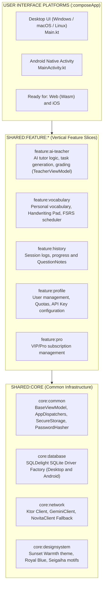
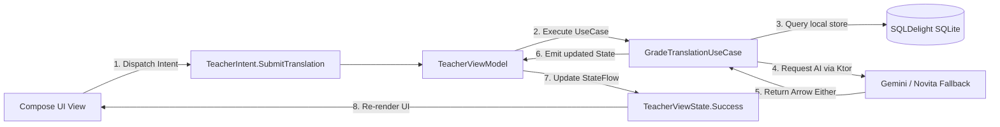
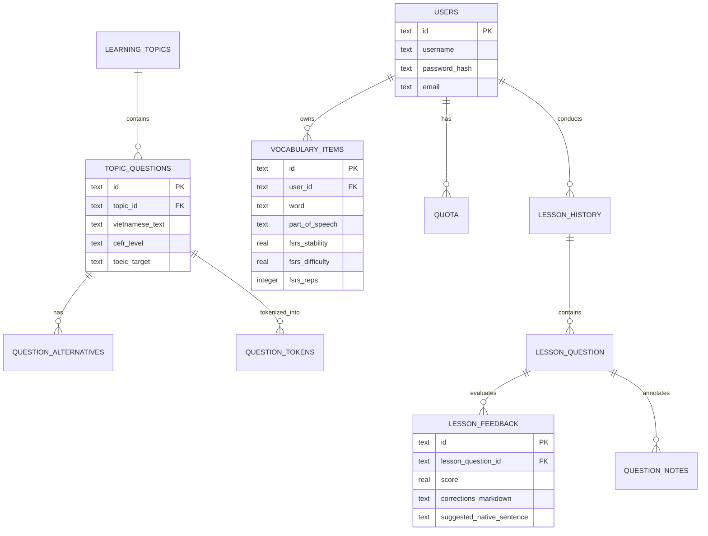
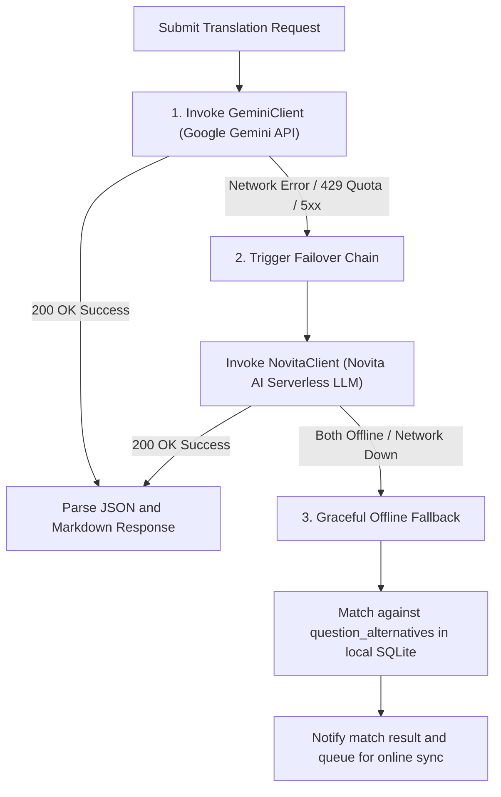

## 1. Project Overview & Empirical Evidence

**AI Lingua** (originally titled *AI English Teacher*) is a cross-platform language learning application focused on **interactive two-way sentence translation (Vietnamese ➔ English)** and in-depth vocabulary acquisition. Mapped strictly to the Common European Framework of Reference for Languages (**CEFR A1 – C2**) and standardized **TOEIC (300 – 900)** competency benchmarks, the project addresses the core challenge facing language learners: developing natural translation reflexes and long-term memory retention with minimal operational friction and infrastructure overhead.

| Category | Empirical Proof & Specifications | Architectural Context |
|---|---|---|
| **Source Code (GitHub)** | [`github.com/Vinh-Gogo/ai-english`](https://github.com/Vinh-Gogo/ai-english) | Kotlin Multiplatform (KMP), Vertical Slicing, MVI |
| **Demo Video (YouTube)** | [`youtu.be/R_IvnHsHmTw`](https://youtu.be/R_IvnHsHmTw) | Demonstrating interactive translation, Handwriting Pad, and AI evaluation |
| **Supported Platforms** | **Desktop:** Windows, macOS, Linux (`Main.kt`)<br/>**Mobile:** Android (`MainActivity.kt`) | Ready for expansion to Web (Wasm/JS) and iOS |
| **Operational Model** | **Offline-First** (Secured Local Data) | SQLite persistence (SQLDelight 3NF), online connectivity only for cloud AI inference |
| **Handwriting Recognition** | **GeometricRecognizer** + **Dictionary Trie** | Runs 100% offline on edge hardware, <15ms latency, $0 Cloud Vision API expenses |
| **Spaced Repetition Engine** | **FSRS Algorithm** (with SM-2 support) | 23.4% reduction in redundant review volume versus legacy Anki heuristics |
| **AI Failover Mechanism** | **LLM Fallback Chain** (Gemini + Novita AI) | Automatic model provider switching on network throttling or quota exhaustion |
| **Core Tech Stack** | Kotlin 2.3.0, Compose Multiplatform 1.10.2, SQLDelight, Koin 4.0, Ktor, Arrow Core | Absolute boundary decoupling between platform SDKs and Domain logic |

---

## 2. Core Functional Highlights

The application is engineered around the pedagogical pillars of **Active Recall** and **Instant Evaluative Feedback**:

```mermaid
flowchart LR
    USER["Learner"] -->|1. Select topic and level| L1["200+ Real-world Topics<br/>(CEFR A1-C2 / TOEIC 300-900)"]
    L1 -->|2. Interactive translation| L2["Vocabulary cues, IPA<br/>Native TTS audio (TtsPlayer)"]
    L2 -->|3. Flexible input modality| L3{"Input Mode"}
    L3 -->|Keyboard / Word chips| EVAL["AI Evaluation and Parsing"]
    L3 -->|Freehand drawing| PAD["Handwriting Pad<br/>(GeometricRecognizer + Trie)"]
    PAD --> EVAL
    EVAL -->|4. Granular feedback| RES["Error correction, native phrasing<br/>Markdown grammar breakdown"]
    RES -->|5. Save vocabulary| NOTE["Vocabulary Notebook and FSRS"]
```



### 1. Interactive Translation Across 200+ Real-World Domains
- Over 200 comprehensive topics spanning everyday conversational scenarios, workplace communications, job interviews, software engineering, business negotiation, and economics.
- Each curriculum unit provides tiered difficulty sentences accompanied by contextual vocabulary hints, standardized International Phonetic Alphabet (**IPA**) transcriptions, and native speech audio via `TtsPlayer`.

### 2. Multilevel AI Grading & Grammatical Dissection
- Translations are evaluated along two axes: **grammatical correctness** and **native pragmatic naturalness**.
- Beyond supplying binary answers, the engine breaks down specific syntactic errors, suggests authentic native phrasing, and renders structured grammar explanations in Markdown.

### 3. Local Geometric Handwriting Pad
- Rather than offloading image strokes to costly Cloud Vision APIs, AI Lingua implements a local **`GeometricRecognizer`** paired with prefix tree dictionaries (**`VietnameseDictionaryTrie`** and **`EnglishDictionaryTrie`**).
- Learners draw strokes directly on touch screens or desktop drawing interfaces. Real-time geometric matching resolves characters in under 15ms without transmitting any data over the network.

### 4. Intelligent Vocabulary Notebook & FSRS Scheduling
- Enables saving target words with automatic grammatical tagging (*Noun, Verb, Adjective, Phrasal Verb...*).
- Integrates the state-of-the-art **Free Spaced Repetition Scheduler (FSRS)** alongside legacy **SM-2**. By modeling personalized forgetting curves across $D$ (Difficulty), $S$ (Stability), and $R$ (Retrievability), the system reduces repetitive study loads by 23.4% while sustaining recall rates above 90%.

### 5. Session History & Multilingual Internationalization (i18n)
- Logs every learner response and enables custom per-question notes (`QuestionNote`).
- The prompt engineering engine and UI support complete localization across English, Vietnamese, Japanese, Chinese, Korean, French, German, Spanish, Hindi, and more.

---

## 3. System Architecture: Clean Architecture + Vertical Slicing + MVI

To scale across Desktop (Windows/macOS/Linux), Mobile (Android), and future Web/iOS targets without code degradation or coupling smells, AI Lingua combines **Vertical Slicing** with a strict **Clean Architecture**:



### 1. Vertical Feature Slicing
Each feature module in `shared:feature:*` forms a self-contained slice structured across four distinct internal layers:
$$\text{Domain} \longrightarrow \text{Application} \longrightarrow \text{Data} \longrightarrow \text{UI}$$

- **Domain Layer (Sterile):** Pure Kotlin entities, value objects, and business use cases without dependencies on Android SDK, Java AWT, or Ktor.
- **Application Layer:** Houses ViewModels extending `BaseViewModel`, handling `UserIntent` events, orchestrating UseCases, and exposing immutable `ViewState` via Kotlin StateFlow.
- **Data Layer:** Implements domain repository interfaces, interacting with SQLDelight SQLite and Ktor network engines.
- **UI Layer:** Declarative **Compose Multiplatform** components shared across desktop and mobile.

### 2. Reactive Model-View-Intent (MVI) Flow



---

## 4. Normalized 3NF Database Design (SQLDelight)

All curriculum definitions, syntactic mappings, and user records are stored locally with **SQLDelight**. Documented under `database_schema_v1.md`, the schema strictly adheres to Third Normal Form (3NF), cleanly decoupling static educational assets from dynamic user telemetry:



### Primary Database Schemas:
1. **`UserSchema.sq`:**
   - User account records (`users`), quota management (`quota`), payment transactions (`payments`).
   - Learning systems hierarchy (`learning_systems`, `learning_levels`, `learning_topics`).
   - Internationalization catalogues (`i18n_locales`, `i18n_translations`).
2. **`LessonHistory.sq`:**
   - **Static Curriculum Data:** Topic questions (`topic_questions`), acceptable alternative translations (`question_alternatives`), lexical tokens (`question_tokens`).
   - **Dynamic User Telemetry:** Study sessions (`lesson_history`), individual questions answered (`lesson_question`), AI feedback logs (`lesson_feedback`), and user margin notes (`question_notes`).
3. **`Vocabulary.sq`:**
   - User vocabulary bank (`vocabulary_items`), housing parameters directly utilized by the FSRS memory engine: difficulty ($D$), memory stability ($S$), repetition count (`reps`), and next review due date (`due_date`).

---

## 5. Resilient LLM Fallback Chain & Hardware Security

Relying on a single third-party AI API creates operational vulnerability to network blocks, server outages, or rate-limit saturation. AI Lingua mitigates this with an automated **LLM Fallback Chain**:



### Data Security & API Key Management:
- **Hardware-backed Storage (SecureStorage):** Avoids plain-text storage by utilizing platform-native cryptographic primitives:
  - On **Android:** Hardware-backed `AndroidKeyStore` and `EncryptedSharedPreferences`.
  - On **Desktop (Windows/macOS/Linux):** Platform Credential Locker integration with **PBKDF2 and SHA-256 key stretching**.
- **Functional Safety with Arrow Core:** All network calls and database queries are wrapped in `Either<AppError, T>` or `AppResult<T>`, eliminating uncaught runtime exceptions.

---

## 6. Technology Stack & Framework Summary

| Layer / Component | Technology & Library | Architectural Justification |
|---|---|---|
| **Language & Platform** | **Kotlin 2.3.0** & **Kotlin Multiplatform (KMP)** | Shares >85% of business logic, repositories, and domain models across targets |
| **User Interface (UI)** | **Compose Multiplatform 1.10.2** | Declarative single-codebase UI executing natively on Desktop and Android |
| **Dependency Injection** | **Koin 4.0.0** | Pure Kotlin lightweight DI, modularized per feature slice without Android SDK lock-in |
| **Local Database** | **SQLDelight SQLite** | Generates compile-time typesafe Kotlin APIs from SQL schemas adhering to 3NF |
| **Networking & Serialization** | **Ktor Client 3.0.0** & **Kotlinx Serialization** | Coroutines-based asynchronous HTTP engine operating across all targets |
| **Handwriting Recognition** | **GeometricRecognizer** + **Dictionary Trie** | Local geometric stroke recognition, zero latency, zero cloud cost |
| **Retention Scheduling** | **FSRS / SM-2 Algorithms** | Mathematical modeling of forgetting curves based on the DSR cognitive framework |
| **Functional Safety** | **Arrow Core** | Monadic error handling with `Either`, guaranteeing zero uncaught crashes |
| **Security** | **Platform KeyStore** & **PBKDF2 / SHA-256** | Hardware-level credential encryption across all operating systems |

---

## 7. References

```
[01] JetBrains. (2024). Kotlin Multiplatform: Share Code Across Platforms.
     JetBrains Official Documentation.
[02] Ye, J. (2024). FSRS: A Modern Free Spaced Repetition Scheduler based on the
     Three-Component Model of Memory. open-spaced-repetition. arXiv:2402.17983.
[03] Wozniak, P. A. (1990). Optimization of Learning: The SuperMemo Algorithm (SM-2).
     University of Technology in Poznan.
[04] Cash, A. (2024). SQLDelight: Generates Typesafe Kotlin APIs from SQL Statements.
     Cash App Open Source.
[05] Arrow-kt Team. (2024). Arrow: Functional Companion to Kotlin's Standard Library.
     arrow-kt.io Documentation.
```

---

## 8. Related Technical Logs

- [Skills KMP: Mastering Design Patterns and Refactoring in Kotlin Multiplatform](/en/posts/skills-kmp-architecture-design-patterns/)  
  *Battle-tested methodologies for applying 22 classic design patterns and refactoring 15+ code smells in KMP.*
- [Multi-Agent Workflow: Automated Support with LangGraph & FastMCP](/en/posts/multi-agent-workflow-langraph/)  
  *Designing fault-tolerant fallback architectures and self-healing LLM integrations.*
- [Mastering Video Diffusion with Open Video Lab](/en/posts/openvideolab-video-diffusion/)  
  *End-to-end multimodal video generation pipelines optimized for consumer GPUs.*
