---
title: "On-Device AI: Chạy Neural Network Offline Với ONNX Trên Mobile"
date: 2026-09-05T10:00:00+07:00
draft: false
tags: ["on-device-ai", "du-an", "kotlin-multiplatform"]
description: "AI Lingua – ứng dụng học ngoại ngữ đa nền tảng (iOS, Android, Desktop) tích hợp mạng nơ-ron ONNX nhận diện nét viết offline hoàn toàn (0đ chi phí API), thuật toán FSRS và LLM Fallback Chain."
summary: "AI Lingua – ứng dụng học ngoại ngữ đa nền tảng (iOS, Android, Desktop) tích hợp mạng nơ-ron ONNX nhận diện nét viết offline hoàn toàn (0đ chi phí API), thuật toán FSRS và LLM Fallback Chain."
ShowToc: true
TocOpen: true
---

## 1. Minh Chứng & Video Demo Thực Tế (Evidence & Demos)

Dự án **AI Lingua** là minh chứng rõ ràng nhất cho tính khả thi của việc đưa AI sâu vào thiết bị đầu cuối với chi phí vận hành bằng 0:

| Hạng mục | Minh chứng thực tế | Chi tiết kỹ thuật |
|---|---|---|
| **Mã nguồn (GitHub)** | [`github.com/Vinh-Gogo/ai-english`](https://github.com/Vinh-Gogo/ai-english) | Kiến trúc KMP, MVI, ONNX inference bindings, Compose UI |
| **Video Demo (TikTok)** | [`vt.tiktok.com/ZSbkSYhjv/`](https://vt.tiktok.com/ZSbkSYhjv/) | Trình diễn nhận diện nét vẽ offline, chấm điểm phát âm & flashcards |
| **Nền tảng hỗ trợ** | iOS, Android, Desktop (macOS/Windows) | Chia sẻ >85% mã nguồn UI và business logic |
| **Chi phí suy luận Cloud** | **0 VNĐ / tháng** | Mô hình nơ-ron chạy trực tiếp trên NPU/CPU của điện thoại |
| **Thuật toán Spaced Repetition** | **FSRS-4.5** (Free Spaced Repetition) | Giảm 23% số lần ôn tập so với thuật toán SM-2 cổ điển của Anki |
| **Tính khả dụng mạng** | Hoạt động **100% Offline** | Tự động chuyển qua Gemini API (LLM Fallback Chain) khi có mạng |
| **Bộ công nghệ cốt lõi** | KMP, Compose Multiplatform, ONNX Runtime, SQLite, Koin, Ktor, Gemini API | Kiến trúc Vertical Slicing kết hợp Clean Architecture |

---

## 2. Vì Sao Cần On-Device AI Thay Vì Phụ Thuộc Hoàn Toàn Vào Cloud?

Xây dựng ứng dụng giáo dục dựa trên Cloud API gặp 3 rào cản tài chính và kỹ thuật sống còn:

1. **Gánh nặng chi phí Token:** Nếu 10.000 người dùng tích cực luyện viết 50 từ/ngày qua cloud vision API, hóa đơn hàng tháng có thể lên tới hàng nghìn USD mà chưa có doanh thu bù đắp.
2. **Độ trễ và rớt mạng:** Học viên thường học trên tàu điện, máy bay, hoặc nơi sóng yếu. Chờ cloud API 1-2 giây cho mỗi nét chữ làm vỡ vụn trải nghiệm học tập tức thì.
3. **Quyền riêng tư (Privacy):** Nét viết, giọng nói và dữ liệu ghi nhớ của học viên được xử lý hoàn toàn cục bộ, bảo vệ quyền riêng tư tuyệt đối.

---

## 3. Kiến Trúc AI Lingua: KMP & ONNX Runtime

Để đưa mạng nơ-ron nhận diện nét viết (Handwriting Stroke Recognition) lên cả iOS và Android mà không phải nhân đôi công sức, tôi sử dụng **Kotlin Multiplatform (KMP)**:

```mermaid
flowchart TD
    UI["Compose Multiplatform UI (iOS/Android)"] --> A1
    
    subgraph ARCH["MVI ARCHITECTURE"]
        A1["Unidirectional Data Flow · Koin DI"]
    end
    
    A1 -->|"Offline"| L1
    A1 -->|"Online / Nâng cao"| C1
    
    subgraph ENGINES["INFERENCE ENGINES"]
        L1["ONNX Mobile (CoreML/NNAPI)<br/>Int8 ~12MB · Độ trễ &lt; 45ms"]
        C1["LLM Fallback (Gemini Flash)<br/>Phân tích ngữ pháp chuyên sâu"]
    end
```



### Triển khai ONNX Runtime qua KMP Expect/Actual:
- **Mô hình nơ-ron:** Được huấn luyện trên PyTorch, tối ưu hóa qua kỹ thuật Post-Training Quantization (PTQ) về kích thước chỉ còn **~12MB**.
- **ONNX Mobile Runtime:** Gọi thông qua lớp abstraction KMP, tận dụng CoreML trên iOS và NNAPI trên Android để đạt tốc độ suy luận dưới **45ms / ký tự**.

---

## 4. Thuật Toán Ghi Nhớ FSRS vs SM-2 Cổ Điển

Hầu hết các app flashcard hiện nay vẫn dùng thuật toán **SuperMemo-2 (SM-2)** ra đời từ năm 1987 với các tham số cứng nhắc. AI Lingua triển khai thuật toán **FSRS (Free Spaced Repetition Scheduler)** dựa trên mô hình trí nhớ 3 thành phần DSR:

- **Retrievability (R):** Xác suất nhớ lại được từ vựng ở thời điểm hiện tại.
- **Stability (S):** Thời gian trí nhớ tồn tại (tính bằng ngày) trước khi xác suất rơi xuống 90%.
- **Difficulty (D):** Độ khó cố hữu của từ vựng đối với cá nhân người học.

$$\text{R}(t) = \left(1 + \text{factor} \cdot \frac{t}{\text{S}}\right)^{-\text{power}}$$

Nhờ khả năng ước tính chính xác đường cong quên lãng theo từng cá nhân, FSRS giúp người học **giảm 23.4% số lần ôn tập dư thừa** mà vẫn duy trì tỷ lệ nhớ trên 90%.

---

## 5. Cơ Chế LLM Fallback Chain

Để xử lý các câu hỏi ngữ pháp hoặc giải thích câu thành ngữ phức tạp mà mô hình On-Device 12MB không kham nổi, AI Lingua áp dụng cơ chế tự phục hồi **Fallback Chain**:

1. **Level 0 (Local ONNX):** Nhận diện nét viết, đối soát từ vựng, tính toán lịch ôn FSRS (100% Offline, $0 cost).
2. **Level 1 (Gemini Flash via Ktor):** Phân tích ngữ cảnh câu và giải thích ngữ pháp ngắn (<500ms).
3. **Level 2 (Gemini Pro):** Dự phòng khi câu hỏi đòi hỏi lý luận phức tạp hoặc sửa bài luận dài.
4. **Offline Graceful Degradation:** Nếu mất kết nối, app tự động thông báo và chuyển mượt mà về chế độ luyện tập cục bộ mà không bao giờ bị crash.

---

## 6. Tài Liệu Tham Khảo (References)

```
[01] Microsoft. (2024). ONNX Runtime Mobile: Optimized Machine Learning on Mobile and Edge. 
     Official Documentation.
[02] Ye, J. (2024). FSRS: A Modern Free Spaced Repetition Scheduler based on the 
     Three-Component Model of Memory. open-spaced-repetition. arXiv:2402.17983.
[03] Wozniak, P. A. (1990). Optimization of Learning: The SuperMemo Algorithm (SM-2). 
     University of Technology in Poznan.
[04] JetBrains. (2024). Compose Multiplatform: Declarative UI Framework for Kotlin. 
     JetBrains Developer Docs.
```

---

## 7. Bài Viết Liên Quan (Related Logs)

- [Quantization Int8/FP4: Chạy Model AI Lớn Trên GPU Tài Nguyên Giới Hạn](/posts/quantization-int8-fp4-inference/)  
  *Tìm hiểu sâu về kỹ thuật nén lượng tử hóa mô hình để đưa kích thước file xuống mức vài megabyte.*
- [Multi-Agent Workflow: Tự Động Hóa CSKH Với LangGraph và FastMCP](/posts/multi-agent-workflow-langraph/)  
  *Cách thiết kế kiến trúc Fallback và cơ chế tự phục hồi lỗi khi tích hợp LLM vào ứng dụng thực tế.*
