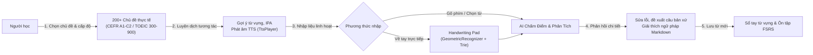
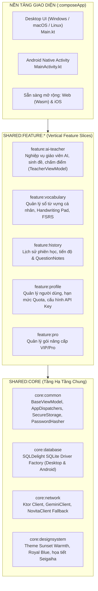
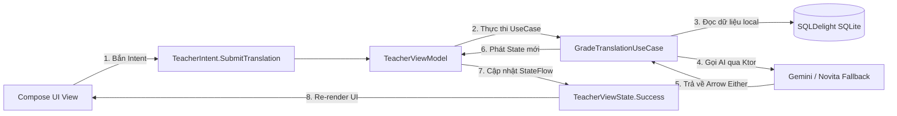
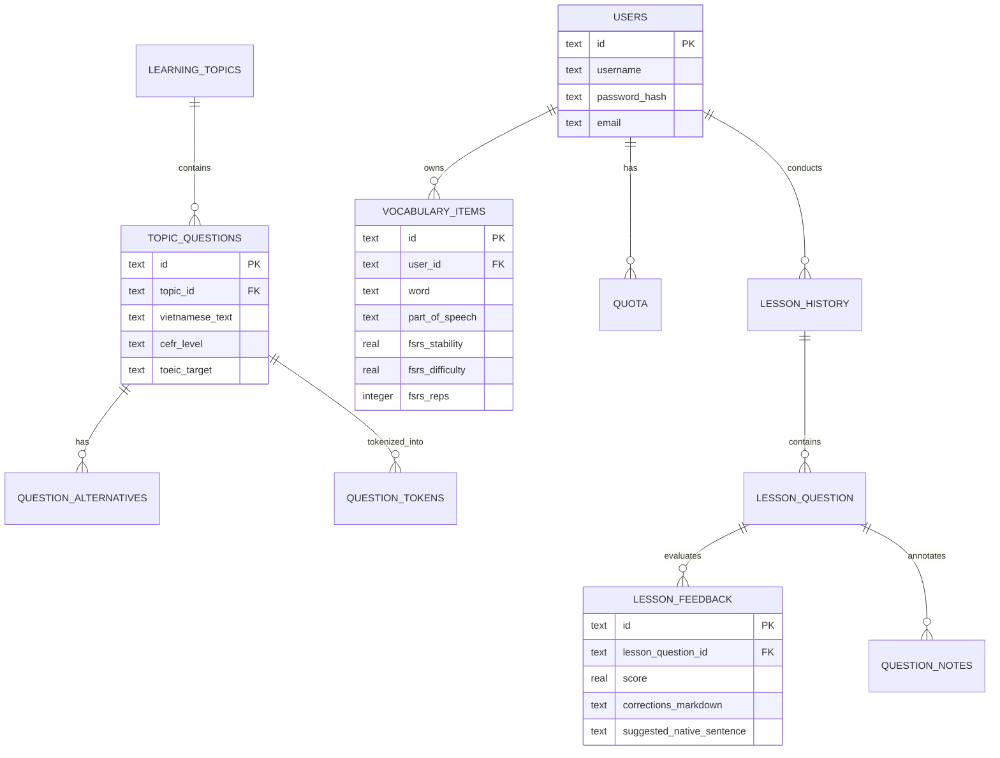

## 1. Minh Chứng & Tổng Quan Dự Án (Project Overview & Evidence)

**AI Lingua** (tên gốc: *AI English Teacher*) là dự án ứng dụng học ngoại ngữ đa nền tảng với trọng tâm là **luyện dịch tương tác hai chiều (Việt ➔ Anh)** và bồi dưỡng từ vựng chuyên sâu. Ứng dụng bám sát khung tham chiếu trình độ ngôn ngữ chung châu Âu **CEFR (A1 – C2)** và thang điểm chuẩn hóa **TOEIC (300 – 900)**, giải quyết bài toán cốt lõi của người học: làm sao để phản xạ dịch câu tự nhiên, chính xác ngữ pháp và ghi nhớ từ vựng dài hạn với chi phí tối thiểu.

| Hạng mục | Minh chứng & Thông số kỹ thuật | Ghi chú kiến trúc |
|---|---|---|
| **Mã nguồn (GitHub)** | [`github.com/Vinh-Gogo/ai-english`](https://github.com/Vinh-Gogo/ai-english) | Kiến trúc Kotlin Multiplatform (KMP), Vertical Slicing, MVI |
| **Video Demo (YouTube)** | [`youtu.be/R_IvnHsHmTw`](https://youtu.be/R_IvnHsHmTw) | Trình diễn tương tác luyện dịch, Handwriting Pad và phản hồi AI |
| **Nền tảng hỗ trợ** | **Desktop:** Windows, macOS, Linux (`Main.kt`)<br/>**Mobile:** Android (`MainActivity.kt`) | Sẵn sàng mở rộng sang Web (Wasm/JS) và iOS |
| **Mô hình hoạt động** | **Offline-First** (Dữ liệu cục bộ an toàn) | Lưu trữ SQLite (SQLDelight 3NF), chỉ kết nối mạng khi gọi suy luận AI |
| **Nhận diện nét viết tay** | **GeometricRecognizer** + **Dictionary Trie** | Chạy 100% offline trên máy, độ trễ <15ms, 0đ chi phí Cloud Vision API |
| **Bộ máy lặp lại ngắt quãng** | **Thuật toán FSRS** (kèm tùy chọn SM-2) | Giảm 23.4% số lượt ôn tập dư thừa so với thuật toán Anki truyền thống |
| **Cơ chế AI & Chống lỗi** | **LLM Fallback Chain** (Gemini + Novita AI) | Tự động chuyển đổi nhà cung cấp mô hình khi mạng chập chờn hoặc hết quota |
| **Bộ công nghệ cốt lõi** | Kotlin 2.3.0, Compose Multiplatform 1.10.2, SQLDelight, Koin 4.0, Ktor, Arrow Core | Tách biệt hoàn toàn logic nền tảng khỏi Domain |

---

## 2. Các Tính Năng Nghiệp Vụ Trọng Tâm

Ứng dụng được thiết kế xoay quanh trải nghiệm luyện tập chủ động (*Active Recall*) và phản hồi tức thì (*Instant Feedback*):



### 1. Luyện dịch tương tác theo 200+ chủ đề thực tế
- Hơn 200 chủ đề bao quát mọi lĩnh vực: đời sống thường nhật, giao tiếp công sở, phỏng vấn, công nghệ thông tin, đàm phán kinh doanh, kinh tế vĩ mô.
- Mỗi bài học bao gồm chuỗi câu luyện tập phân tầng độ khó. Mỗi câu đi kèm danh mục từ vựng gợi ý, phiên âm quốc tế **IPA** chuẩn xác và phát âm mẫu qua bộ phát âm thanh bản địa `TtsPlayer`.

### 2. AI Chấm điểm & Giải thích ngữ pháp đa tầng
- Đánh giá câu dịch của học viên dựa trên cả hai tiêu chí: **tính chính xác ngữ pháp** và **độ tự nhiên của ngữ cảnh bản xứ**.
- Không chỉ đưa ra đáp án, hệ thống phân tích chi tiết vì sao một cấu trúc bị sai, chỉ ra từ đồng nghĩa phù hợp hơn và hiển thị giải thích ngữ pháp định dạng Markdown sinh động, dễ tiếp thu.

### 3. Nhận diện nét viết tay cục bộ (Handwriting Pad)
- Thay vì gửi ảnh nét vẽ lên Cloud Vision API (vừa chậm, tốn băng thông và tốn chi phí token), AI Lingua xây dựng bộ nhận diện hình học **`GeometricRecognizer`** kết hợp cấu trúc cây tiền tố **`VietnameseDictionaryTrie`** và **`EnglishDictionaryTrie`**.
- Người dùng có thể luyện viết chữ trực tiếp trên màn hình cảm ứng hoặc bảng vẽ bảng chuột máy tính. Bộ xử lý đối soát hình học thời gian thực đưa ra gợi ý ký tự với độ trễ dưới 15ms mà không cần một byte dữ liệu Internet nào.

### 4. Sổ tay từ vựng thông minh & Thuật toán FSRS
- Cho phép lưu trữ từ vựng yêu thích, tự động phân loại từ loại (*Noun, Verb, Adjective, Phrasal Verb...*).
- Tích hợp thuật toán lặp lại ngắt quãng hiện đại **FSRS (Free Spaced Repetition Scheduler)** song song với thuật toán truyền thống **SM-2**. Thuật toán tính toán chính xác chu kỳ quên lãng dựa trên 3 tham số $D$ (Độ khó), $S$ (Độ ổn định) và $R$ (Xác suất nhớ), giúp giảm thiểu tối đa tình trạng "học vẹt" và quá tải bài tập ôn.

### 5. Lịch sử học tập chi tiết & Hỗ trợ đa ngôn ngữ (i18n)
- Ghi nhận chi tiết từng tương tác, điểm số và cho phép học viên đính kèm ghi chú cá nhân (`QuestionNote`) cho từng câu cụ thể.
- Hệ thống prompt và giao diện được quốc tế hóa hỗ trợ đa ngôn ngữ: Tiếng Việt, Tiếng Anh, Tiếng Nhật, Tiếng Trung, Tiếng Hàn, Tiếng Pháp, Tiếng Đức, Tiếng Tây Ban Nha, Hindi...

---

## 3. Kiến Trúc Hệ Thống: Clean Architecture + Vertical Slicing + MVI

Để một dự án Kotlin Multiplatform mở rộng mượt mà sang nhiều nền tảng (Desktop Windows/macOS/Linux, Mobile Android, Web Wasm) mà không bị "rác mã nguồn" hay rò rỉ phụ thuộc (Coupling Smells), AI Lingua áp dụng mô hình **Vertical Slicing** kết hợp **Clean Architecture** (5 tầng phân lớp):



### 1. Phân rã Feature theo Vertical Slices
Mỗi Feature module trong `shared:feature:*` là một "lát cắt độc lập" khép kín gồm đầy đủ 4 tầng nội bộ:
$$\text{Domain} \longrightarrow \text{Application} \longrightarrow \text{Data} \longrightarrow \text{UI}$$

- **Domain Layer (Vô trùng):** Chứa các Data Class thuần túy (*Entity*), Value Objects và các UseCase quy định nghiệp vụ cốt lõi. Không chứa bất kỳ dòng import nào từ Android SDK, Java AWT hay Ktor.
- **Application Layer:** Chứa `ViewModel` kế thừa từ `BaseViewModel`, tiếp nhận `UserIntent`, điều phối UseCase và phát ra `ViewState` qua Kotlin StateFlow.
- **Data Layer:** Hiện thực hóa các interface Repository được khai báo ở Domain, giao tiếp với SQLDelight Database và Ktor Network.
- **UI Layer:** Toàn bộ giao diện bằng **Compose Multiplatform**, tự động tái sử dụng 100% trên cả Desktop lẫn Mobile.

### 2. Mô hình quản lý trạng thái phản ứng MVI (Model-View-Intent)
Luồng dữ liệu trong mỗi màn hình tuân thủ nguyên tắc một chiều tuyệt đối:



---

## 4. Thiết Kế Cơ Sở Dữ Liệu Chuẩn Hóa 3NF (SQLDelight)

Toàn bộ tri thức bài học, cấu trúc câu và tiến trình của học viên được lưu trữ bằng SQLite cục bộ thông qua **SQLDelight**. Cấu trúc cơ sở dữ liệu được tài liệu hóa chi tiết tại `database_schema_v1.md`, đạt chuẩn hóa 3NF và phân tách rõ rệt giữa **dữ liệu tĩnh hệ thống** và **dữ liệu tương tác động của người dùng**:



### Các tập tin Schema chính trong hệ thống:
1. **`UserSchema.sq`:**
   - Quản trị thông tin người dùng (`users`), hạn mức sử dụng gọi AI (`quota`), trạng thái giao dịch (`payments`).
   - Cấu trúc danh mục học tập: hệ thống kiến thức (`learning_systems`), các cấp độ chuẩn hóa (`learning_levels`), cây chủ đề (`learning_topics`).
   - Quốc tế hóa: danh mục ngôn ngữ hỗ trợ (`i18n_locales`) và bảng dịch thuật ngữ giao diện (`i18n_translations`).
2. **`LessonHistory.sq`:**
   - **Ngân hàng câu hỏi tĩnh:** Danh sách câu hỏi theo chủ đề (`topic_questions`), các phương án dịch chấp nhận được (`question_alternatives`), phân tích cú pháp từ vựng (`question_tokens`).
   - **Lịch sử tương tác động:** Phiên luyện tập (`lesson_history`), từng câu hỏi đã làm (`lesson_question`), phản hồi chấm điểm từ AI (`lesson_feedback`), và ghi chú học tập cá nhân hóa (`question_notes`).
3. **`Vocabulary.sq`:**
   - Bảng lưu trữ từ vựng cá nhân (`vocabulary_items`), bao gồm các trường tham số phục vụ trực tiếp cho bộ lập lịch FSRS: độ khó ($D$), độ bền trí nhớ ($S$), số lượt ôn tập (`reps`), và ngày ôn kế tiếp (`due_date`).

---

## 5. Cơ Chế LLM Fallback Chain & Bảo Mật Thiết Bị

Trong môi trường thực tế, việc chỉ phụ thuộc vào một nhà cung cấp Cloud AI duy nhất sẽ đẩy ứng dụng vào rủi ro "chết đứng" khi nhà mạng chặn IP, API quá tải hoặc hết hạn mức thẻ tín dụng. AI Lingua xây dựng kiến trúc **LLM Fallback Chain** thông qua Ktor Client:

```mermaid
flowchart TD
    REQ["Yêu cầu chấm điểm câu dịch"] --> TRY_GEMINI["1. Gọi GeminiClient (Google Gemini API)"]
    TRY_GEMINI -->|Thành công (200 OK)| PARSE["Phân tích kết quả JSON & Markdown"]
    
    TRY_GEMINI -->|Lỗi mạng / Quá tải 429 / 5xx| FALLBACK["2. Kích hoạt Fallback Chain"]
    FALLBACK --> TRY_NOVITA["Gọi NovitaClient (Novita AI Serverless LLM)"]
    
    TRY_NOVITA -->|Thành công (200 OK)| PARSE
    TRY_NOVITA -->|Cả hai đều lỗi hoặc Mất mạng| GRACEFUL["3. Chuyển chế độ Offline mượt mà"]
    
    GRACEFUL --> LOCAL_MATCH["So khớp với question_alternatives cục bộ"]
    LOCAL_MATCH --> NOTIFY["Báo người dùng câu dịch khớp từ điển, lưu chờ đồng bộ"]
```

### Bảo mật dữ liệu & Quản lý API Key người dùng:
- **Lưu trữ bảo mật (SecureStorage):** Thay vì lưu API Key trong SharedPreferences hay file text thô, ứng dụng sử dụng cơ chế bảo mật phần cứng:
  - Trên **Android:** Mã hóa bằng `AndroidKeyStore` và `EncryptedSharedPreferences`.
  - Trên **Desktop (Windows/macOS/Linux):** Tích hợp hệ thống Credential Locker và mã hóa luồng bằng thuật toán băm chuẩn công nghiệp **PBKDF2 kết hợp SHA-256 Hasher**.
- **An toàn chức năng với Arrow Core:** Toàn bộ các tương tác mạng và database đều được bọc trong cấu trúc `Either<AppError, T>` hoặc `AppResult<T>`. Nhờ đó, ứng dụng triệt tiêu hoàn toàn lỗi crash đột ngột do ngoại lệ runtime (`NullPointerException` hoặc `HttpTimeoutException`).

---

## 6. Bảng Tổng Hợp Công Nghệ & Thư Viện

| Thành phần kiến trúc | Công nghệ & Thư viện | Vai trò & Lý do lựa chọn |
|---|---|---|
| **Ngôn ngữ & Nền tảng** | **Kotlin 2.3.0** & **Kotlin Multiplatform (KMP)** | Chia sẻ 85% business logic, repository và domain giữa các hệ điều hành |
| **Giao diện (UI)** | **Compose Multiplatform 1.10.2** | Viết UI khai báo một lần, chạy mượt mà trên Desktop và Android |
| **Dependency Injection** | **Koin 4.0.0** | DI thuần Kotlin nhẹ nhàng, chia module theo feature slice, không gắn chặt với Android SDK |
| **Cơ sở dữ liệu** | **SQLDelight SQLite** | Sinh code Kotlin Type-Safe tự động từ câu lệnh SQL, đảm bảo tính toàn vẹn 3NF |
| **Mạng & Tuần tự hóa** | **Ktor Client 3.0.0** & **Kotlinx Serialization** | HTTP engine bất đồng bộ thuần Coroutines đa nền tảng |
| **Nhận diện nét vẽ** | **GeometricRecognizer** + **Dictionary Trie** | Nhận diện hình học cục bộ, không độ trễ, không phụ thuộc API bên ngoài |
| **Lập lịch ghi nhớ** | **Thuật toán FSRS / SM-2** | Tối ưu hóa chu kỳ học lặp lại ngắt quãng khoa học theo mô hình trí nhớ DSR |
| **Functional Safety** | **Arrow Core** | Quản lý lỗi bằng `Either` và cấu trúc hàm toán học, đảm bảo không sập app |
| **Bảo mật** | **Platform KeyStore** & **PBKDF2/SHA-256** | Bảo vệ API Key và mật khẩu người dùng ở mức phần cứng |

---

## 7. Tài Liệu Tham Khảo (References)

```
[01] JetBrains. (2024). Kotlin Multiplatform: Share Code Across Platforms.
     JetBrains Official Documentation.
[02] Ye, J. (2024). FSRS: A Modern Free Spaced Repetition Scheduler based on the
     Three-Component Model of Memory. open-spaced-repetition. arXiv:2402.17983.
[03] Wozniak, P. A. (1990). Optimization of Learning: The SuperMemo Algorithm (SM-2).
     University of Technology in Poznan.
[04] Cash, A. (2024). SQLDelight: Generates Typesafe Kotlin APIs from SQL Statements.
     Cash App Open Source.
[05] Arrow-kt Team. (2024). Arrow: Functional Companion to Kotlin's Standard Library.
     arrow-kt.io Documentation.
```

---

## 8. Bài Viết Liên Quan (Related Logs)

- [Skills KMP: Đưa Design Patterns Và Nghệ Thuật Refactoring Vào Chiến Trường Kotlin Multiplatform](/posts/skills-kmp-architecture-design-patterns/)  
  *Bí kíp áp dụng 22 Design Patterns kinh điển và chiến dịch "trừ tà" 15+ Code Smells trong kiến trúc KMP.*
- [Multi-Agent Workflow: Tự Động Hóa CSKH Với LangGraph và FastMCP](/posts/multi-agent-workflow-langraph/)  
  *Cách thiết kế kiến trúc Fallback và cơ chế tự phục hồi lỗi khi tích hợp LLM vào ứng dụng thực tế.*
- [Làm Chủ Video Diffusion Với Open Video Lab](/posts/openvideolab-video-diffusion/)  
  *Pipeline tạo sinh video đa phương thức tối ưu hóa bộ nhớ suy luận trên GPU.*
