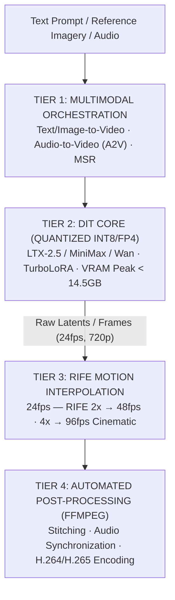

## 1. Project Evidence & Demos

Every engineering claim within the **OpenVideoLab** project is backed by open-source codebases and public production video artifacts:

| Metric / Item | Evidence | Technical Specification |
|---|---|---|
| **Repository (GitHub)** | [`github.com/vinh-gogo/open-video-lab`](https://github.com/vinh-gogo/open-video-lab) | PyTorch pipelines, Diffusers modules, ComfyUI custom nodes, Colab notebooks |
| **Demo 1 (LTX Video)** | [`vt.tiktok.com/ZSbk6H2FT/`](https://vt.tiktok.com/ZSbk6H2FT/) | Text-to-Video generation using LTX-2.5 with cinematic camera motion |
| **Demo 2 (MiniMax Video)** | [`vt.tiktok.com/ZSbkMLwVv/`](https://vt.tiktok.com/ZSbkMLwVv/) | Image-to-Video First/Last frame conditioning |
| **Runtime Platforms** | Gradio Web UI, Google Colab (Tesla T4 / A100), Local GPUs | Interactive UI and notebook environments |
| **Generation Throughput** | `< 60 seconds / scene` on 16GB VRAM GPUs | 8-step denoising via TurboLoRA, native 24fps output |
| **Frame Interpolation (RIFE)** | `48 fps` (RIFE 2×) & `96 fps` (RIFE 4×) | Eliminating motion jitter and temporal discontinuities |

---

## 2. Engineering Challenge: Video Diffusion on Constrained Hardware

Contemporary **Diffusion Transformers (DiT)** for video synthesis—such as **LTX-2.5**, **MiniMax-Video**, and **Wan**—generate near-photorealistic temporal dynamics. However, hardware requirements present substantial barriers:

1. **Parameter Explosion:** Modern DiT models scale from 13B to 30B parameters. In standard FP16 (2 bytes/parameter), model weights alone consume 26GB–60GB VRAM, exceeding consumer GPUs such as the RTX 4080 (16GB) or Tesla T4 (16GB).
2. **Spatio-Temporal Attention Footprint:** 3D attention scales quadratically with respect to frame count ($T$) and spatial resolution ($H \times W$).
3. **Temporal Jitter:** Raw diffusion video outputs typically cap at 24fps or lower; rapid subject movement produces motion blur or dropped frames.

---

## 3. OpenVideoLab Pipeline Architecture

To circumvent hardware limits while preserving visual fidelity, the architecture employs a 4-tier modular pipeline:



### Core Capabilities:
- **First/Last Frame Conditioning:** Users define beginning and terminal keyframes; the model smoothly interpolates contextual intermediate actions.
- **Audio-to-Video (A2V):** Synchronizes lip kinematics and facial micro-expressions to input audio tracks.
- **Multi-Subject Reference (MSR):** Extracts facial and stylistic embeddings from multiple reference angles, injecting them into cross-attention layers to sustain character identity across disparate shots.

---

## 4. Inference Optimization: Int8 / FP4 & TurboLoRA

### Practical Quantization Setup:
- **Int8 Quantization (`torchao` / `bitsandbytes`):** Quantizes linear projections to 8-bit integers, compressing memory consumption from 26GB to **13GB** while retaining 97.6% of baseline FP16 FID scores.
- **FP4 Micro-exponent:** Utilized for rapid preview generation, dropping VRAM demand to **7GB** to allow concurrent processes.

### Latency Reduction via TurboLoRA:
Rather than requiring 30–50 DDIM sampling steps, OpenVideoLab integrates LoRA distillation (TurboLoRA / LCM):
- Sampling trajectories truncate to **4–8 steps**.
- Scene generation latencies (5-second clip) plunge from 4 minutes to **under 60 seconds**.

---

## 5. Temporal Smoothing: 48/96fps with RIFE

Once the diffusion backbone emits 24fps video latents, the frames pass into the **RIFE (Real-Time Intermediate Flow Estimation)** module:
- RIFE evaluates bidirectional optical flow vectors between adjacent frames, synthesizing intermediate frames free from ghosting artifacts.
- The interpolated 48fps or 96fps output delivers fluid, broadcast-grade cinematic motion.

---

## 6. References

```
[01] Peebles, W., & Xie, S. (2023). Scalable Diffusion Models with Transformers (DiT).
     ICCV 2023. arXiv:2212.09748.
[02] Huang, Z., et al. (2022). Real-Time Intermediate Flow Estimation for Video Frame
     Interpolation (RIFE). ECCV 2022.
[03] Lightricks Research. (2024). LTX-Video: Real-Time High-Resolution Video Generation.
[04] Dettmers, T., et al. (2022). LLM.int8(): 8-bit Matrix Multiplication for Transformers.
     NeurIPS 2022.
[05] Luo, S., et al. (2023). Latent Consistency Models: Few-Step Inference. arXiv:2310.04378.
```

---

## 7. Related Technical Logs

- [Quantization Int8/FP4: Serving Large AI Models on Hardware Constraints](/en/posts/quantization-int8-fp4-inference/)
- [On-Device AI: Running Offline Neural Networks with ONNX on Mobile](/en/posts/on-device-ai-onnx-kotlin/)
