---
title: "OpenVideoLab: Tạo Sinh Video AI Đa Phương Thức Trên GPU 16GB"
date: 2026-09-12T10:00:00+07:00
draft: false
tags: ["generative-ai", "du-an", "video-diffusion"]
description: "Pipeline sinh video AI đa phương thức với LTX-2.5, MiniMax, Wan; tối ưu quantization int8/fp4 chạy ổn định trên GPU 16GB (<60s/cảnh) và nội suy mượt 48/96fps (RIFE)."
summary: "Pipeline sinh video AI đa phương thức với LTX-2.5, MiniMax, Wan; tối ưu quantization int8/fp4 chạy ổn định trên GPU 16GB (<60s/cảnh) và nội suy mượt 48/96fps (RIFE)."
ShowToc: true
TocOpen: true
---

## 1. Minh Chứng & Bản Thử Nghiệm (Evidence & Demos)

Mọi tuyên bố kỹ thuật trong dự án **OpenVideoLab** đều được kiểm chứng thông qua mã nguồn mở và các bản demo video thực tế đã xuất xưởng:

| Hạng mục | Minh chứng thực tế | Ghi chú kỹ thuật |
|---|---|---|
| **Mã nguồn (GitHub)** | [`github.com/vinh-gogo/open-video-lab`](https://github.com/vinh-gogo/open-video-lab) | Pipeline PyTorch, Diffusers, ComfyUI nodes, Colab notebooks |
| **Video Demo 1 (LTX Video)** | [`vt.tiktok.com/ZSbk6H2FT/`](https://vt.tiktok.com/ZSbk6H2FT/) | Text-to-Video với LTX-2.5, camera motion mượt mà |
| **Video Demo 2 (MiniMax Video)** | [`vt.tiktok.com/ZSbkMLwVv/`](https://vt.tiktok.com/ZSbkMLwVv/) | Image-to-Video First/Last frame conditioning |
| **Nền tảng triển khai** | Web UI (Gradio), Google Colab (Tesla T4 / A100), Local GPU | Chạy trực tiếp từ notebook hoặc local environment |
| **Tốc độ đo đạc (Benchmark)** | `< 60 giây / phân cảnh` trên GPU 16GB VRAM | Denoising 8 bước với TurboLoRA, 24fps gốc |
| **Nội suy khung hình (RIFE)** | `48 fps` (RIFE 2×) & `96 fps` (RIFE 4×) | Loại bỏ hiện tượng rung lắc (jitter) giữa các khung hình |

---

## 2. Thách Thức Kỹ Thuật: Video Diffusion Trên Phần Cứng Giới Hạn

Các kiến trúc **Diffusion Transformers (DiT)** thế hệ mới trong xử lý video như **LTX-2.5**, **MiniMax-Video**, và **Wan** đã đưa chất lượng tạo sinh tiệm cận chuẩn điện ảnh. Tuy nhiên, rào cản lớn nhất nằm ở tài nguyên phần cứng:

1. **Bùng nổ tham số:** Mô hình kích thước từ 13B đến 30B tham số. Ở định dạng FP16 (2 bytes/param), riêng trọng số đã ngốn 26GB–60GB VRAM, vượt ngưỡng của các GPU phổ thông như RTX 4080 (16GB) hay Tesla T4 (16GB).
2. **Kích thước Spatio-Temporal Attention:** Chú ý 3 chiều (không gian + thời gian) tiêu tốn bộ nhớ theo cấp số nhân khi tăng số lượng khung hình ($T$) và độ phân giải ($H \times W$).
3. **Hiện tượng giật khung hình:** Video sinh trực tiếp từ diffusion model thường dừng ở 24fps hoặc thấp hơn, chuyển động nhanh dễ bị mờ hoặc gãy frame.

---

## 3. Kiến Trúc Pipeline OpenVideoLab

Để giải quyết bài toán trên mà không đánh đổi chất lượng hình ảnh, tôi thiết kế pipeline 4 tầng tối ưu:

```mermaid
flowchart TD
    IN["Văn bản / Ảnh tham chiếu / Audio"] --> T1
    
    T1["<b>TẦNG 1: ĐIỀU PHỐI ĐA PHƯƠNG THỨC</b><br/>Text/Image-to-Video · Audio-to-Video (A2V) · MSR"]
    T2["<b>TẦNG 2: DIT CORE (QUANTIZED INT8/FP4)</b><br/>LTX-2.5 / MiniMax / Wan · TurboLoRA · VRAM peak: dưới 14.5GB"]
    T3["<b>TẦNG 3: NỘI SUY CHUYỂN ĐỘNG RIFE</b><br/>24fps — RIFE 2x ➔ 48fps · 4x ➔ 96fps Cinematic"]
    T4["<b>TẦNG 4: HẬU KỲ TỰ ĐỘNG (FFMPEG)</b><br/>Stitching · Audio Sync · Mã hóa H.264 / H.265"]
    
    T1 --> T2
    T2 -->|"Video Raw (24fps, 720p)"| T3
    T3 --> T4
```



### Các tính năng cốt lõi:
- **First/Last Frame Conditioning:** Cho phép chỉ định ảnh bắt đầu và ảnh kết thúc, model tự nội suy hành động logic ở các frame giữa.
- **Audio-to-Video (A2V):** Đồng bộ chuyển động môi và biểu cảm nhân vật khớp với nhịp điệu audio đầu vào.
- **Multi-Subject Reference (MSR):** Trích xuất feature vector của nhân vật chính từ nhiều góc ảnh khác nhau, inject vào cross-attention để giữ nhất quán diện mạo qua nhiều cảnh quay.

---

## 4. Tối Ưu Hóa Suy Luận: Int8 / FP4 & TurboLoRA

### Cấu hình Quantization thực tế:
- **Int8 Quantization (`torchao` / `bitsandbytes`):** Nén ma trận trọng số Linear về 8-bit, giảm VRAM tiêu thụ từ 26GB xuống còn **13GB**, giữ nguyên 97.6% chất lượng FID so với FP16.
- **FP4 Micro-exponent:** Dùng cho chế độ dựng thử nghiệm (preview) nhanh, đưa VRAM xuống mức **7GB** để có thể chạy song song các tiến trình khác.

### Rút ngắn bước lặp với TurboLoRA:
Thay vì cần 30–50 bước DDIM sampling truyền thống, OpenVideoLab tích hợp LoRA distillation (TurboLoRA / LCM):
- Số bước sampling giảm xuống còn **4 đến 8 steps**.
- Thời gian sinh mỗi cảnh 5 giây giảm từ 4 phút xuống **dưới 60 giây**.

---

## 5. Nâng Mượt Khung Hình 48/96fps Với RIFE

Sau khi mô hình diffusion xuất ra video gốc ở 24fps, pipeline chuyển qua mô-đun **RIFE (Real-Time Intermediate Flow Estimation)**:
- RIFE sử dụng mạng nơ-ron ước lượng dòng quang học (optical flow) giữa hai frame kề nhau, sinh ra các khung hình trung gian hoàn toàn không bị ghosting.
- Kết quả video 48fps hoặc 96fps mang lại cảm giác cinematic mượt mà, sẵn sàng phục vụ sản xuất nội dung số.

---

## 6. Tài Liệu Tham Khảo (References)

```
[01] Peebles, W., & Xie, S. (2023). Scalable Diffusion Models with Transformers (DiT). 
     IEEE/CVF International Conference on Computer Vision (ICCV 2023). arXiv:2212.09748.
[02] Huang, Z., Zheng, T., Heng, P. A., & Zhou, B. (2022). Real-Time Intermediate Flow 
     Estimation for Video Frame Interpolation (RIFE). ECCV 2022.
[03] Lightricks Research. (2024). LTX-Video: Real-Time High-Resolution Video Generation. 
     Official Technical Report.
[04] Dettmers, T., Lewis, M., Belkada, Y., & Zettlemoyer, L. (2022). LLM.int8(): 8-bit 
     Matrix Multiplication for Transformers at Scale. NeurIPS 2022.
[05] Luo, S., et al. (2023). Latent Consistency Models: Synthesizing High-Resolution 
     Images with Few-Step Inference. arXiv:2310.04378.
```

---

## 7. Bài Viết Liên Quan (Related Logs)

- [Quantization Int8/FP4: Chạy Model AI Lớn Trên GPU Tài Nguyên Giới Hạn](/posts/quantization-int8-fp4-inference/)  
  *Phân tích chuyên sâu về toán học đằng sau 8-bit và 4-bit quantization cùng bảng đo đạc VRAM thực tế.*
- [On-Device AI: Chạy Neural Network Offline Với ONNX Trên Mobile](/posts/on-device-ai-onnx-kotlin/)  
  *Cách đưa mô hình AI chạy trực tiếp trên thiết bị di động mà không cần kết nối internet hay chi phí cloud API.*
