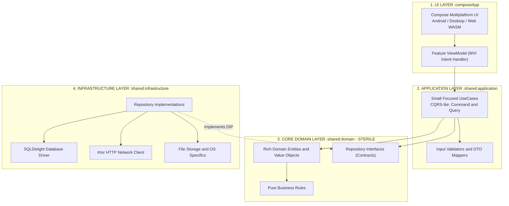
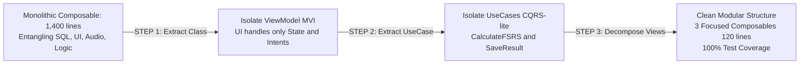

> *"Write once, run natively across Android, iOS, Windows, macOS, and Web! Cut 70% of engineering overhead!"*

If you have ever attended a developer conference discussing **Kotlin Multiplatform (KMP)** or **Compose Multiplatform**, you have undoubtedly encountered this seductive pitch. It sounds like a CTO's paradise: unify business logic under a single umbrella and permanently end the eternal turf wars between Android and iOS teams over divergent edge-case implementations.

Yet, after two or three weeks of enthusiastic feature development, that idyllic dream frequently degenerates into an architectural nightmare:
* **Android Context** instances and platform SDKs leaking indiscriminately throughout `shared/commonMain`.
* ViewModels metastasizing beyond 2,000 lines of code—concurrently firing Ktor network calls, compiling raw SQL queries, and handling UI touch ripples.
* A sprawling thicket of `expect / actual` declarations abused as quick-and-dirty duct tape, requiring engineers to patch five distinct platform targets every time a single function signature changes.
* Flawless runtime performance on Android, paired with catastrophic concurrency locks and race conditions the moment the app compiles to Desktop!

From the trenches of rebuilding the cross-platform Japanese language learning application **Mainichi App** (`mainichi-app-v2`), I arrived at a fundamental realization: **KMP is not the culprit; the fault lies in approaching a distributed cross-platform ecosystem with the mindset of building a single mobile app.**

To resolve this structurally, I synthesized our hard-won production lessons, fusing **22 classic Gang of Four (GoF) Design Patterns** with the **Refactoring Code Smells** catalog to create an open architectural blueprint: [`github.com/vinh-gogo/skills-kmp`](https://github.com/vinh-gogo/skills-kmp).

This post distills those insights: from exorcising notorious architectural code smells to building an enterprise-grade, clean KMP foundation.

---

## 1. Exorcising the Code Smells: Catching 4 Architectural Pitfalls in KMP

When inspecting struggling KMP codebases, four classic "code smells" identified in Refactoring literature emerge with alarming regularity:

### 🤢 Smell 1: The God ViewModel (Large Class & Long Method — Bloaters)
The most common trap for native mobile engineers entering KMP. In single-platform Android, teams often dump arbitrary responsibilities into ViewModels. In KMP, where a single ViewModel must simultaneously orchestrate mobile touch interactions and desktop mouse/keyboard navigation:
* The class mutates into a massive blob managing UI reactive state, Ktor HTTP requests, JSON serialization, and business scoring logic.
* **Consequence:** Writing isolated Unit Tests becomes impossible without mocking the entire UI framework and database stack.

### 💉 Smell 2: Platform Leakage (Feature Envy & Inappropriate Intimacy — Couplers)
During an architecture audit, I once discovered an engineer injecting `android.content.Context` directly into a Domain Use Case in `commonMain` simply to load a local text asset!
* This catastrophically violates **Clean Architecture**.
* The moment your Domain layer becomes contaminated with platform-specific binaries, your codebase loses the ability to compile to Windows (Desktop) or WebAssembly (WASM).

### 🔫 Smell 3: Shotgun Surgery (Change Preventers)
Suppose you need to add an `avatarUrl` property to the user profile.
Under coupled architectures, you are forced to edit an avalanche of files: the SQLDelight schema, the SQLite entity, the network DTO, the Android Compose composable, the Desktop Compose layout, and the ViewModel. Every tiny requirement adjustment triggers a shotgun blast that fractures the entire system.

### 🎭 Smell 4: Branching Thickets (Switch Statement / When Abuse — OO Abusers)
Scattering `when (platform)` checks or creating redundant `expect/actual` function declarations throughout business logic instead of employing Polymorphism and interface abstraction.

---

## 2. Architectural Blueprint: The Sterile Domain Boundary

To neutralize these code smells permanently, the architecture codified in [`skills-kmp`](https://github.com/vinh-gogo/skills-kmp) enforces **strict unidirectional dependency flow**:



### 🛡️ The "Sterility" Mandate for the Domain Layer:
The **`:shared:domain`** module is the beating heart of your product. It must remain strictly isolated:
1. **Zero dependencies on:** Compose, Android SDK, Java AWT (Desktop), Ktor, SQLDelight, or serialization frameworks.
2. **Contains exclusively:** Immutable entities, Value Objects, business heuristics, and abstract Repository contracts.
3. This guarantees your business rules endure for a decade, regardless of UI toolkit migrations or database replacements.

---

## 3. Five Design Patterns That Save KMP Projects

Applying design patterns is not an intellectual exercise in abstraction—it provides targeted remedies for concrete cross-platform friction points:

### 3.1 Adapter Pattern (with Repository Pattern): Domesticating Infrastructure
Rather than allowing ViewModels to touch SQLDelight or Ktor directly, we apply the **Adapter Pattern** via Repository interfaces:

```kotlin
// 1. DOMAIN LAYER (:shared:domain) — Pure, framework-agnostic contract
interface VocabularyRepository {
    suspend fun getWordById(id: WordId): Result<VocabularyWord>
    fun observeLearningList(): Flow<List<VocabularyWord>>
}

// 2. INFRASTRUCTURE LAYER (:shared:infrastructure) — Concrete Adapter
class SqlDelightVocabularyRepository(
    private val database: MainichiDatabase,
    private val wordMapper: DatabaseWordMapper // Maps SQL tables to Domain Entities
) : VocabularyRepository {
    
    override suspend fun getWordById(id: WordId): Result<VocabularyWord> {
        return runCatching {
            database.vocabularyQueries
                .selectById(id.value)
                .executeAsOne()
                .let(wordMapper::toDomain)
        }
    }

    override fun observeLearningList(): Flow<List<VocabularyWord>> {
        return database.vocabularyQueries
            .selectLearning()
            .asFlow()
            .mapToList(Dispatchers.IO)
            .map { list -> list.map(wordMapper::toDomain) }
    }
}
```
**Advantage:** If you decide to transition from SQLite to Realm or synchronize with cloud GraphQL backends, you simply write a new Adapter without altering a single line of UI or Use Case logic.

---

### 3.2 Strategy Pattern: Eliminating `expect / actual` Proliferation
Rather than declaring dozens of scattered `expect fun playAudio()` primitives, define a **Strategy Interface** in common code and inject platform implementations via Dependency Injection:

```kotlin
// Common Strategy Interface
interface AudioPlayerStrategy {
    suspend fun play(audioUrl: String)
    fun stop()
}

// Android Strategy: Leverages Android MediaPlayer / ExoPlayer
class AndroidAudioPlayer(private val context: Context) : AudioPlayerStrategy { ... }

// Desktop Strategy: Leverages JavaFX Media / CoreAudio bindings
class DesktopAudioPlayer : AudioPlayerStrategy { ... }
```
In the Koin DI configuration, simply bind the active strategy per platform target:
```kotlin
// androidMain
val platformModule = module {
    single<AudioPlayerStrategy> { AndroidAudioPlayer(get()) }
}

// desktopMain
val platformModule = module {
    single<AudioPlayerStrategy> { DesktopAudioPlayer() }
}
```
Not a single `when (platform)` check remains in your business logic.

---

### 3.3 State & Observer Pattern: Unidirectional MVI Architecture
Managing cross-platform reactive state via **Model-View-Intent (MVI)** represents an optimal marriage between the **State Pattern** (screens represented as Immutable Data Classes) and the **Observer Pattern** (via Kotlin `StateFlow`):

```kotlin
// 1. Immutable State
data class WordReviewUiState(
    val isLoading: Boolean = false,
    val currentWord: VocabularyWord? = null,
    val isRevealed: Boolean = false,
    val errorMessage: String? = null
)

// 2. User Intents
sealed interface WordReviewIntent {
    data object RevealAnswer : WordReviewIntent
    data class SubmitRating(val rating: Int) : WordReviewIntent
    data object NextWord : WordReviewIntent
}

// 3. MVI ViewModel
class WordReviewViewModel(
    private val reviewWordUseCase: ReviewWordUseCase,
    private val getNextWordUseCase: GetNextWordUseCase
) : ViewModel() {

    private val _uiState = MutableStateFlow(WordReviewUiState(isLoading = true))
    val uiState: StateFlow<WordReviewUiState> = _uiState.asStateFlow()

    fun processIntent(intent: WordReviewIntent) {
        when (intent) {
            is WordReviewIntent.RevealAnswer -> _uiState.update { it.copy(isRevealed = true) }
            is WordReviewIntent.SubmitRating -> handleRating(intent.rating)
            is WordReviewIntent.NextWord -> loadNextWord()
        }
    }
}
```
**Core Takeaway:** The UI performs only two actions: (1) Render incoming state from `uiState`, and (2) Dispatch `Intents` back to the ViewModel. State flows unidirectionally, eradicating concurrency race conditions across platforms.

---

### 3.4 Value Object Pattern: Eliminating Primitive Obsession
Avoid passing ambiguous raw primitives:
```kotlin
// ❌ ANTI-PATTERN: Easy to transpose arguments because both are raw Strings!
fun enrollCourse(userId: String, courseId: String, amount: Long)

// ✅ IDIOMATIC VALUE OBJECTS (Zero overhead with Kotlin @JvmInline value classes):
@JvmInline
value class UserId(val value: String) {
    init { require(value.isNotBlank()) { "UserId cannot be blank" } }
}

@JvmInline
value class CourseId(val value: String)

data class Money(val amount: Long, val currency: Currency) {
    init { require(amount >= 0) { "Amount cannot be negative" } }
}

// The compiler prevents argument transposition at build time!
fun enrollCourse(userId: UserId, courseId: CourseId, payment: Money)
```

---

## 4. Practical Refactoring: Anatomy of a Code Surgery

In the Mainichi App codebase, the vocabulary flashcard screen originally resided in a monolithic `FlashcardScreen.kt` file spanning **1,400 lines** (Smell: *God Class + Long Method*).

We executed a disciplined 3-step refactoring procedure:



1. **Step 1: Extract ViewModel (Extract Class):** Hoisted all mutable variables (`var isFlipped`, `var score`) into an immutable `FlashcardUiState`. Decoupled audio execution into `AudioPlayerStrategy`.
2. **Step 2: Extract Business Logic (Extract Use Case):** Extracted FSRS spaced repetition algorithms into an isolated `CalculateNextReviewUseCase`. Free from framework dependencies, this component achieved 100% unit test coverage across 50 test scenarios.
3. **Step 3: Decompose View Composables:** Segmented the monolith into lightweight composables: `CardFrontView`, `CardBackView`, and `RatingBarAction`.

The root UI file shrank from 1,400 lines down to **120 lines of declarative Compose code**.

---

## 5. Enterprise Multi-Module Layout

For enterprise-scale multiplatform development, `skills-kmp` recommends the following modular topology:

```
├── composeApp/                  # Platform entry points and shell activities
│   ├── androidMain/             # Android Activity, Manifest
│   ├── desktopMain/             # Desktop Window, Menu bar, System Tray
│   └── wasmJsMain/              # WebAssembly / JS bootstrap
│
├── shared/
│   ├── core/                    # Common utilities, Result wrappers, Coroutine dispatchers
│   ├── domain/                  # Pure Entities, Value Objects, Repository Contracts
│   ├── application/             # UseCases, Mappers, CQRS Handlers
│   └── infrastructure/          # SQLDelight, Ktor, Platform Adapters
│
└── feature/                     # Feature-oriented packaging (Vertical Slices)
    ├── review/                  # Vocabulary review UI, State & ViewModels
    ├── dictionary/              # Search & lookup feature slice
    └── settings/                # Preferences and license management
```

Each feature module constitutes an autonomous vertical slice. Team A developing the review engine works without risking merge conflicts with Team B refining dictionary lookups.

---

## 6. Closing Thoughts & How to Leverage `skills-kmp`

Kotlin Multiplatform is a formidable technology. It offers immense velocity, but demands far greater architectural discipline than siloed native engineering.

By anchoring your engineering standards to **Design Patterns** and rigorously eliminating **Code Smells** from day one, KMP becomes the force multiplier it was always promised to be.

The open-source repository and comprehensive prompt engineering guidelines are hosted at:
* 🌐 **GitHub Repository:** [`github.com/vinh-gogo/skills-kmp`](https://github.com/vinh-gogo/skills-kmp)

You can utilize this repository as an ongoing team reference guide, or ingest its `README.md` directly as a System Prompt for AI assistants (Cursor, Claude, Antigravity) to enforce architectural rigor across every line of generated code.

Have you encountered architectural growing pains while adopting KMP? Share your war stories in the discussion section below!

---

## References

```
[01] vinh-gogo. (2026). Skills-KMP: Enterprise Architecture & Patterns for Kotlin Multiplatform.
     GitHub: https://github.com/vinh-gogo/skills-kmp
[02] Alexander Shvets. (2018). Dive Into Design Patterns.
     Refactoring.Guru: https://refactoring.guru/design-patterns
[03] Martin Fowler. (2018). Refactoring: Improving the Design of Existing Code (2nd Edition).
     Addison-Wesley Professional.
[04] Robert C. Martin. (2017). Clean Architecture: A Craftsman's Guide to Software Structure.
[05] JetBrains. (2024). Kotlin Multiplatform & Compose Multiplatform Guidelines.
```

---

## Related Technical Logs

- [On-Device AI: Running Offline Neural Networks with ONNX on Mobile](/en/posts/on-device-ai-onnx-kotlin/)
  *Direct application of KMP & MVI architecture serving offline neural networks on iOS and Android.*
- [Building Real-World ReAct Agents: When Chatbots Love to Hallucinate and How to Tame Them with LangGraph Hooks](/en/posts/multi-agent-workflow-langraph/)
  *State machine design patterns and strict data flow control in agentic systems.*
