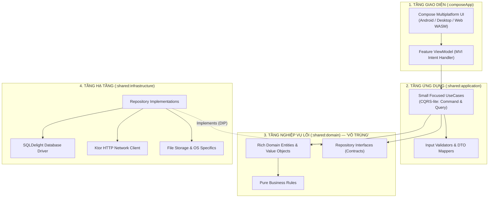
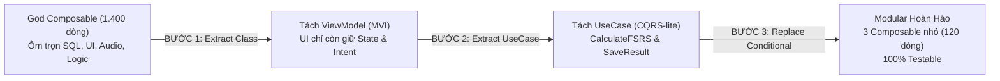

> *"Viết code một lần, chạy mượt trên Android, iOS, Windows, macOS và Web! Tiết kiệm 70% nguồn lực kỹ thuật!"*

Nếu bạn từng tham gia một buổi tech talk về **Kotlin Multiplatform (KMP)** hay **Compose Multiplatform**, chắc hẳn bạn đã nghe những lời quảng cáo đầy mê hoặc này. Nghe như một giấc mơ thiên đường của mọi CTO và Lead Engineer: gom hết logic về một mối, tạm biệt những ngày tháng hai team Android và iOS cãi nhau chí chóe vì làm lệch logic nghiệp vụ.

Thế nhưng, sau 2 đến 3 tuần hăm hở nhảy vào dự án, giấc mơ màu hồng ấy thường biến thành một cơn ác mộng kiến trúc:
* **Android Context** và native libraries rò rỉ khắp nơi trong thư mục `shared/commonMain`.
* Các file ViewModel phình to hơn 2.000 dòng code, vừa gọi HTTP, vừa bắn câu lệnh SQLite, vừa hứng sự kiện click của Compose.
* Một rừng từ khóa `expect / actual` bị lạm dụng vô tội vạ, khiến mỗi lần sửa một hàm nhỏ là phải mở 5 tab để vá lỗi cho từng hệ điều hành.
* Ứng dụng chạy mượt trên Android nhưng cứ bật trên Desktop là văng lỗi giật lag (race condition) do xung đột quản lý luồng!

Từ những ngày "vật lộn" đập đi xây lại kiến trúc cho dự án ứng dụng học tập đa nền tảng **Mainichi App** (`mainichi-app-v2`), tôi nhận ra rằng: **KMP không hề có lỗi, lỗi là chúng ta mang tư duy code app đơn lẻ vào một hệ thống phân tán đa nền tảng.** 

Để giải quyết dứt điểm vấn đề này, tôi đã hệ thống hóa toàn bộ kinh nghiệm chiến trường, kết hợp tinh hoa của **22 Design Patterns kinh điển** và bộ cẩm nang **Refactoring Code Smells** để tạo nên kho tri thức mở: [`github.com/vinh-gogo/skills-kmp`](https://github.com/vinh-gogo/skills-kmp). 

Bài viết này là bản đúc kết những bài học xương máu nhất: từ cách "trừ tà" các mùi hôi code (Code Smells) đến cách thiết kế một kiến trúc KMP đạt chuẩn doanh nghiệp.

---

## 1. Chiến Dịch "Trừ Tà": Bắt Quả Tang 4 Mùi Hôi Code (Code Smells) Trong KMP

Khi mở một dự án KMP đang gặp bế tắc, bạn sẽ rất dễ dàng ngửi thấy 4 "mùi hôi" quen thuộc được định danh trong cẩm nang Refactoring:

### 🤢 Mùi hôi 1: God ViewModel (Large Class & Long Method — Bloaters)
Đây là căn bệnh phổ biến nhất của các lập trình viên mobile khi bước sang KMP. Trong Android thuần, bạn có thể dễ dãi nhét mọi thứ vào ViewModel. Nhưng ở KMP, khi ViewModel phải phục vụ đồng thời cho cả màn hình cảm ứng điện thoại lẫn giao diện chuột/phím của Desktop:
* ViewModel vừa quản lý trạng thái UI, vừa gọi thẳng Ktor API, vừa map JSON, vừa xử lý logic tính điểm.
* Hậu quả: Không thể viết Unit Test cho logic cốt lõi mà không phải mock cả một mớ thư viện UI và Database.

### 💉 Mùi hôi 2: Rò Rỉ Nền Tảng (Feature Envy & Inappropriate Intimacy — Couplers)
Trong một buổi review code, tôi từng giật mình khi thấy một bạn dev inject thẳng `android.content.Context` vào bên trong một Domain Use Case ở `commonMain` chỉ để... đọc một file text tài nguyên!
* Đây là sự vi phạm nghiêm trọng nguyên tắc **Clean Architecture**.
* Khi Domain Layer bị "nhiễm độc" bởi SDK của một hệ điều hành cụ thể, dự án lập tức mất khả năng biên dịch sang Windows (Desktop) hay WebAssembly (WASM).

### 🔫 Mùi hôi 3: Phẫu Thuật Đạn Súng Săn (Shotgun Surgery — Change Preventers)
Bạn cần thêm một trường dữ liệu `avatarUrl` cho người dùng?
Nếu kiến trúc tồi, bạn sẽ phải mở hàng loạt file: sửa Model SQLite, sửa Entity, sửa DTO, sửa màn hình Compose Android, sửa màn hình Compose Desktop, sửa ViewModel... Mỗi lần sửa một chi tiết nhỏ là một "phát súng săn" bắn đạn chùm làm nứt vỡ khắp dự án.

### 🎭 Mùi hôi 4: Rừng Lệnh Rẽ Nhánh (Switch Statements / When Abuse — OO Abusers)
Lạm dụng `when (platform)` hoặc tạo quá nhiều hàm `expect/actual` nhỏ lẻ khắp nơi thay vì dùng tính đa hình (Polymorphism) và trừu tượng hóa (Abstraction).

---

## 2. Toàn Cảnh Kiến Trúc: Bộ Khung "Vô Trùng" Tại `skills-kmp`

Để tiêu diệt triệt để các Code Smells trên, kiến trúc chuẩn hóa trong [`skills-kmp`](https://github.com/vinh-gogo/skills-kmp) thiết lập **hướng phụ thuộc một chiều tuyệt đối (Strict Unidirectional Dependency)**:



### 🛡️ Nguyên Tắc "Vô Trùng" Của Domain Layer:
Tầng **`:shared:domain`** là trái tim của hệ sinh thái. Nó phải được bảo vệ nghiêm ngặt:
1. **Tuyệt đối KHÔNG phụ thuộc vào:** Compose, Android SDK, Java AWT (Desktop), Ktor, SQLDelight, hay bất kỳ thư viện Serialization nào.
2. **Chỉ chứa:** Entity bất biến (Immutable), Value Object, Business Rule, và Repository Interfaces.
3. Nhờ đó, nghiệp vụ của bạn có thể tồn tại 10 năm, bất chấp việc Google hay JetBrains có thay đổi framework UI hay cơ sở dữ liệu trong tương lai!

---

## 3. Vũ Khí Tối Thượng: 5 Design Patterns Cứu Rỗi Dự Án KMP

Áp dụng đúng Design Pattern không phải là để phô diễn kỹ thuật, mà là phương thuốc đặc trị cho từng bài toán đa nền tảng:

### 3.1 Adapter Pattern (Kết hợp Repository Pattern): Thuần Hóa Hạ Tầng
Thay vì để ViewModel trực tiếp tương tác với cơ sở dữ liệu SQLDelight hay Ktor Client, ta áp dụng **Adapter Pattern** thông qua Repository Interface:

```kotlin
// 1. DOMAIN LAYER (:shared:domain) — Tinh khiết, không dính dáng SQL
interface VocabularyRepository {
    suspend fun getWordById(id: WordId): Result<VocabularyWord>
    fun observeLearningList(): Flow<List<VocabularyWord>>
}

// 2. INFRASTRUCTURE LAYER (:shared:infrastructure) — Đóng vai trò Adapter
class SqlDelightVocabularyRepository(
    private val database: MainichiDatabase,
    private val wordMapper: DatabaseWordMapper // Map từ bảng SQL sang Domain Entity
) : VocabularyRepository {
    
    override suspend fun getWordById(id: WordId): Result<VocabularyWord> {
        return runCatching {
            database.vocabularyQueries
                .selectById(id.value)
                .executeAsOne()
                .let(wordMapper::toDomain)
        }
    }

    override fun observeLearningList(): Flow<List<VocabularyWord>> {
        return database.vocabularyQueries
            .selectLearning()
            .asFlow()
            .mapToList(Dispatchers.IO)
            .map { list -> list.map(wordMapper::toDomain) }
    }
}
```
**Lợi ích:** Ngày mai nếu muốn đổi từ SQLite sang Realm hay đồng bộ đám mây qua GraphQL, bạn chỉ cần viết một Adapter mới mà không phải sửa dù chỉ một dòng code trong UI hay Use Case!

---

### 3.2 Strategy Pattern: Thay Thế Rừng `expect / actual`
Thay vì viết hàng loạt hàm `expect fun playAudio()` rải rác làm nát codebase, hãy định nghĩa một **Strategy Interface** trong commonMain và inject engine tương ứng ở từng platform:

```kotlin
// Common Strategy Interface
interface AudioPlayerStrategy {
    suspend fun play(audioUrl: String)
    fun stop()
}

// Android Implementation: Dùng ExoPlayer / MediaPlayer
class AndroidAudioPlayer(private val context: Context) : AudioPlayerStrategy { ... }

// Desktop Implementation: Dùng JavaFX Media hoặc Native ALSA/CoreAudio
class DesktopAudioPlayer : AudioPlayerStrategy { ... }
```
Tại tầng Dependency Injection (Koin), ta chỉ việc cung cấp Strategy tương ứng cho từng nền tảng:
```kotlin
// androidMain
val platformModule = module {
    single<AudioPlayerStrategy> { AndroidAudioPlayer(get()) }
}

// desktopMain
val platformModule = module {
    single<AudioPlayerStrategy> { DesktopAudioPlayer() }
}
```
Không còn một dòng `when (platform)` nào tồn tại trong logic nghiệp vụ!

---

### 3.3 State & Observer Pattern: Kiến Trúc MVI Phản Xạ Một Chiều
Quản lý trạng thái đa nền tảng bằng **MVI (Model-View-Intent)** là sự kết hợp kinh điển giữa **State Pattern** (mỗi trạng thái màn hình là một Immutable Data Class) và **Observer Pattern** (thông qua `StateFlow`):

```kotlin
// 1. Immutable State
data class WordReviewUiState(
    val isLoading: Boolean = false,
    val currentWord: VocabularyWord? = null,
    val isRevealed: Boolean = false,
    val errorMessage: String? = null
)

// 2. User Intents
sealed interface WordReviewIntent {
    data object RevealAnswer : WordReviewIntent
    data class SubmitRating(val rating: Int) : WordReviewIntent
    data object NextWord : WordReviewIntent
}

// 3. MVI ViewModel
class WordReviewViewModel(
    private val reviewWordUseCase: ReviewWordUseCase,
    private val getNextWordUseCase: GetNextWordUseCase
) : ViewModel() {

    private val _uiState = MutableStateFlow(WordReviewUiState(isLoading = true))
    val uiState: StateFlow<WordReviewUiState> = _uiState.asStateFlow()

    fun processIntent(intent: WordReviewIntent) {
        when (intent) {
            is WordReviewIntent.RevealAnswer -> {
                _uiState.update { it.copy(isRevealed = true) }
            }
            is WordReviewIntent.SubmitRating -> handleRating(intent.rating)
            is WordReviewIntent.NextWord -> loadNextWord()
        }
    }
}
```
**Điểm mấu chốt:** UI chỉ có 2 nhiệm vụ: (1) Render dữ liệu từ `uiState` và (2) Bắn `Intent` về ViewModel. Dữ liệu chảy một chiều tuần hoàn, loại bỏ 100% nguy cơ race condition giữa các luồng giao diện!

---

### 3.4 Value Object Pattern: Triệt Phá Mùi Hôi "Primitive Obsession"
Thay vì truyền `String` và `Long` khắp nơi:
```kotlin
// ❌ SAI: Dễ truyền nhầm userId sang courseId vì đều là String!
fun enrollCourse(userId: String, courseId: String, amount: Long)

// ✅ ĐÚNG (Value Objects với @JvmInline value class trong Kotlin):
@JvmInline
value class UserId(val value: String) {
    init { require(value.isNotBlank()) { "UserId cannot be empty" } }
}

@JvmInline
value class CourseId(val value: String)

data class Money(val amount: Long, val currency: Currency) {
    init { require(amount >= 0) { "Amount cannot be negative" } }
}

// Trình biên dịch sẽ bắt lỗi ngay nếu bạn truyền lộn tham số!
fun enrollCourse(userId: UserId, courseId: CourseId, payment: Money)
```
Không tốn thêm bộ nhớ runtime (nhờ `value class`), nhưng code an toàn gấp 10 lần!

---

## 4. Refactoring Thực Chiến: Giải Phẫu Một Ca "Phẫu Thuật" Thành Công

Trong dự án Mainichi App, màn hình Flashcard học từ vựng ban đầu là một file `FlashcardScreen.kt` dài **1.400 dòng** (Code Smell: *God Class + Long Method*). 

Chúng tôi đã thực hiện quy trình Refactoring chuẩn mực theo 3 bước:



1. **Bước 1: Trích xuất ViewModel (Extract Class):** Toàn bộ trạng thái mutable (`var isFlipped`, `var score`) được gom về `FlashcardUiState`. Tách rời việc phát âm thanh sang `AudioPlayerStrategy`.
2. **Bước 2: Trích xuất nghiệp vụ sang UseCase (Extract Business Logic):** Thuật toán tính đường cong quên lãng FSRS được tách riêng thành `CalculateNextReviewUseCase`. Use case này không phụ thuộc vào bất kỳ framework nào, có thể viết Unit Test với 50 kịch bản kiểm thử trong tích tắc.
3. **Bước 3: Chia nhỏ giao diện (Decompose Composables):** Chia file 1.400 dòng thành các Composable nhỏ gọn: `CardFrontView`, `CardBackView`, `RatingBarAction`.

Kết quả: File giao diện chính giảm từ 1.400 dòng xuống chỉ còn **120 dòng code Declarative Compose** thanh thoát và trong sáng!

---

## 5. Cấu Trúc Module Mẫu Cho Dự Án KMP Cấp Doanh Nghiệp

Nếu bạn đang bắt đầu một dự án KMP nghiêm túc, đây là cấu trúc phân rã module mà `skills-kmp` khuyến nghị:

```
├── composeApp/                  # Entry point cho các nền tảng UI
│   ├── androidMain/             # Android Activity, Manifest
│   ├── desktopMain/             # Desktop Window, Menu bar, Tray
│   └── wasmJsMain/              # Web entry point
│
├── shared/
│   ├── core/                    # Tiện ích chung, Result wrapper, Dispatchers
│   ├── domain/                  # Pure Entities, Value Objects, Repository Interfaces
│   ├── application/             # UseCases, Mappers, CQRS Handlers
│   └── infrastructure/          # SQLDelight, Ktor, Platform Adapters
│
└── feature/                     # Tách module theo tính năng (Vertical Slicing)
    ├── review/                  # Toàn bộ màn hình & ViewModel của tính năng Ôn tập
    ├── dictionary/              # Tính năng Tra cứu từ điển
    └── settings/                # Tính năng Cài đặt & Bản quyền
```

Mỗi feature module là một "lát cắt dọc" (Vertical Slice) độc lập. Team A làm tính năng Ôn tập có thể tự do code mà không bao giờ sợ đụng độ mã nguồn (merge conflict) với Team B đang làm tính năng Từ điển!

---

## 6. Lời Kết & Cách Đưa `skills-kmp` Vào Workflow Của Bạn

Làm việc với Kotlin Multiplatform là một hành trình thú vị. Nó mang lại sức mạnh to lớn, nhưng đi kèm trách nhiệm kiến trúc khắt khe hơn rất nhiều so với lập trình native thông thường.

Khi bạn nắm vững các **Design Patterns** cốt lõi và kiên quyết loại bỏ các **Code Smells** ngay từ ngày đầu tiên, KMP sẽ thực sự trở thành một "vũ khí tối thượng" giúp bạn tăng tốc độ ra mắt sản phẩm lên gấp nhiều lần.

Kho mã nguồn và bộ tài liệu hướng dẫn chi tiết được lưu trữ tại:
* 🌐 **GitHub Repository:** [`github.com/vinh-gogo/skills-kmp`](https://github.com/vinh-gogo/skills-kmp)

Bạn có thể sử dụng repo này như một cẩm nang tham chiếu, hoặc ném trực tiếp file `README.md` vào làm System Prompt cho các AI Assistant (Cursor, Claude, Antigravity) để AI tự động tuân thủ kỷ luật kiến trúc khi code KMP cùng bạn.

Bạn đã từng gặp phải "cú lừa" kiến trúc nào khi làm KMP chưa? Hãy chia sẻ trải nghiệm của bạn ở phần bình luận bên dưới nhé!

---

## Tài Liệu Tham Khảo (References)

```
[01] vinh-gogo. (2026). Skills-KMP: Enterprise Architecture & Patterns for Kotlin Multiplatform.
     GitHub: https://github.com/vinh-gogo/skills-kmp
[02] Alexander Shvets. (2018). Dive Into Design Patterns.
     Refactoring.Guru: https://refactoring.guru/design-patterns
[03] Martin Fowler. (2018). Refactoring: Improving the Design of Existing Code (2nd Edition).
     Addison-Wesley Professional.
[04] Robert C. Martin. (2017). Clean Architecture: A Craftsman's Guide to Software Structure.
     Prentice Hall.
[05] JetBrains. (2024). Kotlin Multiplatform & Compose Multiplatform Guidelines.
     Official Documentation: https://www.jetbrains.com/lp/compose-multiplatform/
```

---

## Bài Viết Liên Quan (Related Logs)

- [On-Device AI: Chạy Neural Network Offline Với ONNX Trên Mobile](/posts/on-device-ai-onnx-kotlin/)
  *Ứng dụng trực tiếp của kiến trúc KMP & MVI trong việc đưa mạng nơ-ron chạy offline trên iOS và Android.*
- [Chuyện Làm ReAct Agent: Khi Bot CSKH Thích "Tự Biên Tự Diễn" Và Cách Trị Bằng LangGraph Hooks](/posts/multi-agent-workflow-langraph/)
  *Kỹ thuật thiết kế State Machine và kiểm soát luồng dữ liệu chặt chẽ trong hệ thống AI Agent.*
